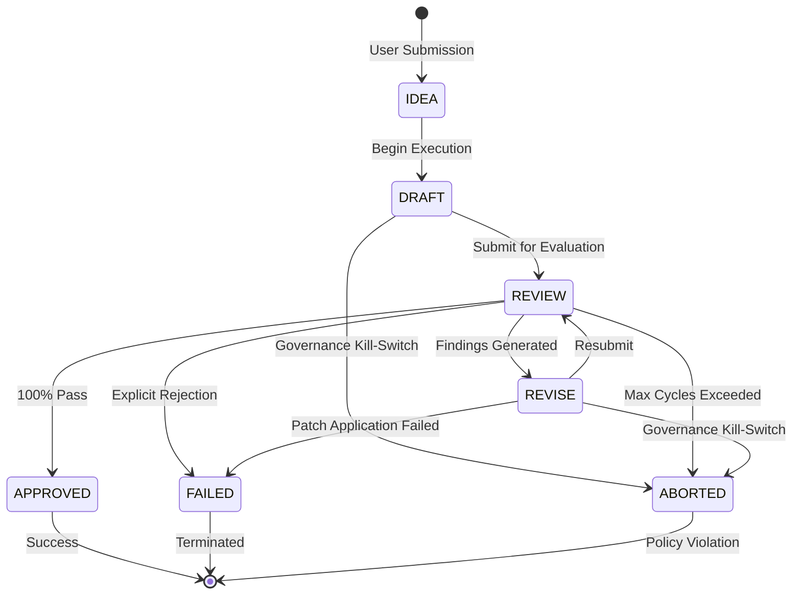

# Workflow State Machine

## 1. Overview

Karsa operates as an autonomous delivery platform. To ensure safety and predictability, every workflow is modeled as a strict finite state machine (FSM). This prevents agents from entering infinite loops, proceeding without approval, or ignoring governance constraints.

## 2. Workflow States

### 2.1. Non-Terminal States

- **`IDEA`**
  - **Description**: The initial state. The human founder has submitted a raw idea, bug report, or feature request.
  - **Entry Conditions**: Submission of a raw prompt.
  - **Exit Conditions**: The Discovery agent successfully parses the idea and prepares to expand it.
  - **Governance**: Pre-execution budget checks.

- **`DRAFT`**
  - **Description**: An agent (Product or Engineering) is actively building the initial artifact, architecture, or code payload.
  - **Entry Conditions**: Transition from `IDEA` or resumption from an interrupted workflow.
  - **Exit Conditions**: An initial, complete artifact is generated.
  - **Governance**: Telemetry starts tracking execution cost and token growth.

- **`REVIEW`**
  - **Description**: A secondary agent (Reviewer/Quality Gate) or the human is actively evaluating the `DRAFT` against success criteria and policies.
  - **Entry Conditions**: Completion of a `DRAFT` or `REVISE` state.
  - **Exit Conditions**: The artifact is either approved, rejected with comments, or fails due to a hard policy limit.
  - **Governance**: Evaluation of `max_review_cycles`.

- **`REVISE`**
  - **Description**: An agent is actively modifying the artifact based on feedback generated during the `REVIEW` state.
  - **Entry Conditions**: Rejection from the `REVIEW` state.
  - **Exit Conditions**: A modified artifact is successfully generated and patched.
  - **Governance**: Check for infinite loops; verify budget is not exhausted before starting the next cycle.

### 2.2. Terminal States

- **`APPROVED`**
  - **Description**: The artifact or code has passed all quality gates, human reviews, and verification steps.
  - **Entry Conditions**: A successful `REVIEW` outcome.
  - **Exit Conditions**: None (Terminal).
  - **Governance**: Final aggregation of total cost and prompt growth metrics.

- **`FAILED`**
  - **Description**: The workflow ended unsuccessfully due to an unrecoverable failure (e.g., cannot compile, unresolvable architecture flaw, or human rejection without retry).
  - **Entry Conditions**: Verification failure, Human rejection.
  - **Exit Conditions**: None (Terminal).
  - **Governance**: Failure metrics recorded.

- **`ABORTED`**
  - **Description**: The workflow was forcibly terminated by the Governance Engine due to a policy violation (e.g., budget exceeded, infinite loop).
  - **Entry Conditions**: BudgetExceeded, TokenLimitExceeded, ReviewCycleExceeded.
  - **Exit Conditions**: None (Terminal).
  - **Governance**: High-priority alert triggered.

## 3. Transition Matrix

| Current State | Transition To | Trigger / Allowed Condition | Invalid Transition |
|---------------|---------------|-----------------------------|--------------------|
| `IDEA`        | `DRAFT`       | Discovery agent initialized | `APPROVED`, `REVIEW`, `REVISE` |
| `DRAFT`       | `REVIEW`      | Initial artifact generated  | `APPROVED`, `IDEA`, `REVISE` |
| `DRAFT`       | `ABORTED`     | Budget/Token limit hit      | - |
| `REVIEW`      | `APPROVED`    | All criteria met            | `DRAFT`, `IDEA` |
| `REVIEW`      | `REVISE`      | Feedback generated          | `DRAFT`, `IDEA` |
| `REVIEW`      | `FAILED`      | Human rejects explicitly    | - |
| `REVIEW`      | `ABORTED`     | Max review cycles hit       | - |
| `REVISE`      | `REVIEW`      | Revision patched            | `APPROVED`, `IDEA`, `DRAFT` |
| `REVISE`      | `FAILED`      | Patch failed to apply       | - |
| `REVISE`      | `ABORTED`     | Budget/Token limit hit      | - |

## 4. State Diagram

