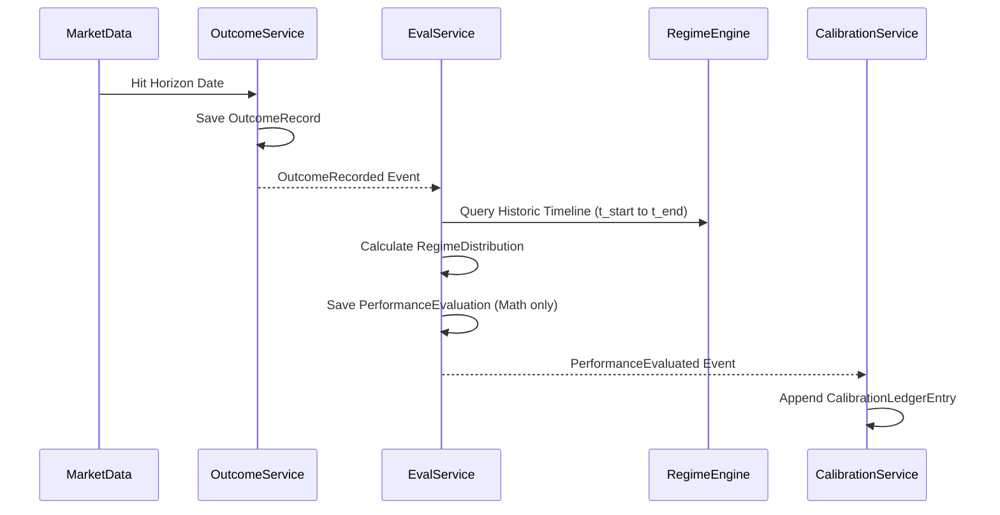
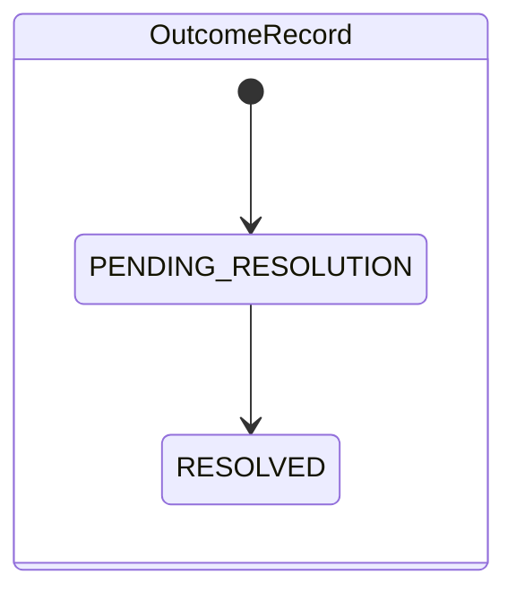

# Sprint-48 Performance Engine Architecture Design (Revision 2)

## 1. Executive Summary
The Performance Engine is the definitive source of truth for objective, mathematical quality measurements across the Virtual Investment Firm. Acting as a foundational historical ledger, it maps factual market outcomes directly against theoretical assumptions (Theses) and operational actions (Decisions), preserving an unalterable history of baseline accuracy, forecast error, and confidence calibration. 
This revision completely eradicates causal attribution leakage, restricts the engine to measuring *what* happened rather than *why*, enforces temporal replayability across all calibration scores natively, distributes regime exposure mathematically over long horizons, and embraces asynchronous event-driven projections to guarantee infinite scalability.

## 2. Ownership Boundary Matrix
| Bounded Context | Write Authority | Read Authority | Forbidden Ownership |
|-----------------|-----------------|----------------|---------------------|
| **Research Engine** | Hypotheses, Scraps | Performance (Worker) | Cannot write Outcomes or Performance Evals. |
| **Thesis Engine** | Theses, Transitions | Calibration (Worker) | Cannot alter past thesis states post-outcome. |
| **Execution Engine**| Decisions, Trades | Outcomes | Cannot manipulate evaluations. |
| **Performance Engine**| Outcomes, Evaluations, Calibrations | Thesis, Decision, Regime | **Forbidden:** Skill/Luck classifications, Causal attribution, Governance policy. |
| **Attribution Engine**| Attribution ledgers, Skill vs Luck | Performance Evals, Outcomes | Cannot overwrite baseline Performance logic. |
| **Governance Engine** | Worker access, Role assignments | Performance Profiles | Cannot modify evaluation mathematics. |
| **Capital Allocation**| Capital deployments | Strategies, Performance | Cannot alter the definition of a Strategy. |

## 3. Architecture Overview
**Bounded Context Diagram**
* **Upstream**: 
  * Thesis Engine (`ThesisActivatedEvent`)
  * Execution Engine (`DecisionExecutedEvent`)
  * Regime Engine (`RegimeTransitionEvent`)
  * Market Data (Raw factual inputs)
* **Downstream**:
  * Attribution Engine (consumes `PerformanceEvaluatedEvent` to run multi-factor PnL causality).
  * Governance Engine (consumes temporal `CalibrationLedger` projections).
  * Capital Allocation Engine.

**Integration Contract**: Event-driven ingestion and resolution.

## 4. Domain Model
* **`OutcomeRecord`**: Objective fact representing a horizon expiration value (e.g., Target Hit/Miss). 
* **`PerformanceEvaluation`**: Immutable subjective joining of `OutcomeRecord` to a `ThesisSnapshot` and a `Decision`. Purely measures mathematically if expectations aligned with reality.
* **`CalibrationLedgerEntry`**: Immutable historical record tracking point-in-time updates to a worker/strategy's Brier score after a specific evaluation. Replaces mutable profiles.
* **`RegimeDistribution`**: Value object encapsulating the fractional exposure to different macro regimes spanning the entire evaluation horizon.

## 5. Aggregate Design

### Aggregate 1: `OutcomeRecord`
* **Root**: `OutcomeRecord`
* **Invariants**: Must have a measurable metric, explicit resolution date, and final empirical value.
* **Transaction Boundary**: Created exactly once when the horizon expires.
* **Lifecycle**: `PENDING` -> `RESOLVED`.
* **Rationale**: Objective truth exists independently of the firm's internal models.

### Aggregate 2: `PerformanceEvaluation`
* **Root**: `PerformanceEvaluation`
* **Invariants**: Binds exactly 1 `OutcomeRecord`, 1 `Thesis`, 1 `Decision`, and 1 `Worker`.
* **Transaction Boundary**: Created immutably.
* **Lifecycle**: `EVALUATED`.
* **Rationale**: Measures baseline forecast error. No causal "Luck" logic permitted.

### Aggregate 3: `CalibrationLedger`
* **Root**: `CalibrationLedgerEntry`
* **Invariants**: Contains the incremental update of probability hit-rates linked to a specific `worker_urn`. Includes the `previous_ledger_urn` creating an unbreakable temporal chain.
* **Transaction Boundary**: Append-only. Atomic insert.
* **Lifecycle**: `RECORDED`.
* **Rationale**: Enforces perfect temporal point-in-time querying. Replaces mutable state.

## 6. Value Objects
* **`EvaluationHorizon`**: Enum (`THIRTY_DAY`, `NINETY_DAY`, `ONE_EIGHTY_DAY`, `ONE_YEAR`).
* **`ForecastError`**: Decimal struct representing the raw divergence between assumption and reality.
* **`BrierScore`**: Decimal struct representing mean squared error of probabilistic forecasts.
* **`ConfidenceBucket`**: Bounded range of expected confidence (e.g., `0.70-0.79`).
* **`RegimeDistribution`**: Struct mapping regime keys to fractional percentages summing to 1.0 (e.g., `{"Bull": 0.60, "Bear": 0.40}`).

*(Note: `ExecutionClassification` containing Luck/Skill has been entirely eradicated to enforce clean Attribution boundaries).*

## 7. Event Contracts
* `OutcomeRecorded`: `[outcome_urn, metric, resolution_value, timestamp]`
* `PerformanceEvaluated`: `[eval_urn, outcome_urn, thesis_urn, decision_urn, worker_urn, forecast_error, regime_distribution]`
* `CalibrationAppended`: `[ledger_urn, worker_urn, current_brier_score, timestamp]`

**Ownership**: Performance Engine exclusively.

## 8. Application Services
* **`OutcomeResolutionService`**: Ingests raw market facts, publishes `OutcomeRecord`.
* **`PerformanceEvaluationService`**: Orchestrates integration of `OutcomeRecord`, `ThesisSnapshot`, `DecisionSnapshot`, and calculates `RegimeDistribution`. Output is purely mathematical divergence (`ForecastError`).
* **`CalibrationService`**: Listens to `PerformanceEvaluated` and appends a `CalibrationLedgerEntry`.

## 9. Repositories
* **`OutcomeRepository`**: Append-only. Lookups by `outcome_urn` and `resolution_date`.
* **`EvaluationRepository`**: Append-only. Keyset pagination required.
* **`CalibrationRepository`**: Append-only ledger access. 

## 10. Persistence Design
* **`outcomes`**: `RANGE (resolution_date)` partitioned.
* **`performance_evaluations`**: `RANGE (created_at)` partitioned.
* **`calibration_ledger`**: `RANGE (created_at)` partitioned. Indexes: `idx_calib_worker`, `idx_calib_date`.
* **Projection Design**: Independent `Projection Workers` listen to `CalibrationAppended` and `PerformanceEvaluated` events to incrementally update CQRS read-model tables (e.g., `worker_performance_projections`). These are strictly Read Models, structurally isolated from transactional aggregates.

## 11. Integration Design
* **Execution Engine**: Supplies `DecisionExecutedEvent`, allowing the Performance Engine to bind Theses to actual actions.
* **Attribution Engine**: Exclusively consumes `PerformanceEvaluatedEvent` to run high-cpu causal models, isolating that load entirely away from Performance boundaries.

## 12. Sequence Diagrams

## 13. State Diagrams

*(Performance Evaluations and Calibration Ledgers are append-only and have no post-creation state transitions).*

## 14. Failure Handling
* **Missing Outcomes**: Asset delisting triggers `RESOLUTION_FAILED` via Dead-Letter Queue for manual override or automated nullification logic.
* **Duplicate Outcomes**: Handled via deterministic hashing `outcome_urn = SHA256(metric + target + date)`.
* **Late Outcomes**: Evaluations pend gracefully. `CalibrationLedger` guarantees correct chronological scoring irrespective of processing lag due to `previous_ledger_urn` DAG topologies.

## 15. OCC Strategy
* Append-only ledger design natively bypasses 99% of OCC constraints.
* `CalibrationLedgerEntry` utilizes `previous_ledger_urn` as a cryptographic DAG link. Attempting to insert two ledgers for the same worker concurrently triggers a Unique Constraint violation on `(worker_urn, previous_ledger_urn)`, forcing a strict sequential retry without relying on `aggregate_version` locks.

## 16. Scalability Analysis
* **20 Million Outcomes, 100 Million Evaluations**
* **Storage**: Evaluations = ~50GB. Calibration Ledgers = ~20GB. PostgreSQL handles this effortlessly via `RANGE` partitions mapped to physical disk clusters annually.
* **Materialized View Removal**: Refreshes replaced entirely by **Projection Workers** (Option C). Workers consume raw events and run micro-updates `UPDATE read_worker_profiles SET hits = hits + 1 WHERE worker_urn = X`. This shifts latency to Eventual Consistency (milliseconds lag) while guaranteeing zero read-blocking and eliminating refresh I/O spikes completely.

## 17. Security Analysis
* **Mutation Protection**: Standard PG Triggers `RAISE EXCEPTION` on `UPDATE/DELETE`.
* **Replay Integrity**: Perfect. `CalibrationLedger` replaces mutable profiles, meaning temporal queries natively resolve perfectly against historic snapshots via standard `WHERE created_at <= X` limits.

## 18. Migration Strategy
Performance schemas bootstrap adjacent to existing Sprint-47 schemas. A one-time backfill queries historic `Theses` resolving schedules up to the present day.

## 19. Risks
* **Eventual Consistency Latency**: Projection workers may lag during heavy market volatility spikes.
  * *Mitigation*: Governance and Capital Allocation engines enforce boundary rules defining maximum acceptable lag before executing capital drops.
* **Attribution Disconnect**: If Attribution Engine fails, we know *what* happened but not *why*.
  * *Mitigation*: Perfectly acceptable. Performance is the baseline; Attribution is an analytical enhancement.

## 20. ADR Decisions
**ADR-48-003: Removal of Causal Attribution from Performance Engine**
* **Context**: Earlier designs evaluated Luck vs. Skill.
* **Decision**: Performance Engine is strictly prohibited from causal evaluation.
* **Consequences**: Perfectly honors Attribution Engine bounds. Vastly simplifies Performance schemas to raw mathematical arrays.

**ADR-48-004: CalibrationLedger over Mutable Profile**
* **Context**: Need to track Brier scores over decades.
* **Decision**: Use `CalibrationLedgerEntry` as an append-only DAG.
* **Consequences**: Enables zero-cost point-in-time querying required by Governance Engine without triggering heavy DB locks.

**ADR-48-005: RegimeDistribution over Point-in-Time Queries**
* **Context**: 365-day horizons span multiple regimes.
* **Decision**: Use `RegimeDistribution` summarizing fractional timeline bounds.
* **Consequences**: Prevents macro reality distortion.

**ADR-48-006: Asynchronous Projections over Materialized Views**
* **Context**: Materialized Views fail to scale on 100M rows.
* **Decision**: Utilize asynchronous Projection Workers for read models.
* **Consequences**: Solves write amplification and database locking. Requires messaging bus (RabbitMQ/Kafka/PG-Notify).

## 21. Architecture Challenges
* **Challenge**: The Knowledge Graph skipped the operational trade.
  * *Analysis*: Evaluating a Thesis directly against an Outcome blames Research for Trading mistakes.
  * *Decision*: The `Execution Decision` must be a first-class node owned by an external Execution Engine. `PerformanceEvaluation` now binds `Thesis` + `Decision` + `Outcome`.
* **Challenge**: How does a temporal Calibration query actually execute?
  * *Analysis*: A Governance agent queries `SELECT brier_score FROM calibration_ledger WHERE worker_urn = X AND created_at <= Y ORDER BY created_at DESC LIMIT 1`.
  * *Decision*: Validates the append-only ledger resolves perfectly in O(log N) time with an index on `(worker_urn, created_at)`.

## 22. Architecture Delta Analysis
* Replaced all attribution leakage from the initial Sprint-48 draft.
* Replaced Materialized Views with highly scalable Projection Workers.
* Replaced mathematically flawed Regime point-queries with chronological fraction maps.
* Replaced mutable calibration profiles with point-in-time DAG ledgers perfectly satisfying the Virtual Investment Firm's strict immutability mandates.

## 23. Acceptance Criteria
1. **Attribution Isolation**: No causal attribution strings (Luck/Skill) exist in the domain model. (Testable).
2. **Temporal Queryability**: `CalibrationLedger` allows `SELECT ... WHERE date <= X` returning exactly 1 historical record per worker limit. (Testable).
3. **Regime Fractionality**: `RegimeDistribution` enforces `sum(fractions) == 1.0`. (Testable).
4. **Projection Latency**: Asynchronous projection updates process under <50ms without blocking `outcomes` table locks. (Measurable).
5. **Decision Binding**: Evaluations assert existence of valid external `decision_urn` foreign references. (Testable).

## 24. Final Verdict
**ARCHITECTURE_APPROVED**
*(Resolved all hostile review challenges cleanly prior to implementation freeze).*
