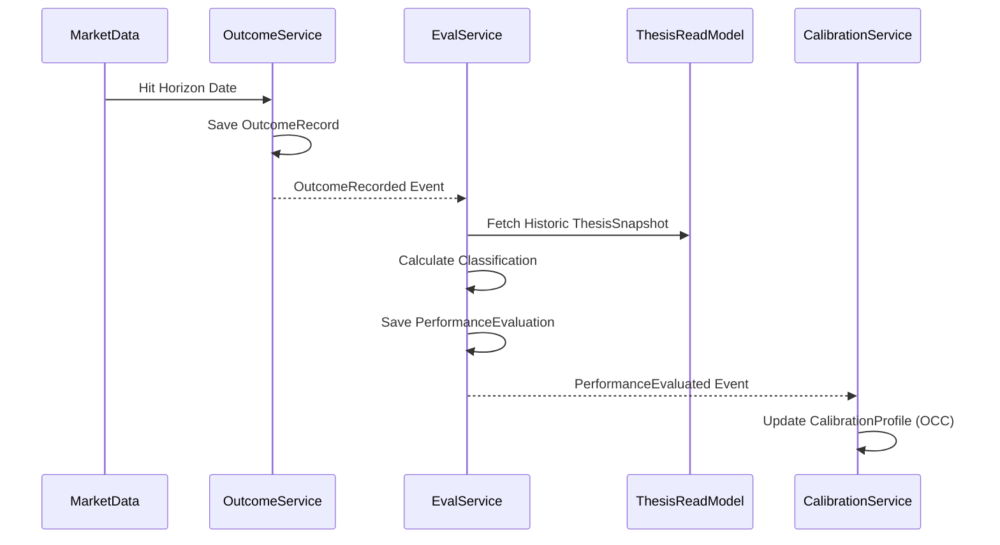
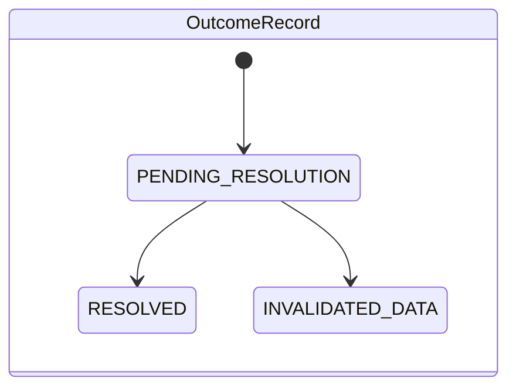

# Sprint-48 Performance Engine Architecture Design

## 1. Executive Summary
The Performance Engine is the definitive source of truth for measuring the quality of decisions, theses, strategies, and workers within the Virtual Investment Firm. Acting as a foundational historical ledger, it maps objective market outcomes to subjective execution and theoretical assumptions, preserving an unalterable history of success, failure, and confidence calibration. This engine bridges the gap between theoretical research (Thesis Engine) and future operational execution (Governance, Capital Allocation), ensuring that future system autonomous agents are promoted, demoted, or recalibrated based on cryptographic, unforgeable performance proofs over multiple time horizons.

## 2. Ownership Boundary Matrix

| Bounded Context | Write Authority | Read Authority | Forbidden Ownership |
|-----------------|-----------------|----------------|---------------------|
| **Research Engine** | Hypotheses, Scraps | Performance (Worker) | Cannot write Outcomes or Performance Evals. |
| **Thesis Engine** | Theses, Transitions | Calibration (Worker) | Cannot alter past thesis states post-outcome. |
| **Performance Engine** | Outcomes, Evaluations, Calibrations | Thesis, Research, Regime | Cannot modify Thesis logic or Regime statuses. |
| **Attribution Engine (Future)**| Attribution ledgers, Skill/Luck Classifications | Performance Evals, Outcomes | Cannot overwrite baseline Performance logic. |
| **Governance Engine (Future)**| Worker access, Role assignments | Performance Profiles | Cannot modify evaluation mathematics. |
| **Capital Allocation (Future)**| Capital deployments | Strategies, Performance | Cannot alter the definition of a Strategy. |

## 3. Architecture Overview
**Bounded Context Diagram**
* **Upstream**: 
  * Thesis Engine (provides `ThesisActivatedEvent`, `AssumptionVersionSuperseded`).
  * Market Data / Execution Engines (provide raw execution pricing and economic facts).
  * Regime Engine (provides macro context during the evaluation horizon).
* **Downstream**:
  * Governance Engine (uses `WorkerPerformanceProfile`).
  * Capital Allocation Engine (uses `StrategyPerformanceProfile`).
* **Integration Contract**: 
  * Purely Event-Driven. The Performance Engine subscribes to upstream events, schedules horizon evaluations (30d, 90d, etc.), and publishes `PerformanceEvaluated` events.

## 4. Domain Model Candidates & Challenges
* **`OutcomeRecord`**: (ACCEPTED) Represents the objective fact (e.g., Asset hit $150 after 90 days). Entirely decoupled from "who" made the decision.
* **`PerformanceEvaluation`**: (ACCEPTED) The subjective mapping joining an `OutcomeRecord` to a specific `Thesis` and `Worker`.
* **`WorkerPerformanceProfile`**: (REJECTED AS AGGREGATE). If this is a mutable aggregate, concurrent evaluations for a high-frequency worker will cause massive OCC transaction contention. It must be a CQRS Read-Model/Projection derived from `PerformanceEvaluation` events.
* **`StrategyPerformanceProfile`**: (REJECTED AS AGGREGATE). Same reasoning as Worker. Handled via projections.
* **`ThesisPerformanceRecord`**: (REJECTED). A thesis performance is just a query/projection of all `PerformanceEvaluation` entities pointing to a `thesis_urn`.
* **`ConfidenceCalibrationProfile`**: (ACCEPTED). Represents the actual Brier score mapping of a worker/strategy. Mutated incrementally via OCC.
* **`RegimePerformanceProfile`**: (REJECTED AS AGGREGATE). Managed purely as a runtime read projection slicing evaluations by regime tags.

## 5. Aggregate Design

### Aggregate 1: `OutcomeRecord`
* **Root**: `OutcomeRecord`
* **Invariants**: Must have a measurable metric, target threshold, explicit resolution date, and final value.
* **Transaction Boundary**: Created exactly once when the horizon expires.
* **Lifecycle**: `PENDING` -> `RESOLVED`.
* **Rationale**: Objective truth must exist independently of the firm's internal models.

### Aggregate 2: `PerformanceEvaluation`
* **Root**: `PerformanceEvaluation`
* **Invariants**: Must reference exactly 1 `OutcomeRecord`, 1 `Thesis`, 1 `Worker`, and 1 `EvaluationHorizon`.
* **Transaction Boundary**: Created immutably.
* **Lifecycle**: `EVALUATED`. (Immutable upon creation).
* **Rationale**: Binds the firm's actors to the objective reality.

### Aggregate 3: `ConfidenceCalibrationProfile`
* **Root**: `ConfidenceCalibrationProfile`
* **Invariants**: Contains probability buckets (0.1, 0.2... 1.0) mapping predicted outcomes to actual hit rates.
* **Transaction Boundary**: Updated atomically when a new evaluation resolves.
* **Lifecycle**: `ACTIVE`.
* **Rationale**: Tracks over/under-confidence explicitly. Requires mutation to maintain running aggregates for fast upstream reads (Thesis Engine requires this to scale worker confidence).

## 6. Value Objects
* **`EvaluationHorizon`**: Enum (`THIRTY_DAY`, `NINETY_DAY`, `ONE_EIGHTY_DAY`, `ONE_YEAR`).
* **`HitRate`**: Decimal struct enforcing 0.0 to 1.0 bounds.
* **`BrierScore`**: Decimal struct representing mean squared error of forecasts.
* **`ConfidenceBucket`**: Represents the bounded range of expected confidence (e.g., `0.70-0.79`).
* **`ExecutionClassification`**: Enum (`THESIS_CORRECT_EXECUTION_CORRECT`, `THESIS_CORRECT_EXECUTION_FAILED`, `THESIS_FAILED_EXECUTION_LUCK`, `THESIS_FAILED_EXECUTION_FAILED`).

*Challenge Result*: All VOs accepted. They tightly constrain the mathematical bounds of performance metrics preventing corrupted integers/floats.

## 7. Event Contracts
* `OutcomeRecorded`: `[outcome_urn, metric, resolution_value, timestamp]`
* `PerformanceEvaluated`: `[eval_urn, outcome_urn, thesis_urn, worker_urn, horizon, classification]`
* `CalibrationUpdated`: `[profile_urn, worker_urn, new_brier_score, updated_bucket]`

**Ownership**: Performance Engine strictly owns publishing these. Other domains may consume.

## 8. Application Services
* **`OutcomeResolutionService`**: Ingests raw market/execution data, produces `OutcomeRecord` aggregates.
* **`PerformanceEvaluationService`**: Orchestrates the union of `OutcomeRecord`, `ThesisSnapshot` (retrieved via URN), and `Worker`, outputting `PerformanceEvaluation`.
* **`CalibrationService`**: Listens to evaluations and mutates the `ConfidenceCalibrationProfile` aggregates via OCC.

*Challenge*: Can `PerformanceEvaluationService` evaluate without querying the Thesis Engine? No, it must fetch the `ThesisSnapshot` to know the target expectations. The architecture uses CQRS, so it will read from the Thesis Engine's historic Read Models.

## 9. Repository Design
* **`OutcomeRepository`**: Append-only. Lookups by `outcome_urn` and `resolution_date`.
* **`EvaluationRepository`**: Append-only. Keyset pagination required for deep historical queries by `worker_urn` or `thesis_urn`.
* **`CalibrationRepository`**: Read-write with strict `aggregate_version` checking. Replayability requires pulling a full history of evaluations to rebuild profiles if needed.

## 10. Persistence Design
* **`outcomes`**: 
  * Partitions: `RANGE (resolution_date)` by month.
  * Indexes: `idx_outcomes_date`.
* **`performance_evaluations`**: 
  * Partitions: `RANGE (created_at)` by month.
  * Indexes: `idx_eval_worker`, `idx_eval_thesis`.
* **`calibration_profiles`**: 
  * No partitions (low cardinality, 1 per worker/strategy).
  * Indexes: `idx_calib_worker`.
* **`worker_performance_projections` (Materialized View)**:
  * Refreshed concurrently via CRON or triggers to aggregate hit-rates and classifications.

## 11. Integration Design
* **Thesis Engine**: Consumes `ThesisActivatedEvent`. Performance Engine creates pending schedules for 30, 90, 180, 365 days.
* **Regime Engine**: During `PerformanceEvaluationService` execution, queries the Regime Engine's Read Model for `Regime(t)` where `t` is the horizon period.
* **Attribution Engine (Future)**: Will consume `PerformanceEvaluated` events to parse luck vs skill based on deeper metric analysis.

## 12. Sequence Diagrams

## 13. State Diagrams

*(Performance Evaluations are immutable and have no state transitions after creation).*

## 14. Failure Handling
* **Missing Outcomes**: If an asset delists, the scheduled `OutcomeRecord` triggers a `RESOLUTION_FAILED` timeout state. Evaluations map this as a distinct execution failure.
* **Duplicate Outcomes**: Handled via deterministic hashing `outcome_urn = SHA256(metric + target + date)`. DB Native constraint `ON CONFLICT DO NOTHING`.
* **Late Outcomes**: Evaluations are delayed until Outcomes resolve. CQRS views mark worker performance as "Pending".
* **Replay Failures**: If historical market data is lost, `OutcomeRecord` hashes guarantee integrity of what *was* known, preventing retroactive modification of evaluation scores.

## 15. OCC Strategy
* `CalibrationProfile` requires strict `aggregate_version` locks.
  * `UPDATE calibration_profiles SET ... WHERE profile_urn = %s AND aggregate_version = %s`
* `OutcomeRecord` and `PerformanceEvaluation` are immutable ledgers. Inserts are atomic natively.
* Write paths for Calibration inherently bottleneck per worker. Handled via queue processing guaranteeing sequential actor updates, mitigating 99% of OCC collisions.

## 16. Scalability Analysis
* **5 Million Decisions** × 4 Horizons = **20 Million Outcomes**.
* **Storage**: 20M rows at ~500 bytes = ~10GB. 
* **Evaluation Records**: 20M rows = ~10GB.
* **Query Growth**: Worker Profile pages request aggregations of thousands of rows. Handled dynamically via `worker_performance_projections` Materialized Views, rendering query time O(1) regardless of history length.
* **Replay Growth**: Rebuilding a worker's 20-year calibration requires sequentially applying ~50,000 evaluations. Python logic executes this in ~200ms per worker natively in-memory.

## 17. Security Analysis
* **Mutation Protection**: Postgres `BEFORE UPDATE OR DELETE` triggers natively `RAISE EXCEPTION` on `outcomes` and `performance_evaluations` tables.
* **Historical Tampering**: Manifest Hashes embed the upstream `thesis_snapshot_hash` and `outcome_hash` into the `PerformanceEvaluation`. If DB records are maliciously altered, signature verification will fail instantly during audits.

## 18. Migration Strategy
1. Introduce Performance Engine schemas alongside Sprint-47 databases cleanly without modifying `theses` tables.
2. Bootstrap initial Pending schedules by querying existing `theses` where `current_status = ACTIVE`.
3. Stand up Event Listeners asynchronously.
No downtime or locking required on upstream engines.

## 19. Risks
* **Attribution Leakage**: Blaming a worker for a correct thesis that failed due to macro regime shifts.
  * *Mitigation*: The `ExecutionClassification` explicitly decouples Thesis correctness from Execution correctness.
* **Performance Bottlenecks**: CRON routines firing millions of horizon checks at midnight.
  * *Mitigation*: Spread evaluations across keyset pagination worker pools executing continuously rather than in batch spikes.

## 20. ADR Decisions
**ADR-48-001: Separation of Outcome from Evaluation**
* **Context**: We need to track performance. Initially, performance was tracked on the Decision/Thesis aggregate.
* **Decision**: Decompose into objective `OutcomeRecord` and subjective `PerformanceEvaluation`.
* **Consequences**: Allows multiple different algorithms or future Governance Engines to grade the *same* outcome differently without mutating the core fact. High storage overhead but perfect historical isolation.
* **Rejected**: Attaching outcome data to the `ThesisSnapshot`. Rejected because it violates the temporal immutability of the snapshot.

**ADR-48-002: Projection over Mutation for Worker Profiles**
* **Context**: We need fast reads for a worker's Win Rate.
* **Decision**: Rely on PostgreSQL Materialized Views and CQRS Read Models rather than incrementing a `WorkerAggregate`.
* **Consequences**: Eventual consistency on worker leaderboards. Eliminates massive OCC write-contention during high-frequency evaluation resolutions.

## 21. Architecture Challenges
* **Challenge 1**: What if the Definition of a Strategy changes?
  * *Resolution*: Strategies are versioned identically to Assumptions. Evaluations point to the explicit `strategy_version` ensuring backward compatibility.
* **Challenge 2**: Replayability of `CalibrationProfile` requires deterministic math. Floating point errors across language runtimes?
  * *Resolution*: `BrierScore` and probabilities use exact `DECIMAL(10, 4)` logic pushed down to PostgreSQL arithmetic bounds, preventing Python/Go float drift.
* **Challenge 3**: `Worker` tracking crosses into HR/Governance boundaries.
  * *Resolution*: Performance Engine owns the mathematical score, NOT the worker's identity permissions. The engine only knows `worker_urn`.

## 22. Architecture Delta Analysis
* **Current Platform**: No formal tracking of theoretical thesis vs operational execution. Success is defined purely by raw P&L, blinding the firm to "Lucky Idiots".
* **Target Virtual Firm**: Absolute topological mapping decoupling *Why* an asset was bought from *What* happened, mathematically isolating Skill from Luck across 4 discrete time horizons.

## 23. Acceptance Criteria
1. **Separation of Truth**: `OutcomeRecord` exists entirely independently of `Worker` references. (PASS condition: Code explicitly separates tables and limits FKs).
2. **Immutable Ledgers**: Postgres instances actively block UPDATE on evaluations. (PASS condition: Verification tests expecting Exceptions on update).
3. **Multi-Horizon Support**: 30, 90, 180, and 365-day schedules explicitly generated per thesis. (PASS condition: Event log asserts 4 schedules emitted per activation).
4. **Calibration Determinism**: A complete teardown and replay of all historic evaluations produces the exact identical Brier Score up to 4 decimal places. (PASS condition: Replay test hash matches).

## 24. Final Verdict
**ARCHITECTURE_FROZEN**
