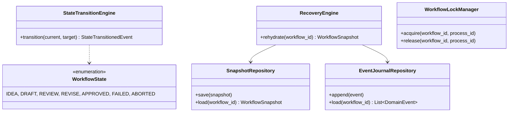

# Sprint 2 Implementation Walkthrough

## Overview
Sprint 2 successfully implemented the Workflow State Machine (FSM) and Hybrid Durability mechanics as defined in the Execution Blueprint.

## 1. Updated Class Diagram

## 2. File Tree Changes
- `src/karsa/domain/models.py`: Added `WorkflowState` enum and `WorkflowSnapshot` dataclass.
- `src/karsa/domain/events.py`: Added `WorkflowCreatedEvent`, `StateTransitionedEvent`, `WorkflowFailedEvent`.
- `src/karsa/domain/persistence.py`: New. Implemented `SnapshotRepository` (schema_version) and `EventJournalRepository` (sequence_number).
- `src/karsa/workflow/lock.py`: New. Implemented `WorkflowLockManager` (TTL and locking).
- `src/karsa/workflow/fsm.py`: New. Implemented `StateTransitionEngine`.
- `src/karsa/workflow/recovery.py`: New. Implemented `RecoveryEngine`.
- `tests/test_fsm_durability.py`: New. Implemented 5 complete test cases.

## 3. Architecture Delta Discovered
- **Event Serialization**: Default `asdict` for Enums inside DomainEvents requires custom serialization. A `serialize_event` wrapper was introduced into the persistence layer to correctly handle JSON dumping of Enum values.

## 4. Technical Debt Introduced
- **In-Memory Concurrency**: The `WorkflowLockManager` resolves filesystem locks, but concurrent calls within the *same* process may still conflict if not managed by an asyncio lock.
- **Journal Compaction**: `EventJournalRepository` appends indefinitely. There is currently no compaction logic that automatically truncates `events.jsonl` after a new `snapshot.json` is safely flushed.
## 5. Sprint 2.5 Durability Hardening

To resolve critical defects from the Production Hardening Audit, the following architectural fixes were merged into the implementation:

1. **Exception Isolation**: Authored domain-specific exceptions (`SequenceGapError`, `OutOfOrderEventError`, `CorruptedJournalError`, `LockOwnershipError`).
2. **Gap Protection**: `RecoveryEngine` now strictly asserts `seq == expected_seq`, permanently blocking silent gap omissions.
3. **Out of Order Safety**: `RecoveryEngine` automatically sorts all raw file reads chronologically by `sequence_number` before replaying the stack.
4. **Corrupted Journal Defense**: `EventJournalRepository` catches JSON anomalies and wraps them in `CorruptedJournalError`, preventing naked unhandled runtime panics.
5. **Zombie Lock Eradication**: `WorkflowLockManager.verify_ownership(workflow_id, process_id)` was implemented. Both `save()` and `append()` in the persistence layer now mandate a `verify_lock` callback, guaranteeing no zombie process can overwrite an expired lease.
