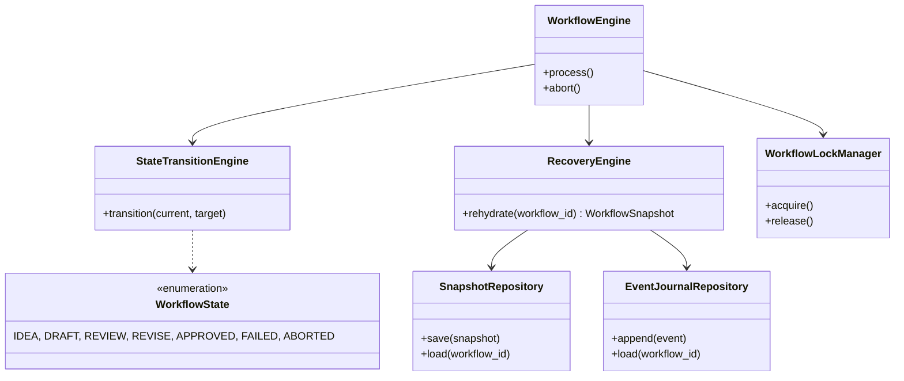

# Sprint 2 Execution Blueprint: FSM & Durability

## 1. Sprint 2 Scope Definition

**In Scope:**
- Workflow State Machine implementation (IDEA, DRAFT, REVIEW, REVISE, APPROVED, FAILED, ABORTED)
- State Transition Engine (Gate conditions and valid transitions)
- Workflow Durability via Hybrid Persistence (Events + Snapshot)
- Crash Recovery Mechanics
- Idempotency & Lock Management at the Workflow level

**Out of Scope:**
- Governance rules (e.g. strict token budgeting to trigger FAILED, except manual aborts)
- Agent implementations (Coder, Reviewer)
- Real LLM generation inside the workflow transitions
- Patch generation and revision logic

## 2. Dependency Analysis

**Domain Models Required:**
- `WorkflowState` (Enum)
- `WorkflowEvent` (e.g., `TransitionRequestedEvent`, `StateChangedEvent`)
- `WorkflowSnapshot` (Dataclass)
- `IdempotencyKey`

**New Services Required:**
- `StateTransitionEngine`
- `RecoveryEngine`
- `WorkflowLockManager`
- `WorkflowEngine`

**New Repositories Required:**
- `SnapshotRepository`
- `EventJournalRepository`

**New Events Required:**
- `WorkflowCreatedEvent`
- `StateTransitionedEvent`
- `ExecutionFailedEvent`

**New Persistence Files Required:**
- `snapshot.json`
- `events.jsonl`
- `lock.json`
- `metadata.json`

## 3. Architecture Delta

| Gap | Current Sprint 1 Implementation | Target Sprint 2 Architecture |
|---|---|---|
| **State Machine** | Hardcoded logic or absent | `WorkflowState` enum and `StateTransitionEngine` enforcing valid transitions |
| **Durability** | Ephemeral, purely in memory | Hybrid Persistence (Snapshot + Event Journal) |
| **Recovery** | Restarts cause total data loss | `RecoveryEngine` rehydrates state from snapshot & events |
| **Concurrency** | Unsafe | `WorkflowLockManager` prevents overlapping workflow dispatches |
| **Events** | `ExecutionCompletedEvent` | Full lifecycle events (`StateTransitionedEvent`, etc.) |

## 4. Implementation Work Packages

### WP-01: WorkflowState Enum
- **Purpose**: Define the canonical states (IDEA, DRAFT, REVIEW, REVISE, APPROVED, FAILED, ABORTED).
- **Files Affected**: `src/karsa/domain/models.py`
- **Dependencies**: None
- **Acceptance Criteria**: Enum exists and matches `02-execution-platform.md`.

### WP-02: Workflow Events
- **Purpose**: Define events for FSM transitions.
- **Files Affected**: `src/karsa/domain/events.py`
- **Dependencies**: None
- **Acceptance Criteria**: `StateTransitionedEvent`, `WorkflowFailedEvent` defined.

### WP-03: Snapshot & Event Journal Repositories
- **Purpose**: Provide persistence logic for hybrid durability.
- **Files Affected**: `src/karsa/domain/persistence.py`
- **Dependencies**: None
- **Acceptance Criteria**: Methods to `save_snapshot`, `load_snapshot`, `append_event`, `load_events` implemented.

### WP-04: Workflow Lock Manager
- **Purpose**: Prevent concurrent executions on the same workflow ID.
- **Files Affected**: `src/karsa/workflow/lock.py`
- **Dependencies**: None
- **Acceptance Criteria**: Acquires and releases `lock.json`, raises `WorkflowLockedError`.

### WP-05: State Transition Engine
- **Purpose**: Validate and execute state transitions.
- **Files Affected**: `src/karsa/workflow/fsm.py`
- **Dependencies**: WP-01, WP-02
- **Acceptance Criteria**: Rejects invalid transitions (e.g., DRAFT -> APPROVED without REVIEW). Publishes `StateTransitionedEvent`.

### WP-06: Recovery Engine
- **Purpose**: Rehydrate workflows after a crash.
- **Files Affected**: `src/karsa/workflow/recovery.py`
- **Dependencies**: WP-03
- **Acceptance Criteria**: Merges `snapshot.json` base state with any un-snapshotted events in `events.jsonl`.

### WP-07: Integration & Crash Testing
- **Purpose**: Prove the system survives abrupt exits.
- **Files Affected**: `tests/test_fsm_durability.py`
- **Dependencies**: All previous WPs
- **Acceptance Criteria**: Tests simulate a crash and verify exact state recovery.

## 5. Proposed Class Diagram



## 6. Persistence Layout

```text
.karsa/
└── workflows/
    └── <workflow_id>/
        ├── snapshot.json
        ├── events.jsonl
        ├── lock.json
        └── metadata.json
```

## 7. Testing Strategy
- **Unit Tests**: Test the `StateTransitionEngine` valid/invalid matrix in memory.
- **Integration Tests**: Test the full `WorkflowEngine` triggering transitions that write to disk via `SnapshotRepository` and `EventJournalRepository`.
- **Crash Recovery Tests**: Simulate an exception mid-workflow, instantiate a new `RecoveryEngine`, and assert the `WorkflowState` and data arrays match precisely.
- **Corruption Tests**: Write malformed JSON to `events.jsonl` and verify `RecoveryEngine` fails safely or falls back to `snapshot.json`.

## 8. Risk Assessment
- **Technical Risks**: File I/O bottlenecks if `events.jsonl` grows too large before a snapshot is compacted.
- **Migration Risks**: Retrofitting the Sprint 1 metrics tracking into the new FSM state logic might skew execution counts if a workflow crashes and recovers.
- **Performance Risks**: Synchronous lock acquisition on `lock.json` across processes could cause race conditions if the filesystem is slow or distributed (e.g., NFS).

## 9. Sprint 2 Exit Criteria
- `WorkflowState` fully matches the architecture matrix.
- Hybrid persistence is operational.
- A failed test harness simulating an OS `kill -9` successfully rehydrates exactly where it left off upon reboot.
- `docs/sprint-02-fsm-durability/audits/` contains the Crash Recovery Evidence and FSM State Audit.

---

# Architecture Freeze Review

## 1. Architecture Freeze Checklist

- [x] **Architecture complete**: The 5 canonical platforms (`01` through `05`) are fully defined.
- [x] **ADRs complete**: 5 core ADRs are documented covering hybrid persistence and contracts.
- [x] **Domain model complete**: Models are strictly cataloged in `02-execution-platform.md`.
- [x] **Persistence model complete**: Hybrid Snapshot + Events defined in `05-sandbox-and-recovery.md`.
- [x] **Event model complete**: Valid lifecycle states and transitions cataloged.
- [x] **Governance model complete**: Strict budget/kill-switches defined in `03-governance-platform.md`.

## 2. Open Decisions
- **None**: All known ambiguities regarding file layout, crash survival, and FSM transition rules were resolved and explicitly locked in the blueprint.

## 3. Technical Debt Register

### Accepted Debt
- **Git Worktree Overhead**: We accept the disk performance penalty of git worktrees in exchange for isolated execution without requiring Docker (ADR-003).

### Deferred Debt
- **EventBus Exception Isolation**: The EventBus remains synchronous without isolated try/except fault barriers. A subscriber crash will still crash the engine. This is deferred until Sprint 4.

### Critical Debt
- **Configuration Hardcoding**: Paths to `.karsa/metrics` and `pricing.json` are still rigidly hardcoded instead of being injected via an overarching `ConfigurationManager`.

## 4. Sprint 2 Implementation Risks
- **Synchronous Locking (`lock.json`)**: Implementing a filesystem lock on the workflow execution could cause zombie locks if the process crashes and `RecoveryEngine` fails to release it. We may be forced to redesign the locking mechanism or introduce a TTL if deadlock occurs during testing.
- **Race Condition on Event Journal**: If the `StateTransitionEngine` writes to `events.jsonl` at the exact millisecond the `SnapshotRepository` is truncating it, data loss will occur.

## 5. Freeze Verdict
**GO WITH ACCEPTED DEBT**

The architecture is mature, stable, and completely documented. The remaining technical debt does not block the safe implementation of FSM Durability. Sprint 2 Implementation is officially authorized to begin.
