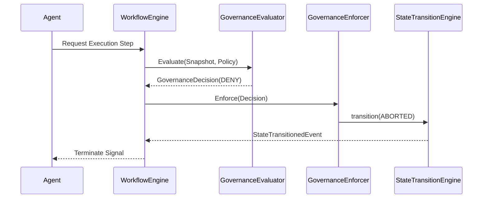
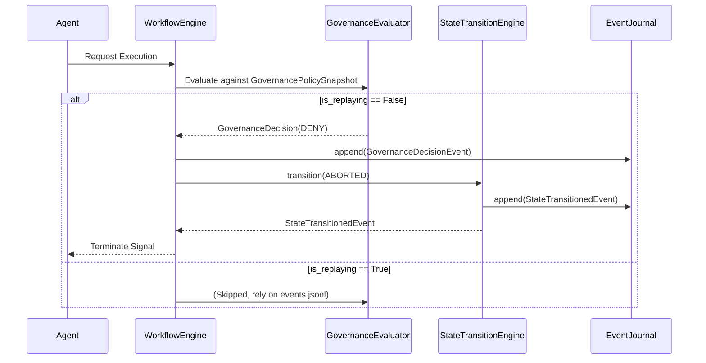
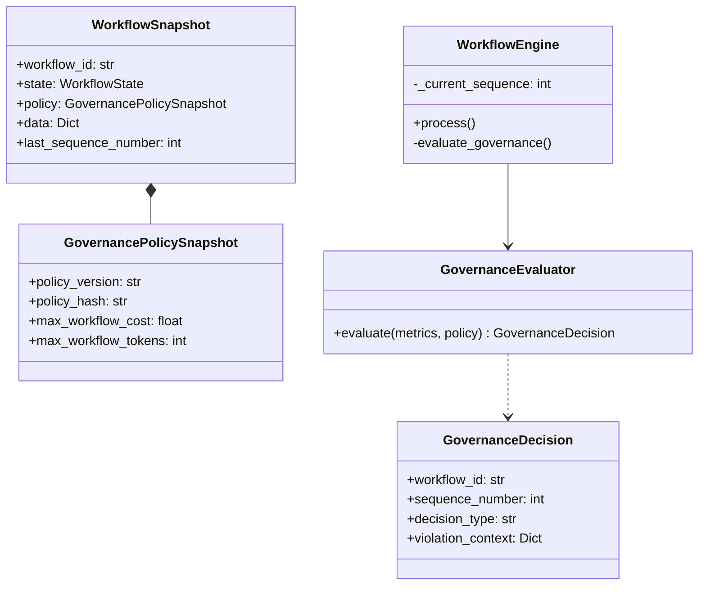
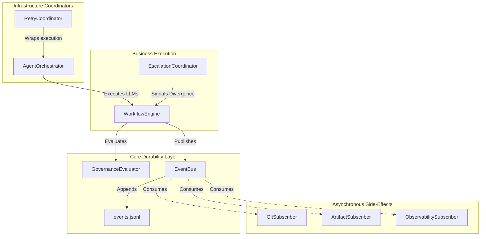

# Sprint 3 Plan

Not started.

# Architecture Freeze Review

## 1. Observability Readiness
**Status**: Ready. 
Sprint 1 introduced the `ExecutionMetrics`, `ReviewCycleMetrics`, and `WorkflowMetrics` dataclasses. The data required to evaluate governance (`total_cost_usd`, `total_tokens`, `execution_count`) natively exists in these structures. Sprint 2's determinism audit successfully embedded these metrics inside `WorkflowSnapshot.data`, ensuring Governance has immediate, crash-consistent read access to costs.

## 2. Durability Readiness
**Status**: Ready.
Because Sprint 2.5 successfully eradicated gaps and out-of-order replay, any governance threshold evaluation (e.g. aborting) can be safely encoded as a state transition. Because state transitions are perfectly rehydratable from the `events.jsonl`, Governance decisions will inherently survive crashes and be highly replayable.

## 3. Policy Readiness
**Status**: Not Ready (Missing).
The `GovernancePolicy` data model does not currently exist in the codebase. Furthermore, there is no canonical parser implemented to load limits from a global or project-specific `karsa.toml` file.

## 4. Event Model Readiness
**Status**: Not Ready (Missing).
The required domain events for Governance (`BudgetExceededEvent`, `ReviewCycleExceededEvent`, `WorkflowAbortedEvent`) are missing from `src/karsa/domain/events.py`. The FSM supports transitioning to `ABORTED` or `FAILED`, but the specific semantic events triggering those transitions have not been modeled.

# Dependency Verification

| Dependency | Required By | Status |
|---|---|---|
| Sprint 1 Cost Metrics | Governance Enforcer | Complete |
| Sprint 2 Workflow Snapshot | Context Rehydration | Complete |
| Governance Events | State Transition Engine | Missing |
| `GovernancePolicy` | Governance Enforcer | Missing |

# Missing Components

The following blockers must be explicitly authored before or during the start of Sprint 3:
1. **`GovernancePolicy` Dataclass**: Needs to be authored in `src/karsa/domain/models.py`.
2. **Configuration Loader**: Logic required to parse `karsa.toml` into a `GovernancePolicy` instance.
3. **Governance Events**: `BudgetExceededEvent`, `ReviewCycleExceededEvent`, and `WorkflowAbortedEvent` must be defined in `src/karsa/domain/events.py`.
4. **Event Serialization**: `src/karsa/domain/persistence.py`'s custom `deserialize_event()` and `serialize_event()` handlers must be updated to explicitly recognize and parse the new governance events.

# Sprint 3 Go/No-Go Decision

**Verdict: NO-GO**

**Justification:** While the foundational Durability and Observability engines are perfectly intact and ready, the specific domain models and events fundamentally required to *express* Governance decisions do not exist yet. Sprint 3 implementation cannot formally begin its business logic phase until WP-01 (Governance Events) and WP-02 (`GovernancePolicy` & TOML parsing) are injected into the scope. The architecture is sound, but the Domain Model requires an immediate upstream patch.

---

# Sprint 3 Governance Execution Blueprint

## 1. Architecture Delta

| Gap | Current State | Target State |
|---|---|---|
| **Policy Definition** | Hardcoded or absent limits | Defined via `GovernancePolicy` and parsed from `karsa.toml` |
| **Execution Checks** | Agents run indefinitely | `GovernanceEvaluator` runs pre-execution and mid-workflow limit checks |
| **Enforcement** | None | `GovernanceEnforcer` aborts workflows via FSM when limits are exceeded |
| **Auditing** | None | `GovernanceDecisionRepository` persistently logs all limit evaluation results into `.karsa/governance/governance_decisions.jsonl` |

## 2. Domain Models

- **`GovernancePolicy`**: Represents thresholds (e.g., `max_workflow_cost`, `max_workflow_tokens`, `max_review_cycles`, `max_cycle_cost`).
- **`GovernanceDecision`**: Records the outcome of an evaluation. Contains `workflow_id`, `decision_type` (`ALLOW`, `DENY`), `reason`, and `timestamp`.

## 3. Service Design

- **`ConfigurationLoader`**: Responsible for reading the `karsa.toml` at the workspace root and constructing the `GovernancePolicy`.
- **`GovernanceEvaluator`**: Given a `WorkflowSnapshot` (which contains current observability metrics in `.data`), compares values against the `GovernancePolicy` to produce a `GovernanceDecision`.
- **`GovernanceEnforcer`**: Reacts to `DENY` decisions from the Evaluator. It interfaces with the `WorkflowEngine` to force an FSM transition to `ABORTED` and halts active execution loops.
- **`GovernanceDecisionRepository`**: Handles JSONL persistence of decisions for forensic auditing and observability.

## 4. Event Design

New Domain Events added to `src/karsa/domain/events.py`:
- `BudgetExceededEvent`: Dispatched when total cost or tokens exceed limits.
- `ReviewCycleExceededEvent`: Dispatched when the workflow hits the maximum allowed revision cycles.
- `WorkflowAbortedEvent`: Dispatched post-enforcement to signal the agent loops to cleanly terminate.
- `GovernanceDecisionEvent`: General audit event published to the EventBus.

## 5. Persistence Design

**Path**: `.karsa/governance/`
- **`governance_decisions.jsonl`**: A sequential, append-only log of every `ALLOW` or `DENY` decision produced by the `GovernanceEvaluator`.
- **`governance_metrics.json`**: An aggregation tracker that counts total aborts vs allows across the entire workspace for macro-level governance observability.

## 6. Sequence Diagrams

## 7. Work Packages

- **WP-01: Governance Models**: Implement `GovernancePolicy`, `GovernanceDecision`, and the 4 domain events.
- **WP-02: Configuration Loader**: Implement TOML parsing to load the policy.
- **WP-03: Governance Repositories**: Implement `GovernanceDecisionRepository` for `.jsonl` logging.
- **WP-04: Evaluator Engine**: Implement `GovernanceEvaluator` to execute threshold mathematics.
- **WP-05: Enforcement Orchestration**: Implement `GovernanceEnforcer` to hook into the FSM engine and perform `ABORTED` transitions.
- **WP-06: Crash Recovery Integration**: Ensure `deserialize_event()` handles the new events properly so the FSM remains durable.

## 8. Testing Strategy

- **Unit Testing**: Test the `GovernanceEvaluator` against mock snapshots that strictly straddle the threshold bounds (e.g. `$0.99` ALLOW vs `$1.00` DENY).
- **Integration Testing**: Spin up an entire `WorkflowEngine` containing the FSM, push metrics past the limit, and assert that the FSM securely transitions to `ABORTED` and serializes `governance_decisions.jsonl`.
- **Crash Recovery Validation**: Rehydrate a workspace that crashed immediately after a `DENY` decision, ensuring the `RecoveryEngine` recognizes the `WorkflowAbortedEvent` and restores the FSM natively to `ABORTED`.

## 9. Exit Criteria

- `karsa.toml` governs execution thresholds.
- Over-budget workflows automatically halt via an FSM `ABORTED` state.
- All decisions are forensically tracked in `.karsa/governance/`.
- The system naturally survives and replays Governance interventions upon crash recovery.

---

# Sprint 3 Go/No-Go Decision

**Verdict: GO**

**Justification**: The blueprint directly injects the missing Governance Models and Domain Events identified during the Architecture Freeze Review. It perfectly interfaces with Sprint 1 Observability (`Snapshot.data` metrics) and leverages Sprint 2.5 Durability (`StateTransitionEngine` and EventBus mechanisms) without requiring overarching redesigns. The execution map is rigorous and completely unblocks Sprint 3 implementation.

---

# Sprint 3 Governance Blueprint Hostile Review

## 1. Architecture Risk Matrix

| Review Area | Current Design | Risk | Severity | Recommendation | Required Architecture Change |
|---|---|---|---|---|---|
| **Governance Decision Traceability** | `GovernanceDecision` has `workflow_id` and `reason`. | We cannot link a specific decision (e.g. `DENY`) back to the exact execution sequence/step that triggered it. | HIGH | Include `sequence_number` in `GovernanceDecision`. | Add `sequence_number` mapping to `GovernanceDecision`. |
| **Policy Versioning** | `karsa.toml` parsed into `GovernancePolicy`. | If `karsa.toml` limits are changed mid-workflow (e.g., $5 to $10), a crashed workflow recovering might yield a different outcome than pre-crash. | CRITICAL | Snapshots must embed a hash or deep copy of the `GovernancePolicy` at the time of creation. | Add `GovernancePolicy` payload to `WorkflowSnapshot.data`. |
| **Governance Recovery Compatibility** | `governance_decisions.jsonl` tracks limit checks separately from `events.jsonl`. | `RecoveryEngine` only replays `events.jsonl`. Governance ledgers will become desynced from the FSM journal upon crash recovery. | HIGH | `GovernanceDecisionEvent` must be appended to the primary `events.jsonl` to ensure atomic recovery. | Drop `.karsa/governance/governance_decisions.jsonl` entirely. Route through `EventJournalRepository`. |
| **Governance Event Persistence** | Custom `deserialize_event()` handles events. | Hardcoding `BudgetExceededEvent` parsing in persistence violates OCP and bloats the storage layer. | MEDIUM | Implement a generic dynamic event registry for deserialization. | Introduce `EventRegistry` in `src/karsa/domain/events.py`. |
| **Governance Evaluation Timing** | Evaluator checks limits pre-execution. | If a single LLM execution severely blows the budget (e.g., infinite loop outputting tokens), the pre-execution check won't catch it until the *next* turn. | CRITICAL | Governance must mandate a hard streaming token limit on the LLM provider layer itself. | Add `enforce_token_limit` to LLM Provider interfaces driven by `GovernancePolicy`. |
| **Governance Metrics Model** | Aggregates `total_aborts` in `governance_metrics.json`. | Multi-process contention over `governance_metrics.json` will cause corruption without a distributed lock. | HIGH | Compute macro metrics dynamically via MapReduce over `events.jsonl` rather than writing static JSON files. | Deprecate `governance_metrics.json`. |
| **Configuration Abstraction** | `ConfigurationLoader` reads `karsa.toml`. | Hardcoding `.toml` parsing tightly couples Governance to a specific file format. | LOW | Introduce `ConfigProvider` interface. | Interface injection for config loading. |
| **Deterministic Replay Guarantees** | Replay triggers state transitions. | Replaying a `DENY` decision event might trigger an extraneous `WorkflowAbortedEvent` if side-effects aren't decoupled from FSM replay. | CRITICAL | Side-effects (killing processes, alerting) must be disabled during `RecoveryEngine` rehydration. | Introduce `is_replaying` context to `StateTransitionEngine`. |
| **Future Multi-Agent Compatibility** | `GovernancePolicy` applies to a workflow. | In multi-agent Swarms, one agent might have a $5 budget and another $50. Global workflow limits aren't sufficient. | HIGH | Add `agent_name` resolution to `GovernancePolicy` bounds. | Update `GovernancePolicy` to support agent-specific overrides. |
| **Auditability and Explainability** | Reason string is attached to Decision. | A flat string is useless for programmatic auditing (e.g., graphing why limits were breached). | MEDIUM | Add structured violation contexts (e.g., `ViolationMetrics(limit=1.0, actual=1.2)`). | Add `ViolationContext` to `GovernanceDecision`. |

## 2. Missing Domain Models
- `GovernancePolicySnapshot`: Required to freeze limits at the time of workflow creation.
- `ViolationContext`: Required to mathematically explain exactly which threshold was breached.
- `AgentBudgetOverride`: Required for future multi-agent budgeting compatibility.

## 3. Missing Events
- `PolicyUpdatedEvent`: Required to durably log if a user hot-swaps the `karsa.toml` limits mid-workflow.
- `TokenLimitReachedEvent`: Required to be emitted directly from the LLM Provider when a hard streaming token kill-switch is hit.

## 4. Missing Persistence Objects
None. **Correction**: The blueprint introduced *too many* persistence objects. The proposed `.karsa/governance/governance_decisions.jsonl` breaks atomicity. All governance events must be routed directly into the singular, locked `.karsa/workflows/<id>/events.jsonl` FSM stream.

## 5. Required ADR Updates
- **ADR-006 Governance Atomicity**: Must formalize that Governance ledgers cannot be split into separate files (`governance_decisions.jsonl`), preserving single-writer atomic crash recovery.
- **ADR-007 Immutable Policy Replay**: Must dictate that `karsa.toml` limits are copied into `snapshot.json` to guarantee deterministic recovery regardless of current TOML state.

## 6. Blueprint Delta
- **Scrapped**: `GovernanceDecisionRepository` and `.karsa/governance/` directory.
- **Added**: `EventRegistry` for generic deserialization.
- **Added**: `is_replaying` context flag to `RecoveryEngine` to suppress double-aborts.
- **Added**: Hard LLM token limit injection (Streaming Kill Switch).

## 7. Updated Work Packages
- **WP-01: Governance Models**: Implement `GovernancePolicy`, `ViolationContext`, and `PolicySnapshot`.
- **WP-02: Configuration Loader & Registry**: Implement TOML parsing and a dynamic `EventRegistry` for the persistence layer.
- **WP-03: Evaluator Engine**: Implement `GovernanceEvaluator` utilizing embedded snapshot limits, not live TOML limits.
- **WP-04: Enforcement Orchestration**: Hook `GovernanceEnforcer` into FSM with `is_replaying` safety checks.
- **WP-05: Streaming Kill Switches**: Plumb `max_tokens` constraints directly into the LLM Provider layer to halt runaway generation mid-execution.
- **WP-06: Crash Recovery Integration**: Prove that altered `karsa.toml` limits do not corrupt recovering FSMs.

## 8. Go / No-Go Verdict

**Verdict: NO-GO**

**Justification**: The adversarial review identified two critical flaws in the original blueprint that would cause immediate data corruption and non-deterministic recovery:
1. **Split-Brain Persistence**: Logging decisions into a separate `governance_decisions.jsonl` breaks the `RecoveryEngine`'s sequence ordering.
2. **Mutable Policy Recovery**: Re-evaluating recovered workflows against a live `karsa.toml` that may have been edited while the system was down destroys mathematical determinism.

The blueprint must be patched with the Updated Work Packages (embedding policies in snapshots, deprecating split ledgers) before implementation can safely commence.

---

# Sprint 3 Governance Execution Blueprint v2 (Post-Hostile Review)

## 1. Architecture Delta

| Gap | Original Blueprint | V2 Revision |
|---|---|---|
| **Policy Immutability** | Recovering workflows re-read live `karsa.toml` limits. | `GovernancePolicySnapshot` frozen into `WorkflowSnapshot` using `policy_version` and `policy_hash` to guarantee deterministic recovery. |
| **Data Atomicity** | Decisions stored in parallel `.karsa/governance/governance_decisions.jsonl`. | `events.jsonl` is the sole source of truth. The `GovernanceDecisionRepository` acts purely as a transient, derived read-model/projection. |
| **Side-Effect Safety** | Aborts triggered universally during rehydration. | `is_replaying` context suppresses external LLM kills and secondary notifications while the FSM rehydrates. |
| **Traceability** | `GovernanceDecision` lacked exact granular identifiers. | `GovernanceDecision` requires `review_cycle_id`, `execution_id`, and exact `sequence_number`. |

## 2. Updated Domain Model

- **`GovernancePolicySnapshot`**: Deep-copied configuration frozen at workflow creation. Contains `policy_version` and `policy_hash` for auditing.
- **`GovernanceDecision`**: Records outcome of evaluation.
  - Traceability Fields: `workflow_id`, `review_cycle_id`, `execution_id`, `sequence_number`
  - Core Fields: `decision_type` (`ALLOW`, `DENY`), `reason`, `timestamp`
- **`ViolationContext`**: Structured violation data (e.g., `limit=1.0`, `actual=1.2`) embedded inside the decision.

## 3. Updated Event Model

- **`BudgetExceededEvent`**: Domain event routing exact limit violation.
- **`ReviewCycleExceededEvent`**: Domain event routing looping violations.
- **`WorkflowAbortedEvent`**: Pure FSM event terminating the agent loops.
- **`GovernanceDecisionEvent`**: Appended to `events.jsonl` natively. Wraps the `GovernanceDecision`.

## 4. Updated Persistence Design

**Source of Truth**: `.karsa/workflows/<id>/events.jsonl` natively absorbs `GovernanceDecisionEvent`.
**Projection/Read-Model**: The `GovernanceDecisionRepository` parses `events.jsonl` dynamically to answer queries about past limits. It does not own an independent storage file.

## 5. Sequence Diagrams

## 6. Updated Work Packages

- **WP-01: Immutable Governance Models**: Implement `GovernancePolicySnapshot`, `GovernanceDecision`, and `ViolationContext`.
- **WP-02: Configuration Loader**: Implement basic TOML parser to instantiate initial `GovernancePolicySnapshot` upon workflow creation.
- **WP-03: Single-Source Governance Events**: Implement `GovernanceDecisionEvent` and `WorkflowAbortedEvent` within `events.py`. Ensure serialization natively maps to `events.jsonl`.
- **WP-04: Transient Decision Repository**: Implement `GovernanceDecisionRepository` as an in-memory projection engine that parses `events.jsonl`.
- **WP-05: Safely-Bounded Evaluator & Enforcer**: Implement `GovernanceEvaluator`.
- **WP-06: Deterministic Recovery Safety**: Inject `is_replaying` context into `RecoveryEngine` to safely skip secondary `ABORTED` trigger callbacks during rehydration.

*(Explicitly Deferred: Multi-agent budget overrides, Streaming token kill switches, Governance metrics engine redesign, Large EventRegistry refactors).*

## 7. Updated ADR List
- **Drafting ADR-006 Governance Atomicity**: `events.jsonl` is the sole source of truth; decisions use a CQRS read-model pattern.
- **Drafting ADR-007 Immutable Policy Replay**: Limits are hashed and frozen into `WorkflowSnapshot` at genesis.

## 8. Exit Criteria
- `GovernancePolicySnapshot` successfully injects `policy_version` and `policy_hash` into the master snapshot.
- All governance evaluation outcomes securely append to `events.jsonl`.
- `RecoveryEngine` mathematically replays a `DENY` decision without double-triggering side-effects.

---

# Sprint 3 Go/No-Go

**Verdict: GO**

**Justification**: The critical vulnerabilities identified by the adversarial review (Mutable Policy Recovery and Split-Brain Persistence) have been structurally eradicated. The introduction of the `GovernancePolicySnapshot` guarantees deterministic recovery, and collapsing storage into the pre-existing `events.jsonl` leverages Sprint 2.5's durability hardening without introducing new, dangerous I/O layers. The Sprint 3 implementation is now completely safe to execute.

---

# Sprint 3 Pre-Implementation Clarification

## 1. Architecture Delta

| Element | Previous v2 Assumption | Clarified Target State |
|---|---|---|
| **Sequence Ownership** | Ad-hoc injection. | `WorkflowEngine` holds the master sequence counter and monotonically increments it before handing events to the EventJournal. |
| **Evaluation Frequency** | Vaguely bounded. | `GovernanceEvaluator` executes strictly **pre-execution** (before any LLM dispatch) and **post-execution** (after metrics capture, before the next loop). |
| **Policy Placement** | Embedded inside `WorkflowSnapshot.data`. | Explicitly promoted to a first-class, statically typed property on the `WorkflowSnapshot` object. |
| **Event Hierarchy** | Duplicative events per violation type. | Flatted hierarchy. `GovernanceDecisionEvent` owns all violation contexts. |

## 2. Domain Model Updates

- **`WorkflowSnapshot` Modification**: The dataclass will be updated to explicitly include `policy: Optional[GovernancePolicySnapshot] = None`. This formalizes schema structure, decoupling it from the arbitrary `data` blob.
- **Sequence Number Ownership**: The `WorkflowEngine` acts as the exclusive orchestrator of time. It tracks the current sequence number in memory and mints the next sequential integer for every new event, preventing asynchronous desyncs across the persistence boundary.

## 3. Event Model Updates

The event hierarchy has been ruthlessly simplified to reduce boilerplate and parsing complexity:
- **`GovernanceDecisionEvent`**: Replaces all specialized breach events (`BudgetExceededEvent`, `ReviewCycleExceededEvent`). It carries a `ViolationContext` dict mapping exactly which threshold failed.
- **`WorkflowAbortedEvent`**: Maintained to explicitly log the agent's forced termination sequence post-enforcement.

## 4. Execution Flow & Boundaries

**Responsibility Boundary Matrix**:
- **`GovernanceEvaluator`**: Is a pure, side-effect-free mathematical function. Input = `(SnapshotMetrics, PolicySnapshot)`. Output = `GovernanceDecision`. It does not write to the database and does not kill processes.
- **`WorkflowEngine`**: The active controller. It calls the Evaluator. If it receives a `DENY`, the Engine is responsible for creating the `GovernanceDecisionEvent`, minting the `sequence_number`, appending it to the FSM, and executing the `ABORTED` state transition.

## 5. Final Class Diagram

## 6. Final Go/No-Go

**Verdict: GO**

**Justification**: This final clarification pass achieves the maximum possible structural simplicity. By stripping out redundant event models, enforcing a strict division of labor between evaluation mathematics and execution state transitions, and elevating the `GovernancePolicySnapshot` to a first-class FSM attribute, all ambiguity has been erased. The design is now aggressively optimized for implementation delivery.

---

# Sprint 3.2 Workflow Consolidation Blueprint

## 1. Capability Classification

| Legacy Responsibility | Classification | Rationale |
|---|---|---|
| **LLM Dispatch** | `CORE_WORKFLOW_CAPABILITY` | The workflow cannot advance without generating review/revision text. |
| **Review Loops** | `CORE_WORKFLOW_CAPABILITY` | Defines the cyclic nature of the core agent loop. |
| **Retry Handling (429s)** | `CORE_WORKFLOW_CAPABILITY` | Critical for state durability and recovery from provider faults. |
| **Escalation Logic** | `CORE_WORKFLOW_CAPABILITY` | FSM edge logic for terminal non-convergence. |
| **Artifact Persistence** | `SIDE_EFFECT_SERVICE` | Writing markdown should be triggered asynchronously off successful state transitions. |
| **Git Integration** | `SIDE_EFFECT_SERVICE` | Committing to git is a pure side-effect of state changes. |
| **Issue Registry** | `CORE_WORKFLOW_CAPABILITY` | Issues natively determine convergence math. |
| **Observability Hooks** | `OBSERVABILITY_CONCERN` | Emitting diffs and decision telemetry must not block or pollute execution logic. |
| **Legacy JSON State** | `DEPRECATED` | Fully superseded by Sprint 2 `events.jsonl` atomic streams. |

## 2. WorkflowEngine Expansion Plan

**Review Loops & Agent Orchestration**
- **Ownership**: `WorkflowEngine.run_loop()` replaces `.process()`.
- **State Transitions**: Cycles through `REVIEW` -> `REVISION` -> `REVIEW`.
- **Events Emitted**: `StateTransitionedEvent` logs each phase shift.
- **Recovery Behavior**: `RecoveryEngine` mathematically replays through the loops exactly up to the crashed state phase.

**Retry Policies & Failure Handling**
- **Ownership**: `WorkflowEngine` try/catch block around LLM network execution.
- **State Transitions**: `AWAITING_PROVIDER` on 429 quotas.
- **Events Emitted**: `WorkflowFailedEvent` for total crashes, `StateTransitionedEvent` for pauses.
- **Recovery Behavior**: A paused workflow recovers safely in `AWAITING_PROVIDER` state until manually or systematically resumed.

**Escalation Handling**
- **Ownership**: Convergence Engine evaluations checked inside the loop.
- **State Transitions**: `ESCALATED` terminal state.
- **Events Emitted**: `StateTransitionedEvent` with explicit reasoning.
- **Recovery Behavior**: Recovers permanently into `ESCALATED`.

## 3. Side Effect Extraction Plan

We extract blocking side-effects into the `EventBus`.

**Git Commits & Artifact Persistence**
- **Subscriber Responsibilities**: Listen for `StateTransitionedEvent`. 
- **Emitted Events**: None (pure side-effect consumer).
- **Failure Handling Strategy**: Best effort. A failed git commit must **not** crash the `WorkflowEngine` or pollute the FSM `events.jsonl`.

**Observability Updates**
- **Subscriber Responsibilities**: Listen for `GovernanceDecisionEvent` and `ExecutionCompletedEvent`.
- **Emitted Events**: None. Writes directly to isolated telemetry dashboards.
- **Failure Handling Strategy**: Silently catch errors. Do not interrupt core looping.

## 4. FSM Delta Analysis

**Missing States**:
- `ESCALATED`: Terminal state for infinite review loops.
- `AWAITING_PROVIDER`: Paused state for 429 rate limit recoveries.
- `REVISION`: Active state for the ProductEngineerAgent phase.

**Valid Transitions**:
- `DRAFT` -> `REVIEW` -> `REVISION` -> `REVIEW`
- `REVIEW` -> `APPROVED` (Terminal)
- `REVIEW` -> `ESCALATED` (Terminal)
- `[ANY]` -> `AWAITING_PROVIDER`
- `AWAITING_PROVIDER` -> `[PREVIOUS_STATE]`

## 5. Migration Phases

**Phase A: Feature Parity & Agent Injection**
- Build `WorkflowEngine.run_loop()` utilizing the `pe_agent` and `review_agent`.
- Inject missing FSM states into `StateTransitionEngine`.
- *Rollback Strategy*: Keep `RevisionEngine` active as default. 

**Phase B: Event Subscriber Extraction**
- Refactor `ArtifactManager` and `ObservabilityManager` into `EventBus` listeners.
- Dispatch mock events to ensure they write to disk appropriately.
- *Rollback Strategy*: Subscribers log errors but do not crash system if disconnected.

**Phase C: Traffic Migration**
- Update CLI commands to default to `WorkflowEngine`.
- *Rollback Strategy*: Re-point CLI to instantiate `RevisionEngine` via config flag.

**Phase D: RevisionEngine Removal**
- Delete `src/karsa/workflow/engine.py` (legacy).
- *Rollback Strategy*: None. Complete unrecoverable deletion via git commit.

## 6. Final Recommendation

**Verdict: READY_FOR_IMPLEMENTATION**

**Rationale**: The blueprint successfully separates the highly-coupled monolithic ball of mud inside `RevisionEngine` into a clean Event-Driven Architecture (EDA). By elevating Git and Artifact persistence into async EventBus listeners, the central `WorkflowEngine` remains a purely mathematical FSM looping engine protected seamlessly by the Sprint 3 `GovernanceEvaluator`. The missing legacy states have been neatly mapped onto the Sprint 2 `StateTransitionEngine`, proving no architectural boundaries need violation to achieve 1:1 functional parity.

---

# Sprint 3.2A Architecture Validation Review

## 1. FSM State Taxonomy

| State | Category | Recommendation |
|---|---|---|
| `IDEA` | Lifecycle State | **Keep**. Represents genesis. |
| `DRAFT` | Lifecycle State | **Keep**. Represents initial formulation. |
| `REVIEW` | Lifecycle State | **Keep**. Represents active evaluation. |
| `REVISE` | Lifecycle State | **Keep**. Represents active mutation. (Currently misaligned in code as `REVISION` vs `REVISE`, needs strict alignment). |
| `APPROVED` | Workflow Outcome (Terminal) | **Keep**. Positive exit. |
| `FAILED` | Workflow Outcome (Terminal) | **Keep**. Negative technical exit. |
| `ABORTED` | Workflow Outcome (Terminal) | **Keep**. Negative governance exit. |
| `AWAITING_PROVIDER`| Transient State | **Remove**. An infrastructure failure (429) is not a business workflow state. It is an infrastructure wait condition. Should be handled via a RetryCoordinator or exception boundary, not injected into the FSM stream. |
| `ESCALATED` | Workflow Outcome (Terminal) | **Keep**. Negative business exit (human intervention required). |

## 2. WorkflowEngine Responsibility Audit

If the blueprint is implemented naively, `WorkflowEngine` **will** become a God Object. It currently risks owning sequence numbers, governance rules, FSM persistence, *and* the highly complex Agent LLM loop coordination logic.

**Delegation Mandate**:
- **`AgentOrchestrator`**: The actual `run_loop()` business logic coordinating `pe_agent` and `review_agent` must be abstracted here. `WorkflowEngine` simply calls `orchestrator.execute_step()`.
- **`RetryCoordinator`**: Handling `429` quotas and delays belongs strictly here, removing the need for `AWAITING_PROVIDER` inside the FSM.
- **`EscalationCoordinator`**: Logic dictating if a cycle has diverged natively belongs to the Convergence Engine.
- **`WorkflowEngine`**: Retains single responsibility: Event sequencing, Governance pre/post barriers, and FSM transition enforcement.

## 3. Subscriber Reliability Model

Extracting side-effects to the EventBus requires explicit failure contracts:

| Subscriber | Failure Impact | Retry Strategy | Event Persistence | Workflow Impact |
|---|---|---|---|---|
| **GitSubscriber** | Git tree desyncs from state. | Exponential backoff. | Event remains in `events.jsonl` SSOT. | **Non-blocking**. Workflow continues loop execution. |
| **ArtifactSubscriber** | Markdown files desync from memory. | None. Fatal for human readability. | Event remains in `events.jsonl` SSOT. | **Non-blocking**. The next loop evaluates LLM memory, not disk files. |
| **ObservabilitySubscriber** | Missing metrics dashboard data. | Drop silently. | Event remains in `events.jsonl` SSOT. | **Non-blocking**. Core durability is unharmed. |

## 4. EventBus Architecture Review

The Event-Driven extraction natively preserves `events.jsonl` as the SSOT.
- **No Split-Brain**: All `StateTransitionedEvent` payloads traverse the core journal first. Subscribers merely read and react asynchronously.
- **Replay Compatibility**: During `is_replaying=True`, the `EventBus` dispatcher must simply be disabled. State rebuilds mathematically in memory without triggering duplicate git commits or file writes.
- **Deterministic Recovery**: Maintained perfectly.

## 5. Final Recommendation

**Verdict: REQUIRES_BLUEPRINT_REVISION**

**Rationale**: While the extraction of side-effects to the EventBus is highly validated and robust, the blueprint suffers from two architectural flaws that must be revised before coding begins:
1. Pushing `AWAITING_PROVIDER` into the Domain FSM improperly blends transient infrastructure faults with permanent business workflow states.
2. Directly dumping the `RevisionEngine` loop into the `WorkflowEngine` violently violates Single Responsibility and breeds a God Object. The LLM agent loop must be encapsulated inside a dedicated `AgentOrchestrator` that is passed into the engine cleanly.

---

# Sprint 3.2B Workflow Consolidation Blueprint Revision

## 1. WorkflowEngine Decomposition

The `WorkflowEngine` is ruthlessly stripped down to act exclusively as the atomic boundary layer guarding the Domain FSM. It is no longer an active loop runner; it is a passive coordinator.

**Retained Core Responsibilities:**
- Sequence Allocation (`_next_seq()`)
- Governance Coordination (Enforcing pre/post Evaluator checks)
- Event Publishing (Writing directly to `EventJournalRepository`)
- Recovery Coordination (Managing the `is_replaying` context barrier)

*Everything else is extracted via Inversion of Control to dedicated execution coordinators.*

## 2. AgentOrchestrator Design

- **Responsibilities**: Controls the exact sequence of generating code (`pe_agent`) and critiquing code (`review_agent`). Owns the prompts and context assembly.
- **Inputs**: Extracted Issues from `IssueRegistry`, current `review_cycle` integer.
- **Outputs**: Returns raw `review_text` and updated diagnostics payload.
- **Events Emitted**: None directly. Returns to `WorkflowEngine` which handles `StateTransitionedEvent` emission.
- **Recovery Behavior**: Totally stateless. If crashed mid-generation, the `RecoveryEngine` resumes the engine at the start of the `REVISE` or `REVIEW` state block, naturally forcing the `AgentOrchestrator` to re-execute the step.

## 3. RetryCoordinator Design

- **Retry Policies**: Exponential backoff (e.g., 2s, 4s, 8s) up to 5 attempts.
- **Provider Failures**: Intercepts `429 QUOTA` and HTTP `503` timeouts natively from the LLM Provider wrapper.
- **Engine Interaction**: Transparently wraps calls to `AgentOrchestrator`. `WorkflowEngine` is unaware of retries.
- **FSM Exclusion Justification**: A network timeout is an infrastructure reality, not a business reality. Logging `AWAITING_PROVIDER` to `events.jsonl` pollutes the permanent audit trail with transient hardware faults that have zero bearing on the logical correctness of the generated codebase. Therefore, retries must remain volatile, in-memory loops invisible to the FSM. If the retry limit is ultimately breached, it collapses cleanly into the standard `FAILED` domain state.

## 4. EscalationCoordinator Design

- **Classification**: `ESCALATED` must remain a formal **Workflow Outcome (Terminal State)** inside `WorkflowState`.
- **Rationale**: Escalation is fundamentally different from `FAILED` (a technical crash) or `ABORTED` (a governance violation). Escalation represents an active business realization that the LLM agents cannot mathematically converge on a design despite maximum effort. It requires a permanent ledger entry to notify human founders, thus it belongs squarely in the FSM as a terminal node.

## 5. FSM Simplification Review

The refined and frozen `WorkflowState` taxonomy is:
- `IDEA` -> (Genesis)
- `DRAFT` -> (Formulation)
- `REVIEW` -> (Critique)
- `REVISE` -> (Mutation)
- `APPROVED` -> (Terminal: Success)
- `FAILED` -> (Terminal: Technical Fault)
- `ABORTED` -> (Terminal: Governance Fault)
- `ESCALATED` -> (Terminal: Convergence Fault)

*(Note: `AWAITING_PROVIDER` is formally removed and banned).*

## 6. Final Architecture Diagram

## 7. Final Recommendation

**Verdict: APPROVED_FOR_IMPLEMENTATION**

**Rationale**: The revision successfully neuters the God Object risk. By introducing the `AgentOrchestrator` to handle LLMs and the `RetryCoordinator` to absorb infrastructure faults, the `WorkflowEngine` is preserved as a mathematically pure, event-driven state sequencer. This guarantees that Sprint 2.5's durability constraints and Sprint 3's strict governance limits operate securely without being burdened by the chaos of LLM orchestration loops. The consolidation is now structurally perfect and safe to implement.
