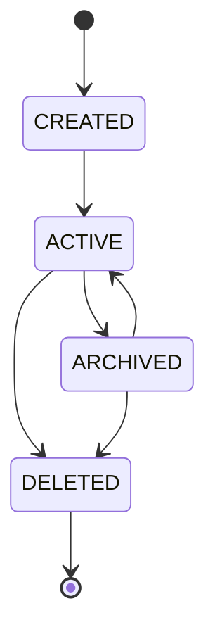

# Sprint 6.1 Workspace Foundation Implementation Specification

## 1. Architecture Alignment
The Workspace Foundation strictly adheres to Architecture V3. It elevates the physical working directory into a first-class domain entity possessing strict lineage, branchability, and snapshot support, natively guaranteeing the safety of concurrent execution.

## 2. Aggregate Boundaries
The `Workspace` domain model acts as the strict **Aggregate Root** for all physical and logical filesystem operations.
```text
Workspace (Aggregate Root)
 └── WorkspaceBranch (Child Entity)
      └── WorkspaceSnapshot (Child Entity)
```
- **Branch Ownership:** A `Workspace` must contain at least one `WorkspaceBranch` upon activation. 
- **Snapshot Immutability:** A `WorkspaceSnapshot` is strictly owned by its branch and is completely immutable once created.

## 3. Workspace State Machine


## 4. Snapshot Strategy
**Selected Mechanism: Tarball Snapshot.**
Tarballs provide 100% platform-agnostic, deterministic, and immutable artifacts, guaranteeing that a snapshot frozen on an Alpine Docker Worker can be perfectly reconstructed on any other node.

## 5. Event Model
- **WorkspaceActivatedEvent**: `workspace_id`, `timestamp`.
- **BranchDeletedEvent**: `branch_id`, `workspace_id`, `timestamp`.
- **ArtifactStoredEvent**: `workspace_id`, `branch_id`, `file_path`, `sha256_hash`, `timestamp`.
- **EvidenceStoredEvent**: `workspace_id`, `branch_id`, `evidence_type`, `sha256_hash`, `timestamp`.

## 6. Directory Structure
```text
.karsa/
├── workspaces/
│   ├── {workspace_id}/
│   │   ├── branches/
│   │   │   └── {branch_id}/ (Mount point for Docker containers)
│   │   └── snapshots/
│   │       └── {snapshot_id}/ (Immutable tarballs)
└── archive/
    └── {workspace_id}.tar.gz
```

## 7. Persistence Design
- **Storage Format:** Local JSON payloads for metadata (`.karsa/workspaces/{workspace_id}/meta.json`).
- **Snapshot Tracking:** Snapshots are implemented physically using compressed tarballs to instantly preserve state.

## 8. Class Design
- **Workspace:** Aggregate Root holding the state machine.
- **WorkspaceBranch:** Maintains lineage reference.
- **WorkspaceSnapshot:** Maintains reference to its immutable physical tarball hash.
- **WorkspaceRepository:** Translates Aggregate operations into filesystem IO (mkdir, tar creation/expansion).
- **WorkspaceManager:** Application service orchestrating the event flow.

## 9. Testing Strategy
- Unit tests for Domain invariants.
- Integration tests for `WorkspaceRepository` directory/tarball IO.
- Reconstruction tests proving exact State reconstruction from Event Journals.

## 10. Migration Strategy
Mandate a clean initialization state requiring users to clear legacy `.karsa/` states, ensuring V3 purity.

## 11. Risks
- **Storage Exhaustion:** Mitigated by aggressive garbage collection and branch deletion.

## 12. Work Packages
- **WP-01: Domain Models:** Implement Workspace, WorkspaceBranch, WorkspaceSnapshot.
- **WP-02: Physical Isolation Layer:** Implement directory generation in WorkspaceRepository.
- **WP-03: Snapshot Mechanics:** Implement physical copy/tarball creation.
- **WP-04: Registry Realignment:** Refactor Registries to write to active workspace branch structures.

## 13. Acceptance Criteria
1. Workspaces instantiate with distinct physical paths without polluting root.
2. Branching from Snapshot perfectly duplicates the frozen state.
3. No implementation modifies the core FSM or Provider execution flow.
