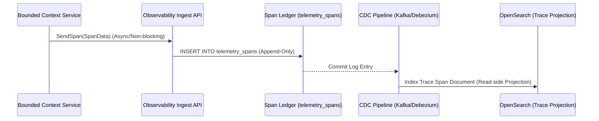

# Sprint-31 Observability Platform Foundation - Final Architecture Remediation Review

This document contains Karsa's final freeze remediation review for the Observability Platform Foundation, resolving findings FIND-31.1 through FIND-31.5.

---

## 1. Executive Summary

This remediation review refines the architecture of Karsa's Observability Platform Foundation to ensure alignment with the Virtual Investment Firm (VIF) target specifications. Business lineage ownership is segregated from technical lineage, delegating it to a future Knowledge Graph context while retaining tracing infrastructure within the Observability Platform. The role of Observability is clarified as a supplementary telemetry store, verifying that all historic replays execute against transaction-safe snapshots in object storage. We establish the **Span Ledger + Trace Projection** storage model to handle 100M+ events/day, design a multi-tiered sampling strategy, and enforce explicit boundaries between Observability and Governance.

---

## 2. Findings Resolution Matrix

| Finding ID | Title | Severity | Status | Remediation Action |
| :--- | :--- | :--- | :--- | :--- |
| **FIND-31.1** | Business Lineage Ownership | **High** | **RESOLVED** | Assigned technical lineage to Observability and business lineage to a future Knowledge Graph context (Option C). |
| **FIND-31.2** | Replay Source of Truth | **High** | **RESOLVED** | Documented that Observability provides supplementary data, and that authoritative replays pull from frozen object store contexts. |
| **FIND-31.3** | Trace Storage Model | **High** | **RESOLVED** | Selected Option B (Span Ledger + Trace Projection) to prevent database lock contention. |
| **FIND-31.4** | Sampling Strategy | **Medium** | **RESOLVED** | Designed a three-tier sampling strategy protecting compliance logs while discarding debug clutter. |
| **FIND-31.5** | Observability vs Audit Boundary | **Medium** | **RESOLVED** | Established a clear boundary matrix separating operational logging from Governance audit ledgers. |

---

## 3. Ownership Boundary Matrix

| Capability | Bounded Context Owner | Principal Storage Location | Permitted Mutating Writer | Read-Only Projections |
| :--- | :--- | :--- | :--- | :--- |
| **Technical Lineage** | Observability Platform | Append-only Span Ledger | `ObservabilityService` | Trace DAG visualizations |
| **Business Lineage** | Future Knowledge Graph | Metadata Relation Graph | `KnowledgeGraphService` | Business process mappings |
| **Compliance Evidence** | Governance Engine | WORM compliance ledger | `GovernanceService` | Audit reports |
| **Replay Inputs** | Transactional Bounded Engines | Immutable Object Storage | Bounded Application Services | Replay coordinator payload |

---

## 4. Technical Lineage vs Business Lineage Analysis (FIND-31.1)

To prevent the Observability Platform from becoming a domain-coupled "God Bounded Context," lineage tracking is divided into two distinct logical layers:

- **Technical Lineage**: Owned by the **Observability Platform**. Covers `traces`, `spans`, `metrics`, `logs`, `correlation`, and `causation`. It records the execution mechanics of software spans, database queries, and inter-service HTTP/event round-trips.
- **Business Lineage**: Owned by a future **Knowledge Graph Bounded Context** (Option C). Covers structural relations mapping Karsa's business flow:
  $$\text{Research} \to \text{Thesis} \to \text{Decision} \to \text{Execution} \to \text{Outcome} \to \text{Attribution} \to \text{Review} \to \text{Post-Mortem} \to \text{Governance} \to \text{Allocation}$$
  This isolates investment logic from technical execution traces.

### Migration Path to Future Knowledge Graph Context
1. **Phase 1 (Current)**: Bounded contexts stamp both technical trace contexts and relational keys (e.g. `thesis_id`, `decision_id`) in their emitted event envelopes. Observability indexes these relational keys as unstructured attributes (`attributes` JSONB) inside spans.
2. **Phase 2 (Future)**: The Knowledge Graph service is introduced. It subscribes to the event streams, extracts the structural business keys, maps the relationships, and writes them to a dedicated metadata graph store.
3. **Phase 3**: Observability deprecates its business tag mapping and structural relationship query APIs, remaining strictly focused on technical tracing and log aggregation.

---

## 5. Replay Source Matrix (FIND-31.2)

The Observability Platform is **not** an authoritative replay source. Decision parameters, inputs, and models must never be retrieved from log files, which are lossy and non-deterministic.

### Replay Source Matrix

| Context | Authoritative Source of Truth | Replay Source | Supplementary Evidence Sources |
| :--- | :--- | :--- | :--- |
| **Decision Journal** | `decision_journal_records` | Immutable Context Payload in Object Storage | execution logs, trace logs, latency metrics |
| **Governance Engine** | `governance_decisions` ledger | Snapshotted active Governance Policy in Object Storage | policy execution traces, rule evaluation logs |
| **Attribution Engine** | `attribution_analyses` ledger | Snapshotted alpha factors in Object Storage | factor calculation debug traces, metric series |
| **Post-Mortem Engine** | `post_mortem_records` ledger | Structured Post-Mortem Event in DB | debug logs of error trace analysis |
| **Capital Allocation** | `allocation_records` ledger | Frozen calculation input snapshot in Object Storage | model evaluation logs, optimizer runs |

### Replay Reconstruction Flow
1. An Auditor requests a historical replay for a given `DecisionId`.
2. The Replay Coordinator queries the authoritative **Decision Journal** database to retrieve the `decision_journal_record` and its associated `context_hash`.
3. The Replay Coordinator pulls the frozen context payload from the **Object Storage** using the `context_hash`.
4. The model calculations are re-executed locally against the payload data to verify output determinism.
5. The **Observability Engine** is queried with the `TraceId` to retrieve supplementary evidence (operational logs, performance metrics, span latencies) for forensic auditing, but these logs are *never* fed into the replay execution engine itself.

---

## 6. Trace Storage Architecture Analysis (FIND-31.3)

How should trace spans be persisted to scale to 100M+ events/day?

- **Option A (Single Trace Table)**: Storing the full trace JSON or aggregate span list in a single record.
  - *Evaluation*: Rejected. Causes high lock contention during span completion and updates, resulting in unacceptable write latencies.
- **Option B (Span Ledger + Trace Projection - Recommended)**:
  - *Span Ledger*: An append-only, strictly immutable ledger table where every child span is written as an independent row.
  - *Trace Projection*: An asynchronous read-side projection compiled via CDC from the Span Ledger and loaded into OpenSearch/ElasticSearch or cached in Redis.
  - *Evaluation*: Highly scalable. Write latency is minimized, and read operations query the flat OpenSearch indices, avoiding join locks.
- **Option C (Full OpenTelemetry-Compatible)**: Complete OpenTelemetry spec schema.
  - *Evaluation*: Over-engineered for Karsa's lightweight agent environment.

---

## 7. Span Ledger vs Trace Projection Analysis (Option B)

### 7.1 Persistence Design
```sql
CREATE TABLE telemetry_spans (
    span_id VARCHAR(64) PRIMARY KEY,
    parent_span_id VARCHAR(64),
    trace_id VARCHAR(64) NOT NULL,
    correlation_id VARCHAR(64) NOT NULL,
    causation_id VARCHAR(64) NOT NULL,
    context_name VARCHAR(64) NOT NULL,
    operation_name VARCHAR(128) NOT NULL,
    attributes JSONB NOT NULL DEFAULT '{}',
    start_time TIMESTAMP NOT NULL,
    end_time TIMESTAMP NOT NULL,
    duration_ms INT NOT NULL
);
```

### 7.2 Ingestion Sequence Diagram


### 7.3 Replay and Storage Model
- **Replay**: Auditing walks the immutable `telemetry_spans` rows sorted by `start_time` within the `trace_id`.
- **Storage Model**: Flat table partitioned monthly on `start_time`. CDC aggregates spans by `trace_id` in OpenSearch for hierarchical search.

---

## 8. Telemetry Sampling Architecture (FIND-31.4)

To control storage costs while guaranteeing audit complete compliance trails, we implement a three-tiered sampling policy:

- **Tier 1 (Governance, Capital Allocation, Decision Journal)**:
  - *Sampling*: 100% Ingestion.
  - *Retention*: 5 Years (WORM compliant storage).
- **Tier 2 (Attribution, Performance, Review, Post-Mortem)**:
  - *Sampling*: Adaptive. 100% of errors, violations, and anomalies are retained. Successful executions are sampled at 10%.
  - *Retention*: 1 Year.
- **Tier 3 (Debug & Operational Telemetry)**:
  - *Sampling*: 1% Random.
  - *Retention*: 14 Days.

*Authoritative Ledgers Unaffected*: Telemetry sampling only discards logs, metrics, and tracing spans stored in the Observability database. Authoritative ledgers (e.g. `decision_journal_records`, `allocation_records`) are transactionally written to their respective bounded databases and are **100% preserved**, completely unaffected by telemetry sampling.

---

## 9. Observability vs Audit Boundary Matrix (FIND-31.5)

| Capability | Bounded Context Owner | Reason |
| :--- | :---: | :--- |
| **Operational Telemetry** | Observability Platform | Ephemeral performance tracking (latency, CPU, errors). |
| **Debugging Logs** | Observability Platform | Developer troubleshooting information. |
| **Distributed Tracing Spans** | Observability Platform | Call trace visualization across services. |
| **Compliance Evidence** | Governance Engine | Authorized, cryptographically signed ledger items. |
| **Policy Decisions** | Governance Engine | Immutable configuration history. |
| **Exception Approvals** | Governance Engine | Authorized temporary overrides. |
| **Governance Overrides** | Governance Engine | Authoritative active blocks. |
| **Audit Reports** | Governance Engine | Compilation of authoritative compliance checks. |
| **Forensic Investigations** | Hybrid | Walk structural graphs (Observability) to verify signed ledgers (Governance). |

---

## 10. Scalability Analysis
Target: **100M+ telemetry events per day**.
- **Monthly Partitioning**: Table partitioning by `created_at` prevents write hotspots.
- **Retention & Archival**: Ephemeral debug data is automatically purged after 14 days, and Tier 1 traces are offloaded to archived S3 storage in compliance WORM mode.
- **Async Indexing**: CDC indexers consume from secondary replicas to avoid degrading primary database write throughput.

---

## 11. Replay Determinism Analysis
- Since all calculation inputs (including active attribution scores) are snapshotted in object storage at the time of creation, replaying historical allocations is deterministic.
- Telemetry data is supplementary only, removing dependencies on non-deterministic logs.

---

## 12. Security Analysis
- Database triggers raise exceptions on any `UPDATE` or `DELETE` commands.
- WORM compliance mode protects archived logs from deletion by compromised agents.

---

## 13. Architecture Delta Analysis

| Capability | Pre-Sprint-31 Baseline | Post-Sprint-31 Observability Design | Gaps Closed |
| :--- | :--- | :--- | :--- |
| **Lineage Tracking** | Disconnected context-specific logging tables. | Segregated Technical Lineage (Observability) and Business Lineage (Knowledge Graph). | Prevented domain coupling and God Context bottlenecks. |
| **Correlation Model** | Ad-hoc identifiers. | Three-key propagation (`TraceId`, `CorrelationId`, `CausationId`). | Resolved trace fragmentation under asynchronous loops. |
| **Trace Storage** | Single trace tables. | Span Ledger + Trace Projection. | Eliminated write lock contention under high-throughput. |

---

## 14. Required Documentation Updates

* **docs/architecture/21-observability-platform.md**:
  * Update tracing model to Span Ledger + Trace Projection.
  * Segregate technical lineage from business lineage (delegating business lineage to a future Knowledge Graph context).
  * Document telemetry sampling strategies.
* **docs/adr/ADR-045-observability-platform-ownership.md**:
  * Document boundaries separating technical tracing from business lineage and Governance evidence stores.
* **docs/adr/ADR-046-telemetry-lineage-and-traceability-model.md**:
  * Document the Span Ledger + Trace Projection decisions and correlation key rules.
* **docs/implementation/sprint-31/audit.md**:
  * Add findings and mark them as REMEDIATED.
* **docs/TRACEABILITY_MATRIX.md**:
  * Update Sprint-31 links.

---

## 15. Final Verdict

**ARCHITECTURE_FROZEN**
