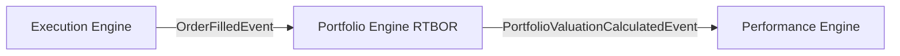
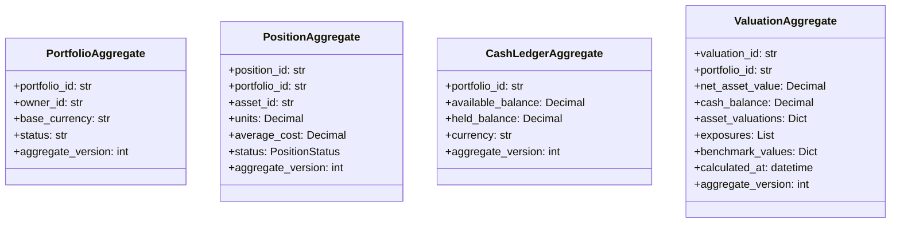
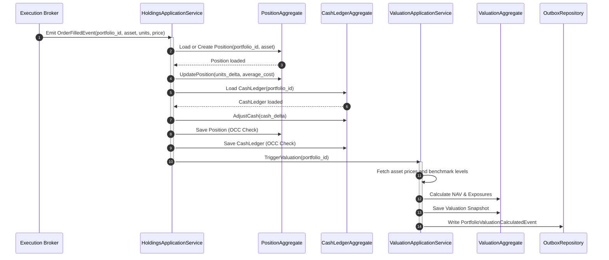
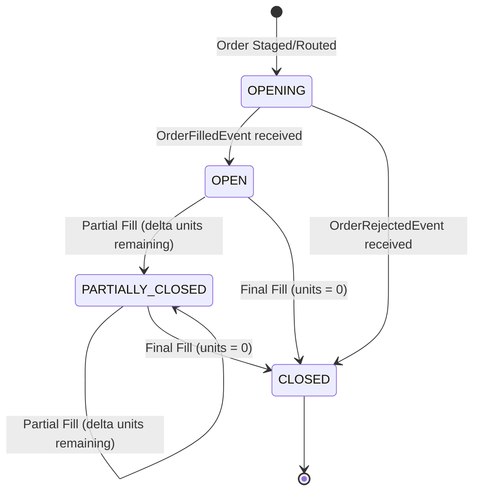

# Sprint-34 Portfolio Engine Foundation Architecture Design

This document defines the canonical architecture for the **Portfolio Engine**, establishing it as the authoritative Real-Time Book of Record (RTBOR) for the Virtual Investment Firm (VIF).

---

## 1. Executive Summary

The Portfolio Engine serves as the core ledger of the VIF platform, sitting directly between the transactional edge (**Execution Engine**) and ex-post analytics (**Performance Engine**). It consumes order execution fills to maintain real-time states of cash balances, asset positions, valuations, exposures, and benchmark reference states.

This design enforces:
* **Separation of Concerns**: Portfolio owns transaction ledgers and current exposures; it does not calculate ex-post performance metrics (Sharpe/Sortino) or predictive ex-ante risk stats (VaR).
* **High-Speed Concurrency Isolation**: Position and cash ledger aggregates are decoupled from the root portfolio aggregate to prevent write bottlenecks and eliminate database lock contention.
* **Deterministic Replayability**: All holdings and cash states are represented as pure projections of append-only transaction logs.

The final verdict is **ARCHITECTURE_APPROVED**.

---

## 2. Bounded Context Dependency Chain

### The Execution $\to$ Portfolio $\to$ Performance Chain

A hard architectural dependency dictates that the Portfolio Engine Foundation must be established before the Performance Engine can evolve:



1. **Execution Engine (Transactional Edge)**: Emits discrete execution fill facts (`OrderFilledEvent`). It possesses no knowledge of total units owned, average cost basis, cash balances, or Net Asset Value (NAV).
2. **Portfolio Engine (RTBOR)**: Consumes fill events to calculate authoritative, real-time holdings, cash levels, and NAV valuation snapshorts.
3. **Performance Engine (Analytics)**: Computes ex-post return percentages, Sharpe ratios, and drawdowns. To compute returns, Performance requires the change in NAV over time (the return numerator) relative to historical capital (the denominator).
4. **Dependency Proof**: Without an authoritative Portfolio context to maintain the RTBOR, the Performance Engine would be forced to duplicate the ledger, violating single-responsibility and bounded-context boundaries. Thus, Portfolio must sit between Execution and Performance as the authoritative source of truth.

---

## 3. Ownership Boundary Matrix

| Core Data / Calculations | Portfolio Engine | Execution Engine | Performance Engine | Risk Engine | Governance Engine |
| :--- | :--- | :--- | :--- | :--- | :--- |
| **Positions & Units** | **Authoritative (RTBOR)** | Prohibited | Read-Only | Read-Only | Read-Only |
| **Cash Balances** | **Authoritative** | Prohibited | Read-Only | Read-Only | Read-Only |
| **NAV & Valuations** | **Authoritative** | Prohibited | Read-Only | Read-Only | Read-Only |
| **Simple Exposures** | **Authoritative** | Prohibited | Read-Only | Read-Only | Read-Only |
| **Benchmark reference**| **Authoritative** | Prohibited | Read-Only | Prohibited | Prohibited |
| **Sharpe & Sortino** | Prohibited | Prohibited | **Authoritative** | Prohibited | Prohibited |
| **Drawdowns** | Prohibited | Prohibited | **Authoritative** | Prohibited | Prohibited |
| **Ex-Ante VaR** | Prohibited | Prohibited | Prohibited | **Authoritative** | Read-Only |
| **Compliance Limits** | Read-Only | Read-Only | Read-Only | Read-Only | **Authoritative** |

---

## 4. Architecture Overview

The Portfolio Engine is structured as a hexagonal core containing isolated write-heavy transactional aggregates and a read-side projection layer for valuations and snapshots:

```
                  +----------------------------------------------+
                  |               PORTFOLIO ENGINE               |
                  |                                              |
                  |     [Inbound Ports]                          |
                  |     - OrderFilledEvent Subscriber            |
                  |     - CashTransaction Handler                |
                  |            |                                 |
                  |            v                                 |
                  |    +---------------+   +----------------+    |
                  |    | Position      |   | CashLedger     |    |
                  |    | Aggregate     |   | Aggregate      |    |
                  |    +---------------+   +----------------+    |
                  |            \                   /             |
                  |             v                 v              |
                  |           +---------------------+            |
                  |           |  Valuation Service  |            |
                  |           +---------------------+            |
                  |                      |                       |
                  |                      v                       |
                  |           +---------------------+            |
                  |           | Valuation           |            |
                  |           | Aggregate (Snapshot)|            |
                  |           +---------------------+            |
                  |                      |                       |
                  |     [Outbound Ports] v                       |
                  |     - HoldingsUpdatedEvent Publisher         |
                  |     - PortfolioValuationCalculated Event     |
                  +----------------------------------------------+
```

---

## 5. Domain Model

The domain model contains:
* **Entities**:
  * [PortfolioAggregate](file:///Users/dwiki.nugraha/dwikicode/karsa/src/karsa/portfolio/domain/model/portfolio.py): Configures the portfolio and acts as the contextual parent.
  * [PositionAggregate](file:///Users/dwiki.nugraha/dwikicode/karsa/src/karsa/portfolio/domain/model/position.py): Tracks units, cost basis, and status for a single asset.
  * [CashLedgerAggregate](file:///Users/dwiki.nugraha/dwikicode/karsa/src/karsa/portfolio/domain/model/cash.py): Represents the cash ledger, handling debits, credits, and holds.
  * [ValuationAggregate](file:///Users/dwiki.nugraha/dwikicode/karsa/src/karsa/portfolio/domain/model/valuation.py): Stores frozen calculations of NAV, sector exposures, and benchmark values.
* **Value Objects**:
  * `Money`, `HoldingLot`, `AssetExposure`, `BenchmarkLevel`, `PortfolioSnapshot`.

---

## 6. Aggregate Design

### Aggregate Boundaries



### Boundary Challenges
* **Challenge**: Should `PositionAggregate` be nested inside `PortfolioAggregate`?
  * *Verdict*: **No**. Nested aggregates require loading the entire portfolio position tree on every trade update, creating OCC conflict bottlenecks. We model `PositionAggregate` as a standalone aggregate. Position writes only conflict with updates to the same asset, enabling concurrent trade processing across different assets.

---

## 7. Value Objects

* **PositionStatus (Enum)**: `OPENING`, `OPEN`, `PARTIALLY_CLOSED`, `CLOSED`.
* **Money (VO)**: Represents absolute value. Contains `amount: Decimal` and `currency: str`.
* **HoldingLot (VO)**: Represents an individual tax lot. Contains `lot_id: str`, `acquired_at: datetime`, `units: Decimal`, and `price: Decimal`.
* **AssetExposure (VO)**: Tracks exposures. Contains `asset_id: str`, `exposure_pct: Decimal`, and `exposure_value: Decimal`.
* **BenchmarkReference (VO)**: References benchmark parameters. Contains `benchmark_id: str`, `index_value: Decimal`, and `timestamp: datetime`.
* **PortfolioSnapshot (VO)**: Full state serialization for historical replays.

---

## 8. Event Contracts

### HoldingsUpdatedEvent
* **Type**: `HoldingsUpdatedEvent`
* **Schema**:
```json
{
  "event_id": "uuid-v4",
  "event_type": "HoldingsUpdatedEvent",
  "portfolio_id": "string",
  "asset_id": "string",
  "units_delta": "string",
  "total_units": "string",
  "average_cost": "string",
  "timestamp": "iso8601"
}
```

### CashUpdatedEvent
* **Type**: `CashUpdatedEvent`
* **Schema**:
```json
{
  "event_id": "uuid-v4",
  "event_type": "CashUpdatedEvent",
  "portfolio_id": "string",
  "available_balance": "string",
  "held_balance": "string",
  "currency": "string",
  "timestamp": "iso8601"
}
```

### PositionOpenedEvent
* **Type**: `PositionOpenedEvent`
* **Schema**:
```json
{
  "event_id": "uuid-v4",
  "event_type": "PositionOpenedEvent",
  "portfolio_id": "string",
  "position_id": "string",
  "asset_id": "string",
  "initial_units": "string",
  "entry_price": "string",
  "timestamp": "iso8601"
}
```

### PositionClosedEvent
* **Type**: `PositionClosedEvent`
* **Schema**:
```json
{
  "event_id": "uuid-v4",
  "event_type": "PositionClosedEvent",
  "portfolio_id": "string",
  "position_id": "string",
  "asset_id": "string",
  "realized_pnl": "string",
  "timestamp": "iso8601"
}
```

### PortfolioValuationCalculatedEvent
* **Type**: `PortfolioValuationCalculatedEvent`
* **Schema**:
```json
{
  "event_id": "uuid-v4",
  "event_type": "PortfolioValuationCalculatedEvent",
  "portfolio_id": "string",
  "net_asset_value": "string",
  "cash_balance": "string",
  "asset_valuations": "object",
  "exposures": "array",
  "benchmark_values": "object",
  "calculated_at": "iso8601"
}
```

### ExposureCalculatedEvent
* **Type**: `ExposureCalculatedEvent`
* **Schema**:
```json
{
  "event_id": "uuid-v4",
  "event_type": "ExposureCalculatedEvent",
  "portfolio_id": "string",
  "exposures": "array",
  "timestamp": "iso8601"
}
```

---

## 9. Application Services

* **PortfolioApplicationService**: Creates portfolios, registers benchmarks, and updates status configurations.
* **HoldingsApplicationService**: Subscribes to `OrderFilledEvent`, coordinates updates to `PositionAggregate` and `CashLedgerAggregate`, and emits position lifecycle events.
* **ValuationApplicationService**: Queries asset prices, computes NAV, aggregates sector/factor exposures, and records the `ValuationAggregate`.

---

## 10. Repository Design

```python
class PortfolioRepository(ABC):
    def save(self, portfolio: PortfolioAggregate) -> None: ...
    def find_by_id(self, portfolio_id: str) -> Optional[PortfolioAggregate]: ...

class PositionRepository(ABC):
    def save(self, position: PositionAggregate) -> None: ...
    def find_by_portfolio_and_asset(self, portfolio_id: str, asset_id: str) -> Optional[PositionAggregate]: ...
    def list_active_by_portfolio(self, portfolio_id: str) -> List[PositionAggregate]: ...

class CashLedgerRepository(ABC):
    def save(self, ledger: CashLedgerAggregate) -> None: ...
    def find_by_portfolio(self, portfolio_id: str) -> Optional[CashLedgerAggregate]: ...

class ValuationRepository(ABC):
    def save(self, valuation: ValuationAggregate) -> None: ...
    def find_latest_by_portfolio(self, portfolio_id: str) -> Optional[ValuationAggregate]: ...
```

---

## 11. Persistence Design

1. **Append-Only Ledgers**: Cash and position lot entries are modeled as append-only tables to maintain a permanent audit trail.
2. **OCC Strategy**: All write operations verify the aggregate version. Updates use a SQL query check:
   `UPDATE position SET units = %s, version = version + 1 WHERE position_id = %s AND version = %s`
3. **Replayability**: State reconstructions load the initial state and replay transactional lots up to the targeted event timestamp.

---

## 12. Integration Design

* **Execution $\to$ Portfolio**: Portfolio listens to `OrderFilledEvent`. When received, it processes cash movements and position updates.
* **Portfolio $\to$ Performance**: Performance listens to `PortfolioValuationCalculatedEvent` to track changes in NAV for returns calculation.
* **Portfolio $\to$ Attribution**: Attribution consumes valuation snapshots to break down returns based on sector exposure.
* **Portfolio $\to$ Future Risk Engine**: Risk Engine queries current holdings snapshots to simulate Monte Carlo VaR runs.

---

## 13. Sequence Diagrams

### Trade Ingestion and Valuation Flow



---

## 14. State Diagrams

### Position Lifecycle



---

## 15. Failure Handling

* **OCC Conflicts**: High concurrent trade writes targeting the same position aggregate raise `ConcurrencyConflictError`. The handler catches this error and retries the operation up to 3 times before putting it into a Dead Letter Queue (DLQ).
* **Missing Prices**: If a real-time price feed is unavailable during valuation calculations, the service falls back to the last recorded position close price and raises a warning flag on the event envelope.
* **Outbox Recovery**: UnitOfWork writes outbox events in the same database transaction. A separate publisher processes outstanding outbox records to guarantee at-least-once delivery.

---

## 16. Scalability Analysis

* **Lock Contention**: By isolating `PositionAggregate` instances per asset rather than nesting them in a global `PortfolioAggregate`, write locks are restricted to single-asset updates, enabling high throughput.
* **Out-of-Band Valuations**: Valuations and exposure calculations are run asynchronously on separate threads or worker instances to prevent ledger write bottlenecks.

---

## 17. Security Analysis

* **Dual Signature Verifications**: The Portfolio Engine validates that any execution event was processed and signed by the Execution PEP before updating ledger balances.
* **WORM database tables**: Ledger tables (`cash_transaction` and `position_lot`) are mapped to write-once-read-many (WORM) tables. UPDATE and DELETE actions are prohibited at the database permissions level.

---

## 18. Migration Strategy

1. **Reconstructing History**: For active portfolios, historical states are reconstructed by replaying the database outbox records of `OrderFilledEvents` starting from the initial deposit date.
2. **Validating Balances**: The computed position balances are cross-verified against existing mock states in the Performance Engine.

---

## 19. Risk Analysis (ADR-049 Alignment)

* **Predictive Boundary Violation**: This architecture strictly enforces ADR-049. No predictive model calculation (VaR, scenarios) runs within this context.
* **Ex-ante decoupling**: Exposure calculations within the Portfolio context represent simple linear asset weights. Non-linear, predictive factor exposures belong to the Risk Engine.

---

## 20. ADR Recommendations

* **ADR-051 (Portfolio Valuation Snapshots)**: Recommends that the Portfolio context acts as the sole, authoritative source of NAV history to prevent data mismatch errors across Performance and Attribution contexts.

---

## 21. Architecture Challenges

* **Valuation Latency**: Calculating NAV on every trade fill might cause latency bottlenecks for high-frequency trading.
  * *Mitigation*: Run valuations asynchronously. The ledger updates immediately, while valuations are calculated out-of-band on a 5-second debounced ticker or on explicit request.

---

## 22. Architecture Delta Analysis

* **Current Repository State**: Positions and cash states do not exist in any database table. The Performance Engine calculates metrics using outcome logs.
* **Target Architecture State**: A PostgreSQL schema owns the holdings (`position`) and cash (`cash_ledger_state`) states, acting as the Single Source of Truth.

---

## 23. Acceptance Criteria

1. **Isolation Invariant**: Modifying holdings or cash balances must never trigger predictive risk calculations.
2. **Replay Invariant**: Replaying order fills from time $T_0$ to $T_1$ must reconstruct the exact historical NAV.
3. **Immutability Invariant**: Valuation records are append-only. No UPDATE or DELETE database operations are allowed.

---

## 24. Final Verdict

### **ARCHITECTURE_APPROVED**
