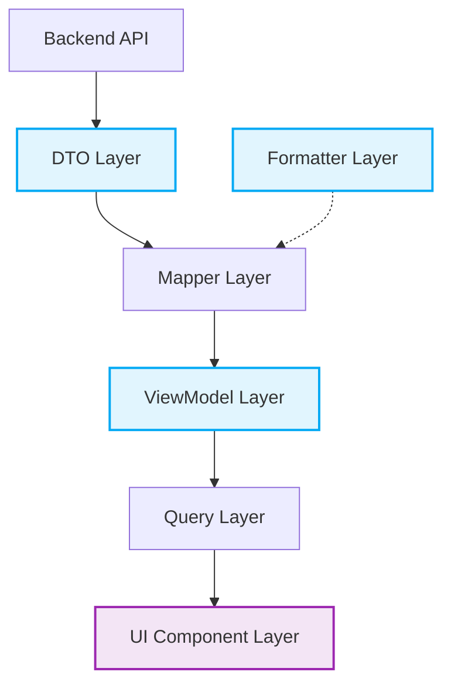

# Wave-5 Mapper Architecture Design

## 1. Executive Summary
The Wave-5 Mapper Architecture establishes the critical translation boundary between Karsa's backend data contracts (DTOs) and the frontend presentation layer. This design enforces strict decoupling, ensuring that UI components remain blissfully unaware of backend structures and terminology. By centralizing semantic translations (e.g., transforming "Worker" to "Analyst"), robust formatters, and a standardized badge system, the architecture prevents UI drift and UI logic duplication. It guarantees that the impending Query Layer (Wave 6) will serve pure, display-ready `ViewModels` to the presentation layer.

## 2. Mapper Architecture
The architecture defines a unidirectional flow of data transformation, strictly isolating responsibilities to prevent leakage.

**Dependency Flow:**
`API Response (DTO)` → `Mapper Layer` (injects `Formatter Layer`) → `ViewModel` → `Query Layer` → `UI Component`

**Ownership & allowed dependencies:**
* **DTO Layer:** Pure interfaces representing network payloads. Depends on nothing.
* **Formatter Layer:** Pure functions (e.g., `formatCurrency`). Depends on nothing.
* **Mapper Layer:** Pure functions orchestrating DTO → ViewModel mapping. Depends on: DTOs, Formatters, ViewModels.
* **ViewModel Layer:** Pure interfaces representing display-ready data. Depends on nothing.
* **UI Component Layer:** Presentation functions. Depends on: ViewModels. *Forbidden:* DTOs, Mappers.



## 3. Domain Inventory

| Domain | Source DTOs | Required ViewModels | Required Mappers | Required Formatters |
|---|---|---|---|---|
| **Portfolio** | `PortfolioSummaryResponseDTO`, `PortfolioExposureResponseDTO` | `PortfolioSummaryVM`, `PortfolioExposureVM` | `mapPortfolioSummary`, `mapPortfolioExposure` | Currency, Percentage |
| **Research** | `ListResearchReportsResponseDTO` | `ResearchReportVM` | `mapResearchReport` | Date, Status |
| **Theses** | `ListThesesResponseDTO`, `ThesisDetailResponseDTO`, `ThesisLineageResponseDTO` | `ThesisVM`, `ThesisDetailVM`, `ThesisLineageVM` | `mapThesis`, `mapThesisDetail`, `mapThesisLineage` | Date, Risk, Status |
| **Memos** | `ListMemosResponseDTO` | `InvestmentMemoVM` | `mapInvestmentMemo` | Date, Status |
| **Analysts** | `ListAnalystsResponseDTO` | `AnalystMetricVM` | `mapAnalystMetric` | Percentage, Number |
| **Performance** | `PerformanceResponseDTO` | `PerformanceAttributionVM` | `mapPerformanceAttribution` | Currency, Percentage |
| **Governance** | `ListPostMortemsResponseDTO` | `InvestmentOversightVM` | `mapInvestmentOversight` | Date, Risk |
| **Search** | `SearchResponseDTO` | `SearchResultVM` | `mapSearchResult` | Date, Status |

## 4. ViewModel Catalog (Representative Sample)

### ThesisVM
* **Purpose:** Drives the main theses data tables and grids.
* **Consumer Screen:** Theses Workspace, Search Results.
* **Fields:** `id` (mapped from `thesis_urn`), `title`, `analystName` (from `worker_id` lookup/join), `createdAt`.
* **Display Fields:** `formattedAum`, `formattedDate`, `convictionBadge`, `statusBadge`.
* **Derived Fields:** `isStale` (Boolean derived from `updatedAt` > 90 days).
* **Formatting Rules:** Dates in `MMM dd, YYYY`. AUM in `$X.Xm`.
* **Sorting Rules:** UI handles sorting natively using mapped `id` and `createdAt` primitive values. 

### AnalystMetricVM
* **Purpose:** Drives the team performance leaderboards.
* **Consumer Screen:** Analysts Workspace.
* **Fields:** `id`, `name`, `activeThesesCount`, `winRate`.
* **Display Fields:** `formattedWinRate` (e.g., "65.4%").
* **Derived Fields:** `performanceStatus` (OUTPERFORM/UNDERPERFORM derived against baseline).

## 5. Semantic Translation Registry

| Backend Term | Frontend Term | Reason | Owner |
|---|---|---|---|
| `worker` | Analyst | Aligns with fund management hierarchy. | Domain Mapper |
| `research_run` | Research Report | Better reflects output over process. | Domain Mapper |
| `decision_journal` | Investment Memo | Standardizes institutional terminology. | Domain Mapper |
| `governance` | Investment Oversight | Differentiates from corporate governance. | Route/Layout Map |
| `policy_override` | Policy Override | Case normalization. | Formatter |

## 6. Formatter Architecture
Formatters are stateless, pure, easily testable functions.

* **CurrencyFormatter:** 
  * *Input:* `(value: number, currency: string)` 
  * *Output:* `string` (e.g. `$10.5M`, `€400K`).
  * *Ownership:* `src/lib/formatters/currency.ts`
* **PercentageFormatter:** 
  * *Input:* `(value: number, decimals?: number)` 
  * *Output:* `string` (e.g. `12.5%`).
  * *Ownership:* `src/lib/formatters/percentage.ts`
* **DateFormatter:** 
  * *Input:* `(isoString: string, formatStyle: "short" \| "long")` 
  * *Output:* `string`.
  * *Ownership:* `src/lib/formatters/date.ts`
* **StatusFormatter:** 
  * *Input:* `(statusEnum: string)` 
  * *Output:* `{ text: string; variant: BadgeVariant }`.
  * *Ownership:* `src/lib/formatters/status.ts`

## 7. Badge System Design
Centralized mapping for `shadcn` Badge variants to enforce color consistency.

| Domain/Context | Backend Value | Display Text | Color Intent (Variant) | Usage Locations |
|---|---|---|---|---|
| **Conviction** | `HIGH` | High | Green (`success`) | Theses Grid, Details |
| **Conviction** | `MEDIUM` | Medium | Yellow (`warning`) | Theses Grid, Details |
| **Conviction** | `LOW` | Low | Gray (`secondary`) | Theses Grid, Details |
| **Thesis State** | `ACTIVE` | Active | Blue (`default`) | Theses Grid |
| **Thesis State** | `INVALIDATED`| Invalidated | Red (`destructive`) | Theses Grid, Memos |
| **Performance** | `OUTPERFORM` | Outperform | Green (`success`) | Analyst Metrics |

## 8. File Structure Design
Target boundary design within `src/features/`.

```text
src/
├── features/
│   ├── theses/
│   │   ├── types/
│   │   │   └── viewmodels.ts
│   │   └── utils/
│   │       └── mappers.ts
│   ├── analysts/
│   │   ├── types/
│   │   │   └── viewmodels.ts
│   │   └── utils/
│   │       └── mappers.ts
└── lib/
    └── formatters/
        ├── currency.ts
        ├── date.ts
        └── numbers.ts
```

## 9. Architecture Challenge
* **Future Sprint-52 (Watchlist introduction):** The mapper architecture isolates the `ThesisVM`. A future `WatchlistVM` can reuse `mapThesis` internally or share formatters without polluting the Theses domain.
* **Knowledge Graph integration:** Graph edges will map to `ThesisLineageVM`. The strict DTO separation prevents complex graph query payloads from bleeding into standard tabular views.
* **Verdict:** The architecture is decoupled, horizontal, and highly resilient to semantic and dimensional expansion.

## 10. Risks
* **Data Bloat in ViewModels:** There is a risk that ViewModels accrue unused UI fields. Mappers must be restricted to returning only data explicitly bound to a presentation component.
* **Component-Specific Leakage:** ViewModels must represent the domain's display contract (e.g. `ThesisVM`), not a specific component's prop contract (e.g. `ThesisRowVM`). This requires strict developer discipline.

## 11. Acceptance Criteria Verification
* **No DTO leakage into UI**: Enforced. UI components will only import `src/features/*/types/viewmodels.ts`.
* **No formatter duplication**: Enforced. Formatters centralized in `src/lib/formatters`.
* **No semantic translation duplication**: Enforced. Handled exclusively in Mapper layer.
* **No API awareness inside ViewModels**: Enforced. ViewModels are pure interfaces.
* **No React Query/Zustand awareness**: Enforced.

## 12. Final Verdict
**WAVE_5_ARCHITECTURE_APPROVED**
