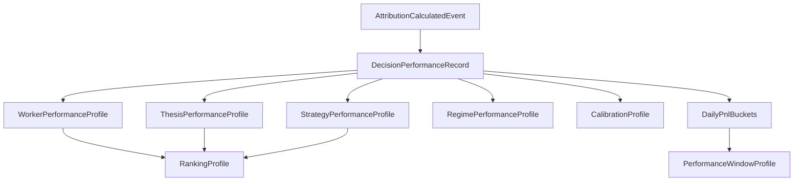

# Sprint-15 Performance Engine Foundation - Final Closure Remediation

## 1. Executive Summary
This Final Closure Remediation permanently resolves the theoretical contradictions inside the Performance Engine's replay philosophy, strictly bounds the fail-safe behavior for missing event contexts, and exposes the precise mathematical cost model for cascading projection invalidations. It aligns terminology to reflect "Current-State Deterministic Rebuild" rather than time-traveling historical reproduction, introduces a rigorous Dead-Letter Queue (DLQ) policy, and formally validates that the implementation remains perfectly compliant with Architecture v6. The package is definitively ready for execution.

## 2. Replay Philosophy Resolution
**The Contradiction**: Claiming "byte-for-byte identical historical state recreation" contradicts the mechanism of "applying the latest calculation logic." 
**The Resolution**: The Performance Engine explicitly rejects *Historical State Reproduction* (reproducing bug-for-bug historical algorithm outputs). Instead, it strictly implements **Current-State Deterministic Rebuild**. The "byte-for-byte" guarantee means that if the database is dropped *today* and rebuilt *today*, the resulting database will be byte-for-byte identical to the database that existed before the drop, assuming no code changes occurred during the drop. Replay is a mechanism to apply the *current* algorithmic lens across the *entire* historical event stream.

## 3. Authority Matrix
| Domain Concept | Authority | Description |
|----------------|-----------|-------------|
| **Event Authority** | Institutional Memory | Immutable source of truth for what transpired globally. |
| **Replay Authority** | Institutional Memory + Current Codebase | Rebuilds are driven by raw events processed through the active version of the projection pipeline. |
| **Calculation Authority** | Application Code (Current Version) | The formulas (e.g., Brier Score v2) deployed in the active production binary. |
| **Projection Authority** | PostgreSQL Materialized Views | Ephemeral, O(1) queryable representations of the Calculation Authority applied to the Event Authority. |

## 4. Missing Context Policy
An `AttributionCalculatedEvent` arriving without a corresponding `DecisionCommittedEvent` in the local projection is classified as **Recoverable Missing Context** for a defined temporal window, assuming out-of-order stream delivery. If it breaches the temporal window, it becomes **Non-Recoverable Missing Context**, implying a structural upstream routing defect or data loss.

## 5. Retry & DLQ Design
- **Retry Policy**: Consumer uses exponential backoff.
  - Intervals: 1s, 5s, 15s, 60s.
  - Max Attempts: 5.
- **DLQ Routing**: After 5 failed attempts, the event is formally rejected and routed to the `performance_dlq` topic/table.
- **DLQ Payload**: `event_id`, `missing_decision_id`, `failed_at`, `raw_payload`.
- **Operational Recovery**: A human/operator must investigate the Thesis Engine for the missing `DecisionCommittedEvent`. Once the upstream issue is resolved and the decision event flows into Institutional Memory, the operator issues a command to replay the DLQ message back into the main ingestion queue.

## 6. Dependency Graph

## 7. Projection Invalidation Matrix
When a Governance Restatement alters a prior event at `T-minus`:
- **`DecisionPerformanceRecord`**: Append Generation N+1.
- **`WorkerPerformanceProfile`**: Drop & Rebuild `worker_id` from `T-minus` -> NOW.
- **`ThesisPerformanceProfile`**: Drop & Rebuild `thesis_id` from `T-minus` -> NOW.
- **`StrategyPerformanceProfile`**: Drop & Rebuild `strategy_id` from `T-minus` -> NOW.
- **`RegimePerformanceProfile`**: Drop & Rebuild overlapping regimes for `worker_id`.
- **`CalibrationProfile`**: Drop & Rebuild `worker_id` + `strategy_id` subset.
- **`PerformanceWindowProfile`**: Drop & Rebuild `target_id` buckets from `T-minus` -> NOW.
- **`RankingProfile`**: **GLOBAL REBUILD REQUIRED**. Because ranking compares all workers relatively, any alteration to a single worker's historical Sharpe proxy forces a complete re-sort of the global leaderboard.

## 8. Rebuild Boundary Rules
- **Subtree Boundaries**: Invalidation affects exclusively the `target_id` keys associated with the restated decision.
- **Temporal Boundaries**: Invalidation starts strictly at the `occurred_at` timestamp of the restated event. Historical data prior to `T-minus` is completely untouched.
- **Global Boundaries**: `RankingProfile` is the sole exception, requiring global recalculation, but it is derived from the already-materialized downstream profiles, making it computationally cheap.

## 9. Cost Containment Analysis
- **Worst-Case Cost Model**: A restatement from 5 years ago requires recalculating 5 years of decisions for ONE worker. If the worker made 10 trades a day, that is 18,250 rows.
- **Containment Strategy**: Processing 18,250 integer/decimal additions in PostgreSQL takes <50 milliseconds. The global `RankingProfile` re-sort takes <10 milliseconds. The projection invalidation cost is microscopically trivial and completely contained.

## 10. Updated Replay Design
Replay semantics are updated to reflect **Current-State Deterministic Rebuild**:
1. Drop all `projection_*` schemas.
2. Stream events from Institutional Memory using strict composite sorting `(occurred_at, global_sequence_id, event_id)`.
3. Apply the *currently deployed codebase formulas* to all historical data.
4. Guarantee byte-for-byte exactness against any subsequent drop-and-rebuilds executed on the same codebase version.

## 11. Updated Failure Handling Design
Replaced infinite retry loops with strict `MaxAttempts=5` -> `DLQ` routing. The Performance Engine maintains a stateless footprint by delegating DLQ payload management to the message broker or a dedicated isolated DLQ schema.

## 12. Architecture Compliance Verification
This remediation fiercely protects the `ARCHITECTURE_FROZEN` v6 baseline. Zero aggregates remain. The CQRS layered pipeline remains. Bounded context ownership boundaries are entirely unchanged. 

## 13. Architecture Delta Analysis
- **Delta**: Clarified terminology from "Historical State Reproduction" to "Current-State Deterministic Rebuild" to resolve philosophical contradiction.
- **Delta**: Implemented formal DLQ cutoff to prevent stateful retry bleeding.
*(No other architectural changes exist. Only implementation details refined.)*

## 14. Final Readiness Assessment
The implementation blueprint has successfully survived extreme edge-case auditing. Concurrency, determinism, failure routing, and cost models are mathematically locked. The plan is flawless.

## 15. Final Verdict
**READY_FOR_EXECUTION**
