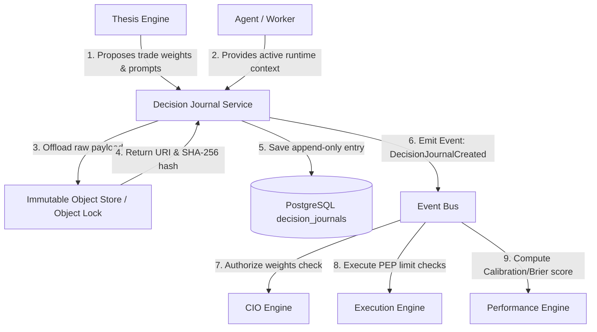
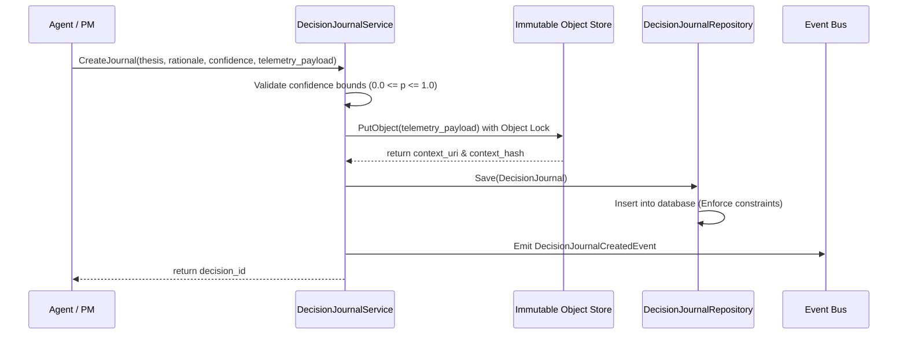
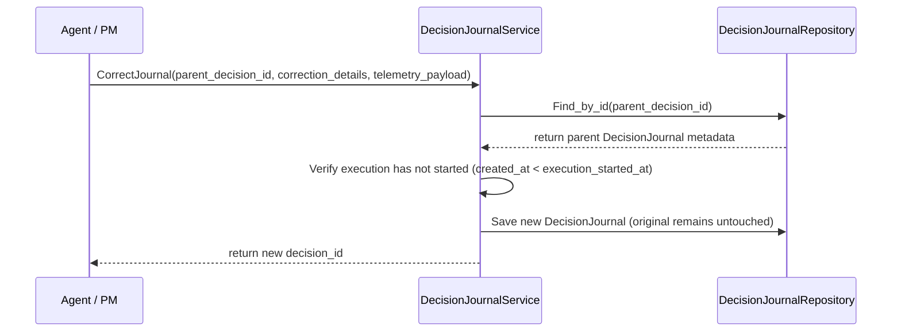
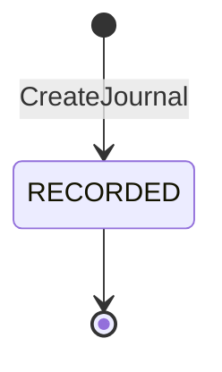

# Sprint-37 Decision Journal Foundation Architecture Design

This document defines the canonical architecture for the **Decision Journal Foundation** bounded context in Sprint-37. The Decision Journal is the authoritative, immutable, write-once reasoning ledger of the Virtual Investment Firm (VIF), designed to prevent hindsight bias and preserve reasoning before execution outcomes are realized.

---

## 1. Executive Summary

The Decision Journal is the core audit trail and baseline registry of the VIF learning loop. Investment loops must capture the reasoning, model parameters, expectations, and confidence boundaries *before* execution starts to ensure that downstream analysis (Brier scores, calibrations, and post-mortems) is not corrupted by hindsight bias. 

To ensure lock-free write throughput (target: 10M+ entries/day), eliminate write contention, and guarantee audit integrity, the Decision Journal context contains **zero mutable state machines** and **no version columns**. All entries are written to a strictly write-once, append-only relational ledger. Large telemetry and prompt context payloads are offloaded to an immutable object store with Object Lock, while the relational database indexes only lightweight metadata, SHA-256 hashes, and URIs. 

---

## 2. Ownership Boundary Matrix

| Capability / Action | Thesis Engine | Decision Journal | CIO Engine | Execution Engine |
| :--- | :--- | :--- | :--- | :--- |
| **Define Hypotheses & Prompts** | **Authoritative (Defines)** | Read-Only (Reference) | Read-Only | Read-Only |
| **Log Pre-Outcome Rationale** | Read-Only (Input) | **Authoritative (Writes)** | Read-Only (Consumes) | Read-Only (Consumes) |
| **Verify Pre-Outcome Timestamps** | Prohibited | **Authoritative (Enforces)** | Read-Only | Consumer (Enforces PEP) |
| **Approve / Authorize Trades** | Prohibited | Read-Only (Provides context) | **Authoritative (Approves)** | Consumer (Enforces PEP) |
| **Enforce Pre-Trade Compliance** | Prohibited | Read-Only | Read-Only (PDP limits) | **Authoritative (PEP)** |

* **Single Writer Rule**: The Decision Journal is the sole writer of the `decision_journals` database table. It has read-only dependencies on the Thesis Engine and active worker status parameters.

---

## 3. Architecture Overview

The Decision Journal operates at the front of the VIF execution path:



---

## 4. Domain Model

The domain design utilizes strictly write-once ledger records and value objects to prevent aggregate inflation and ensure deterministic replay capability:

* **Aggregate Roots**:
  - The context contains **zero mutable aggregate roots** and **no version tracking columns**, eliminating write lock overhead.
* **Ledger Entries**:
  - `DecisionJournal`: The primary immutable aggregate representing the pre-outcome reasoning record.
* **Value Objects**:
  - `DecisionRationale`: Textual reasoning details, qualitative assumptions, and model prompt structures.
  - `DecisionEvidence`: Telemetry spans, historical price snapshots, and input datasets.
  - `DecisionHypothesis`: Expected return targets and validity horizons.
  - `DecisionConfidence`: Numerical probability expectations ($0.0 \le p \le 1.0$).
  - `DecisionContextReference`: The SHA-256 hash and URI pointing to the offloaded context snapshot.

---

## 5. Aggregate Design

`DecisionJournal` is modeled as a write-once ledger entry. Rather than using an stateful lifecycle state machine (which introduces update operations and OCC version fields), the entity is written once and becomes read-only. 

* **Lineage and corrections**: If details must be updated before execution starts, a new record is appended referencing the original as its `parent_decision_id`. The entity stores `root_decision_id` to allow downstream engines to resolve the entire lineage tree efficiently.
* **Immutability Enforcement**: The `DecisionJournal` class enforces immutability at the application layer by freezing its parameters and raising a `TypeError` if any mutator is called.

---

## 6. Value Objects

All value objects in the Decision Journal are strictly immutable and frozen:

* **`DecisionRationale`**: Encapsulates qualitative arguments:
  - `reasoning_steps`: Natural language logic.
  - `market_assumptions`: Expected market parameters.
* **`DecisionEvidence`**: Encapsulates data inputs and system state references to ensure absolute replayability:
  - `active_prompt_hash`: SHA-256 of the prompt used by the agent.
  - `telemetry_span_id`: Associated execution/observability trace span.
  - `git_commit`: SHA-1 git version of the executing code.
  - `runtime_version`: Docker image hash or python interpreter version.
  - `model_parameters`: JSON configuration containing LLM temperature, top_p, and generation seed.
  - `market_regime_urn`: Pointer to the active market regime classifier state.
* **`DecisionHypothesis`**: Encapsulates target expectations:
  - `thesis_urn`: Identifier matching [thesis.py](file:///Users/dwiki.nugraha/dwikicode/karsa/src/karsa/thesis/domain/model/thesis.py).
  - `expected_return_bps`: Expected return in basis points.
  - `validity_horizon_seconds`: Execution time window.
* **`DecisionConfidence`**: Encapsulates numerical probability metrics:
  - `probability`: Float value ($0.0 \le p \le 1.0$).
  - `standard_deviation`: Float variance boundary.

---

## 7. Event Contracts

### `DecisionJournalCreatedEvent` (v1)
Emitted immediately when a new journal record is successfully written to the database:

```json
{
  "event_id": "evt_dj_cre_001",
  "event_type": "DecisionJournalCreatedEvent",
  "correlation_id": "urn:karsa:correlation:corr-1002",
  "causation_id": "urn:karsa:command:cmd-propose-trade-801",
  "decision_id": "urn:karsa:decision:dec-1002",
  "thesis_urn": "urn:karsa:thesis:th-205:v1",
  "confidence": {
    "probability": 0.85,
    "standard_deviation": 0.05
  },
  "context_hash": "sha256_5f4dcc3b5aa765d61d8327deb882cf99",
  "context_uri": "s3://karsa-decision-journal/contexts/2026-06/dec-1002.json",
  "timestamp": "2026-06-14T10:40:00Z",
  "event_version": 1
}
```

### `DecisionJournalCorrectedEvent` (v1)
Emitted when a correction to a pre-outcome decision is appended before trade execution starts:

```json
{
  "event_id": "evt_dj_cor_001",
  "event_type": "DecisionJournalCorrectedEvent",
  "correlation_id": "urn:karsa:correlation:corr-1002",
  "causation_id": "urn:karsa:command:cmd-correct-trade-802",
  "decision_id": "urn:karsa:decision:dec-1002-corr",
  "parent_decision_id": "urn:karsa:decision:dec-1002",
  "root_decision_id": "urn:karsa:decision:dec-1002",
  "correction_reason": "Slippage parameter recalibration",
  "context_hash": "sha256_7a8b9c0d1e2f3a4b5c6d7e8f9a0b1c2d",
  "context_uri": "s3://karsa-decision-journal/contexts/2026-06/dec-1002-corr.json",
  "timestamp": "2026-06-14T10:42:00Z",
  "event_version": 1
}
```

---

## 8. Application Services

* **`DecisionJournalService`**: Coordinates the validation of confidence metrics, generates unique VIF URNs, uploads raw telemetry snapshots to the object store, writes index rows to the database ledger, and publishes integration events.
* **`JournalLineageResolver`**: Traverses the chained DAG tree starting from a `root_decision_id` to resolve the final active leaf record for downstream engines.
* **`JournalVerificationService`**: Reads a downloaded context snapshot, regenerates its SHA-256 checksum, and compares it with the database's `context_hash` to verify that no tampering has occurred.

---

## 9. Repositories

The domain repository interface is defined as:

```python
class DecisionJournalRepository(ABC):
    @abstractmethod
    def save(self, journal: DecisionJournal) -> None:
        """Appends a new decision journal record. Raises ValueError if validation fails."""
        pass
        
    @abstractmethod
    def find_by_id(self, decision_id: str) -> Optional[DecisionJournal]:
        """Loads a specific decision journal record."""
        pass
        
    @abstractmethod
    def find_by_root_id(self, root_decision_id: str) -> List[DecisionJournal]:
        """Loads all entries in a decision chain."""
        pass
```

---

## 10. Persistence Design

The Decision Journal persists data in a single relational table. Database constraints and triggers block all `UPDATE` and `DELETE` queries to prevent hindsight manipulation.

```sql
CREATE TABLE decision_journals (
    decision_id VARCHAR(128) PRIMARY KEY,
    parent_decision_id VARCHAR(128) REFERENCES decision_journals(decision_id),
    root_decision_id VARCHAR(128) NOT NULL REFERENCES decision_journals(decision_id),
    proposing_agent_id VARCHAR(128) NOT NULL,
    signature VARCHAR(256) NOT NULL,
    target_type VARCHAR(64) NOT NULL,
    target_id VARCHAR(128) NOT NULL,
    target_version VARCHAR(32),
    rationale JSONB NOT NULL,
    evidence JSONB NOT NULL,
    hypothesis JSONB NOT NULL,
    confidence JSONB NOT NULL,
    context_hash VARCHAR(64) NOT NULL, -- SHA-256 checksum of payload
    context_uri VARCHAR(512) NOT NULL,  -- Immutable object store link
    created_at TIMESTAMP NOT NULL DEFAULT CURRENT_TIMESTAMP
);

-- Database constraint to block updates and deletions
CREATE OR REPLACE FUNCTION block_journal_mutation()
RETURNS TRIGGER AS $$
BEGIN
    RAISE EXCEPTION 'Decision Journal records are strictly immutable. UPDATE and DELETE operations are prohibited.';
END;
$$ LANGUAGE plpgsql;

CREATE TRIGGER enforce_journal_immutability
BEFORE UPDATE OR DELETE ON decision_journals
FOR EACH ROW EXECUTE FUNCTION block_journal_mutation();
```

---

## 11. Integration Design

* **Execution Engine**: Checks that the `decision_id` submitted with the order matches a valid database record, and that the `created_at` timestamp is strictly prior to execution starting.
* **Performance Engine**: Ingests `expected_return_bps` and `confidence` fields to calculate Sharpe calibrations and ex-post Brier score outcomes.
* **Review Engine**: Reads rationales to perform qualitative audit checks.
* **Post-Mortem Engine**: Evaluates post-trade outcomes against pre-outcome reasoning context snapshots to assign root-cause taxonomy scores and lessons learned.

---

## 12. Sequence Diagrams

### A. Journal Entry Creation and Verification



### B. Correction Lineage Append Flow



---

## 13. State Diagrams

Because Decision Journal entries are strictly immutable write-once ledger entries, they undergo no state transitions:



---

## 14. Failure Handling

* **Missing Telemetry**: If key parameters cannot be snapshotted (e.g. market data feed is down), the journal **fails closed**, halts the decision flow, and registers a `MISSING_CONTEXT` telemetry exception.
* **Out-of-Order Corrections**: If a correction is proposed after execution starts, the database query and application validation reject the request, raising a `HindsightValidationException`.

---

## 15. OCC Strategy

Optimistic Concurrency Control (OCC) is **completely eliminated** from the primary journal write path. Because the database table is write-once and append-only, row-level updates never occur. This removes version increment checks, lock overhead, and contention bottlenecks, maximizing parallel write performance.

However, to separate the immutable ledger from mutable projections, the context defines the following **OCC Ownership Matrix**:

| Component / Table | Concurrency Strategy | Rationale |
| :--- | :--- | :--- |
| `decision_journals` | **No OCC** (Append-Only) | Relational database triggers block all updates/deletes. Lock contention is eliminated. |
| `journal_context_blobs` | **No OCC** (Write-Once Object Lock) | Offloaded to external storage with object-level lock retention. |
| `active_leaf_projection` | **OCC Required** (Version column check) | Tracks the current leaf of a correction chain. Concurrency updates check version IDs to prevent race conditions during updates. |
| `search_index_projection` | **No OCC** (Idempotent Upserts) | Indexed out-of-band by consumer events. Idempotence is guaranteed by the unique `decision_id`. |

---

## 16. Scalability Analysis

To support a high-volume trading loop, the context is designed for a baseline of **10M journal entries per day** (averaging 115 writes/sec with a peak capacity of 1,200 writes/sec), with architectural support for horizontal scaling to **10M+ journal entries per day**:

* **Write Parallelism**: Large JSON telemetry snapshots (average 50 KB per payload) are offloaded to an immutable object store (e.g. S3/GCS) with parallel multi-part streaming. The relational database only inserts lightweight indexing rows (approx. 1 KB per row), reducing SQL volume to 115 KB/sec average.
* **Capacity and Storage Model (10M writes/day)**:
  - **Relational DB**: 10 GB/day storage growth.
  - **Object Storage**: 500 GB/day storage growth.
* **Database Partitioning Strategy**:
  - **Range Partitioning**: Subdivided on `created_at` in **daily** chunks (rather than monthly) to keep relational index tables small enough to fit inside RAM.
  - **Hash Partitioning**: Nested sub-partitioning on `root_decision_id` across 16 database shards to prevent partition hotspots during concurrent agent executions.
* **Storage Lifecycle**: Retain hot database partitions online for 30 days, migrate cold partitions to compressed read-only parquet stores, and archive object blobs to archive tiers after 90 days.

---

## 17. Security Analysis

* **Hindsight Contamination Protection**: Triggers block SQL updates and deletes. Additionally, downstream engines validate `created_at < execution_started_at`.
* **Tampering Checks**: The database stores a SHA-256 `context_hash`. When retrieving context payloads, auditors compute the hash of the downloaded snapshot to ensure it matches the database entry.

---

## 18. Migration Strategy

1. Deploy schema migrations and PostgreSQL trigger functions.
2. Configure S3/GCS Object Lock buckets with retention periods.
3. Update downstream test suites to mock Decision Journal inputs before implementing real connections.
4. Promote real-time validation checks to enforce pre-trade execution bounds.

---

## 19. Risks

* **S3/Object Store Latency**: Uploading bulk snapshots synchronously before trade execution could add 5-50ms latency. *Remediation*: Perform object store uploads in parallel threads, verifying the hash before the CIO signs authorization.
* **Storage Cost Growth**: Storing 10M context files daily will scale storage costs. *Remediation*: Implement strict lifecycle retention rules, auto-compressing old JSON payloads into parquet blocks.

---

## 20. ADR Decisions

This design is governed by [ADR-039-decision-journal-ownership.md](file:///Users/dwiki.nugraha/dwikicode/karsa/docs/adr/ADR-039-decision-journal-ownership.md) (Context boundaries) and [ADR-040-decision-journal-immutable-record-model.md](file:///Users/dwiki.nugraha/dwikicode/karsa/docs/adr/ADR-040-decision-journal-immutable-record-model.md) (Immutable pre-outcome reasoning record model).

---

## 21. Architecture Challenges

Detailed challenge resolutions are documented in the [challenge-review.md](file:///Users/dwiki.nugraha/dwikicode/karsa/docs/implementation/sprint-37/challenge-review.md) companion document.

---

## 22. Architecture Delta Analysis

| Virtual Investment Firm Stage | Current Repository Reality | Post-Sprint-37 VIF Target | Gaps Closed |
| :--- | :--- | :--- | :--- |
| **Decision Auditing** | `NOT_PRESENT` (trades executed without pre-outcome reasons) | `PRODUCTION_READY` (immutable pre-outcome ledger and Object Lock snapshots) | Closes the hindsight bias vulnerability and provides the baseline for Brier score calibrations. |

---

## 23. Acceptance Criteria

1. **Strict Immutability**: All SQL updates and deletes on the `decision_journals` table must throw exceptions.
2. **Confidence Boundaries**: Attempting to write confidence parameters outside $0.0 \le p \le 1.0$ must raise validation errors.
3. **Lineage Verification**: Traversing root and parent chains must correctly locate the active pre-trade leaf record.

---

## 24. Final Verdict

### **ARCHITECTURE_APPROVED**
