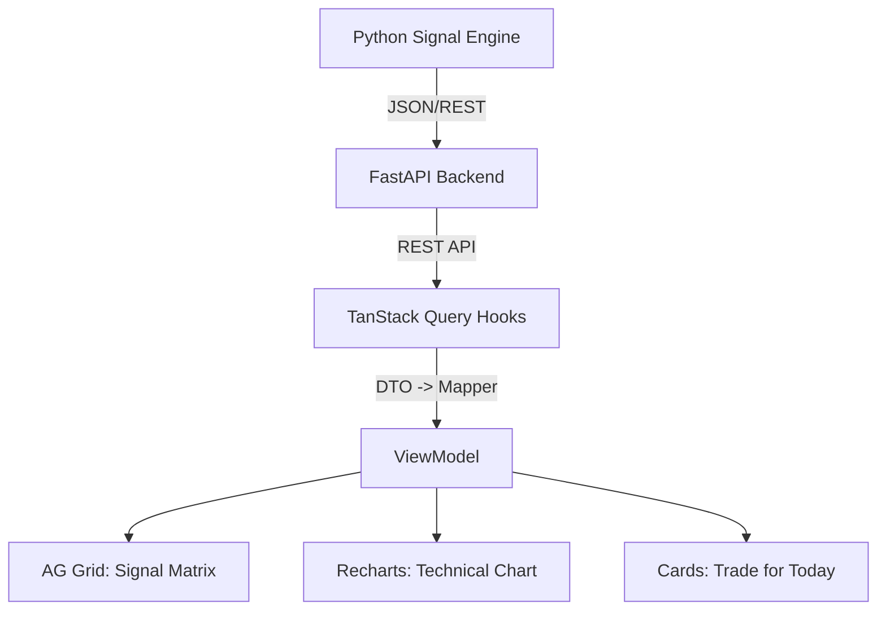

# Karsa Investment Platform: Dashboard & Signal Enhancement Audit
**Date:** June 19, 2026  
**Target Goal:** Build an actionable Investment Firm Dashboard for IDX market stocks with clear signals (Bullish/Bearish), "Trade for Today" recommendations, and easy-to-consume data visualization.

## 1. Current State Analysis
Based on the repository `skeithnight/karsa` and the provided architectural audit:
- **Strengths:** 
  - Exceptional governance model (Event Sourcing, CQRS, Immutable Decision Ledgers).
  - Modern, robust frontend stack (Next.js 16, React 19, AG Grid 35.3, Recharts 3.8, TanStack Query v5).
  - Strict sprint lifecycle and documentation standards.
- **Weaknesses (Relative to Goal):**
  - **Over-engineered for Governance, Under-developed for Trading:** The backend is heavily focused on orchestration and compliance but lacks the actual market data pipeline.
  - **Empty Dashboard:** The Next.js web console exists but has no real data binding. The AG Grid is empty; there are no live charts or signals.
  - **Missing Signal Engine:** No implementation of the ML ensemble (XGBoost/LightGBM/LSTM) or technical indicator calculations required to generate "Bullish/Bearish" signals.

## 2. Gap Analysis: Path to a Signal-Driven Dashboard
To achieve the goal of an "easy to consume" dashboard with daily signals, the following critical gaps must be closed:

| Gap Area | Current State | Required State for Goal |
| --- | --- | --- |
| **Data Ingestion** | None | Daily OHLCV, fundamentals, and foreign fund flow for IDX stocks. |
| **Feature Engineering** | None | Real-time calculation of EMA, RSI, MACD, Bollinger Bands. |
| **Signal Generation** | None | Rule-based + ML ensemble engine outputting daily BUY/SELL/HOLD signals with conviction scores. |
| **Backend API** | FastAPI skeleton exists | Endpoints to serve `/api/v1/signals/today`, `/api/v1/theses`, and `/api/v1/technical/{ticker}`. |
| **Frontend Data Binding** | AG Grid & Recharts installed but empty | TanStack Query hooks fetching live data; AG Grid populated with color-coded signals. |

## 3. Proposed Architecture: Data -> Signals -> Dashboard
To feed the dashboard, we need a streamlined pipeline that bypasses the heavy orchestration framework for daily signal generation.

### 3.1. Data & Signal Pipeline (Python Backend)
1. **Data Fetcher (`src/data/idx_fetcher.py`):** Pulls daily data from TwelveData / yfinance.
2. **Feature Store (`src/feature_store/technical_indicators.py`):** Calculates TA indicators (EMA 10/20, RSI 14, MACD).
3. **Signal Engine (`src/signals/signal_generator.py`):** 
   - Combines ML predictions (if available) with hard technical rules.
   - Outputs a daily JSON/DB record: `{ ticker, signal: 'BULLISH', conviction: 0.82, entry: 1250, sl: 1200, tp: 1350, reason: 'EMA Cross + RSI Oversold' }`.
4. **FastAPI Endpoints:** Exposes these signals to the frontend.

### 3.2. Dashboard Data Flow (Next.js Frontend)


## 4. Dashboard UI/UX Enhancements (The "Trade for Today" View)
To make the dashboard "easy to consume" for daily trading, the UI must prioritize actionable information over raw data.

### 4.1. Hero Section: "Trade for Today" Widget
- **Purpose:** Immediate visibility of the top 3-5 highest conviction setups for the current trading day.
- **UI Elements:** 
  - Large cards with Ticker, Signal (e.g., 🟢 STRONG BUY), Conviction %, and 1-line reason.
  - Quick links to "Add to Watchlist" or "View Thesis".

### 4.2. Signal Matrix (AG Grid)
- **Purpose:** The core workspace for scanning the market.
- **Columns:** 
  - `Ticker` (e.g., BBCA.JK)
  - `Signal` (Color-coded: 🟢 Bullish/Buy, 🔴 Bearish/Sell, 🟡 Neutral/Hold)
  - `Conviction` (Progress bar 0-100%)
  - `Entry Price` | `Stop Loss` | `Take Profit`
  - `Risk/Reward Ratio`
  - `Sector` (Filterable)
- **Features:** 
  - Row clicking opens the "Thesis Detail Panel".
  - Server-side sorting and filtering via TanStack Query.

### 4.3. Thesis Detail Panel (Side Drawer)
- **Purpose:** Explain the "Why" behind the signal without leaving the main screen.
- **UI Elements:**
  - **Technical Chart (Recharts):** Interactive line/candlestick chart with EMA, RSI, and MACD overlays.
  - **Signal Breakdown:** Pie chart showing how much the signal is driven by Technicals vs. Fundamentals vs. ML Model.
  - **Trade Plan:** Clear text outlining Entry, SL, TP, and Position Sizing recommendation.

### 4.4. Market Sentiment & Foreign Flow
- **Purpose:** Context for IDX trading (where foreign flow drives 60%+ of volume).
- **UI Elements:** A simple timeline or bar chart showing net foreign buy/sell for the day and top sectors.

## 5. Backend API Requirements
To support the UI, the FastAPI backend needs the following specific endpoints:

```python
# 1. Daily Signals (For "Trade for Today" and Signal Matrix)
GET /api/v1/signals/today
# Response: List of today's actionable signals with conviction, entry, SL, TP.

# 2. Technical Data (For Recharts)
GET /api/v1/technical/{ticker}?days=90
# Response: Array of OHLCV + EMA10, EMA20, RSI, MACD for charting.

# 3. Thesis Details (For Side Drawer)
GET /api/v1/theses/{thesis_id}
# Response: Full investment memo, ML model breakdown, risk assessment.

# 4. Market Context
GET /api/v1/market/foreign-flow
# Response: Daily net foreign flow data for IDX.
```

## 6. Step-by-Step Implementation Roadmap

### Phase 1: The Data & Signal Engine (Weeks 1-2)
- [ ] **Week 1:** Build `src/data/idx_fetcher.py` to pull 5-year OHLCV for top 50 IDX stocks. Set up PostgreSQL tables for `prices` and `features`.
- [ ] **Week 2:** Implement `src/feature_store/technical_indicators.py` (EMA, RSI, MACD). Build the rule-based `SignalEngine` to generate daily BUY/SELL signals based on indicator crossovers.

### Phase 2: API & Frontend Data Binding (Weeks 3-4)
- [ ] **Week 3:** Create FastAPI endpoints (`/api/v1/signals/today`, `/api/v1/technical/{ticker}`). Ensure CORS is configured for Next.js.
- [ ] **Week 4:** Build TanStack Query hooks in `karsa-web/src/hooks/` (`useDailySignals`, `useTechnicalData`). Create the DTO -> Mapper -> ViewModel pipeline.

### Phase 3: Dashboard UI Implementation (Weeks 5-6)
- [ ] **Week 5:** Build the "Trade for Today" hero cards and the AG Grid Signal Matrix. Implement color-coded cell renderers for Bullish/Bearish signals.
- [ ] **Week 6:** Implement the Recharts Technical Chart component. Build the Thesis Detail side drawer.

### Phase 4: Refinement & ML Integration (Weeks 7-8)
- [ ] **Week 7:** Integrate the ML Ensemble (XGBoost/LightGBM) to replace/augment the rule-based signals with probability scores.
- [ ] **Week 8:** Paper trading validation. Monitor dashboard latency, fix UI bugs, and refine signal thresholds to reduce false positives.

## 7. Recommended Tech Stack Additions
To execute this roadmap, add the following to your `pyproject.toml` and `package.json`:

**Python Backend (`pyproject.toml`):**
```toml
# Data & Technical Analysis
yfinance = "^0.2.40"
pandas = "^2.2.0"
ta = "^0.11.0" # Technical analysis library

# API
fastapi = "^0.109.0"
uvicorn = "^0.27.0"
```

**Next.js Frontend (`karsa-web/package.json`):**
```json
{
  "dependencies": {
    "lightweight-charts": "^4.1.0", 
    "date-fns": "^3.4.0",
    "lucide-react": "^0.300.0" 
  }
}
```
*(Note: Consider `lightweight-charts` by TradingView for the technical chart instead of Recharts if you need professional candlestick charts).*

## 8. Conclusion
Your Karsa repository has a world-class foundation for governance and orchestration. However, to achieve your goal of an **actionable investment firm dashboard**, you must pivot focus from the orchestration framework to the **data pipeline and signal generation**. 

By implementing the streamlined Data -> Signal -> API -> Dashboard flow outlined above, you will transform Karsa from a theoretical governance engine into a practical, daily-use trading tool that clearly tells you what is Bullish, Bearish, and what to trade today.
```

### Key Takeaways for Your Next Steps:
1. **Stop over-engineering the orchestration for now.** Your governance model is already production-grade. Shift 100% of your focus to getting data flowing and generating signals.
2. **Start with Rule-Based Signals.** Before jumping into the XGBoost/LSTM ensemble, build a simple Python script that calculates EMA crossovers and RSI for 50 IDX stocks. Output this to a JSON file or FastAPI endpoint.
3. **Bind the AG Grid.** Once you have that JSON, use TanStack Query to fetch it in Next.js and map it to your AG Grid. Seeing your first "Bullish" signal light up in green on the dashboard will be a massive milestone.