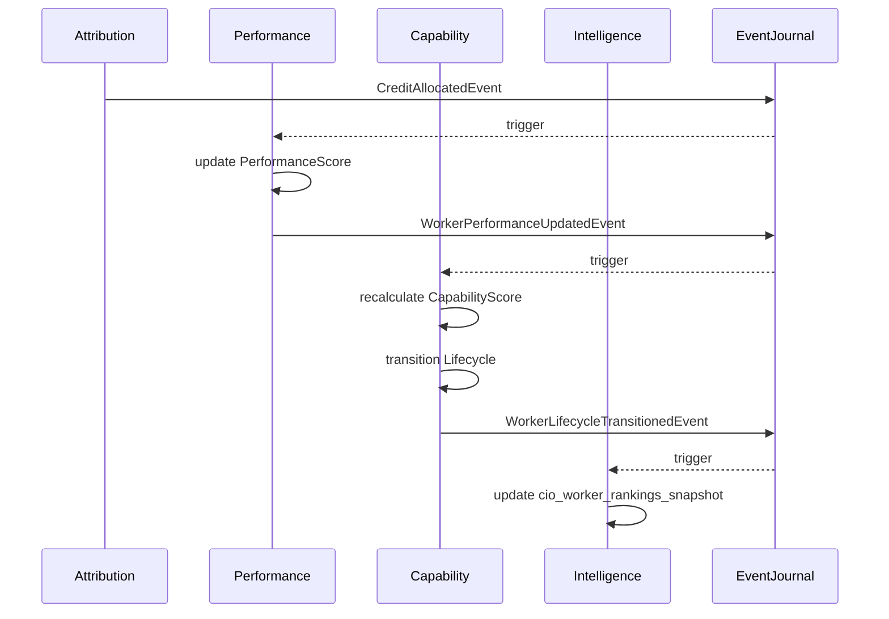
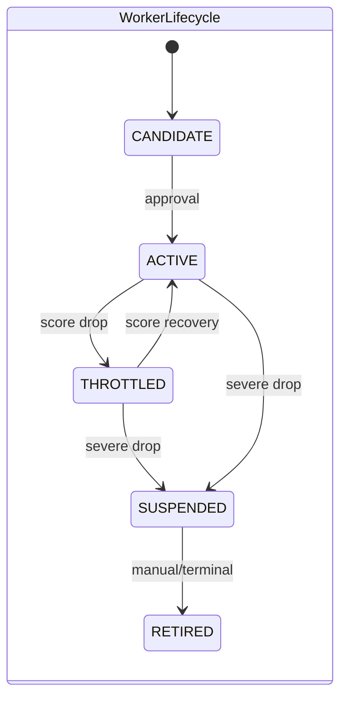

# Sprint-03: Capability & Performance Platform Architecture Design

## 1. Executive Summary
The Sprint-03 Capability & Performance Platform establishes the measurement and governance layer required to transition Karsa into an autonomous investment firm. By strictly segregating lagging indicators (Performance Context) from leading indicators and governance states (Capability Context), the architecture provides a pure, event-sourced evaluation engine. It safely ingests Review & Attribution data from Sprint-02, translating historical alpha generation and calibration grades into a unified, polymorphic Worker Lifecycle. This architecture is the foundational prerequisite for Sprint-58's CIO Agent, Research Director Agent, and Portfolio Manager Agent.

## 2. Ownership Boundary Matrix
| Component | Owner | Constraint / Status |
| :--- | :--- | :--- |
| **WorkerPerformance** | Performance Domain | Owns lagging mathematical track records (accuracy, alpha, consistency). |
| **WorkerCapability** | Capability Domain | Owns leading indicators, capability scoring, and worker lifecycle states. |
| **CIO Projections** | Intelligence Domain | Denormalized, O(1) read models for Capital Allocation & Agent rankings. |

## 3. Architecture Overview
The architecture implements a reactive Saga bridging three boundaries: Review/Attribution -> Performance -> Capability.
When Sprint-02 emits a `CreditAllocatedEvent` or `ReviewSealedEvent`, the Performance Context listens and updates the `WorkerPerformance` ledger, emitting a `PerformanceScoreUpdatedEvent`. The Capability Context listens to performance changes, recalculates the canonical `CapabilityScore`, and transitions the worker's lifecycle (e.g., ACTIVE -> THROTTLED) if risk thresholds are breached. Read models materialize these ledgers into time-series trend data and instant CIO rankings.

## 4. Domain Model
*   **Performance Context:** A purely objective, mathematical ledger tracking *what* a worker has historically achieved.
*   **Capability Context:** A governance ledger determining *what* a worker is authorized to do in the future based on performance inputs and manual risk limits.

## 5. Aggregate Design
**Performance Context:** `WorkerPerformance` Aggregate.
*   **Root:** `WorkerPerformance` (`performance_urn`)
*   **Invariants:** Mathematical tracking only. Cannot suspend a worker. Cannot hold capital allocation limits.

**Capability Context:** `WorkerCapability` Aggregate.
*   **Root:** `WorkerCapability` (`capability_urn`)
*   **Invariants:** Controls lifecycle (ACTIVE, THROTTLED, etc.). Cannot calculate alpha (must receive it from Performance). State transitions require explicit `CapabilityScore` evaluations.

## 6. Nested Entities
*   **Within WorkerPerformance:**
    *   `AccuracyLedger`: Tracks cumulative forecast accuracy.
    *   `AlphaLedger`: Tracks cumulative and annualized alpha generation.
*   **Within WorkerCapability:**
    *   `CapabilityThreshold`: Configurable risk limits defining state transitions (e.g., `throttle_if_score_below`).

## 7. Value Objects
*   `WorkerSubject`: `subject_type` (ANALYST, MODEL, STRATEGY, PROCESS, SWARM, TEAM, PORTFOLIO), `subject_urn`.
*   `PerformanceScore`: `alpha_score`, `accuracy_score`, `calibration_score`, `consistency_score`, `drawdown_impact`.
*   `CapabilityScore`: A weighted float `[0.0, 100.0]` canonicalizing trust in the worker.

## 8. Event Contracts
*   `WorkerPerformanceUpdatedEvent(performance_urn, subject: WorkerSubject, new_score: PerformanceScore)`
*   `CapabilityScoreRecalculatedEvent(capability_urn, subject: WorkerSubject, new_capability_score, rationale)`
*   `WorkerLifecycleTransitionedEvent(capability_urn, subject: WorkerSubject, old_state, new_state, rationale)`

## 9. Application Services
*   `PerformanceTrackingService`: Ingests Sprint-02 events, calculates math, commands `WorkerPerformance`.
*   `CapabilityGovernanceService`: Ingests Performance events, calculates capability score, commands `WorkerCapability`.

## 10. Repository Design
*   `EventJournalRepository`: Append-only underlying store for both contexts.
*   `PostgresCapabilityIntelligenceRepository`: CQRS read-only implementation.

## 11. Persistence Design
*   `performance_ledgers` (Time-series mapping to `PerformanceScore`)
*   `capability_ledgers` (Time-series mapping to `CapabilityScore` and `lifecycle_state`)

## 12. Projection Design
Projections materialize the event streams into two dimensions: instantaneous state (for fast logic) and time-series history (for trends).
*   `PerformanceProjectionService`: Materializes `cio_worker_performance_snapshot`.
*   `CapabilityProjectionService`: Materializes `cio_worker_capability_snapshot` and `worker_lifecycle_history`.

## 13. Read Model Design
*   `cio_worker_rankings_snapshot`: Flat, ordered table of all ACTIVE workers descending by `CapabilityScore`.
*   `cio_capital_efficiency_snapshot`: Tracks `alpha_generated` per unit of capability.

## 14. Integration Design
Performance explicitly subscribes to Sprint-02's `CreditAllocatedEvent` and `ReviewSealedEvent`. Capability explicitly subscribes to `WorkerPerformanceUpdatedEvent`. Communication is exclusively asynchronous via the Event Journal.

## 15. Sequence Diagrams

## 16. State Diagrams

## 17. Failure Handling
If `Attribution` emits poison events, the `Performance` saga isolates the failure via standard exponential backoff and DLQ (Dead Letter Queue) without halting the entire platform.

## 18. OCC Strategy
All writes to `WorkerPerformance` and `WorkerCapability` mandate Optimistic Concurrency Control using `expected_version` matched to `stream_version` to prevent concurrent evaluation overwrites.

## 19. Replayability Analysis
REPLAY_SAFE. All mathematical logic relies purely on previously emitted domain events. Destroying all projections and replaying from `global_sequence = 0` will identically reconstruct the entire lifecycle history of every worker.

## 20. Scalability Analysis
Calculations are asynchronous and heavily partitioned by `subject_urn`. Projections flatten complex time-series data into O(1) read models, ensuring CIO Agents can fetch rankings instantly regardless of firm scale.

## 21. Security Analysis
Transitions to `RETIRED` or `ACTIVE` (from SUSPENDED) require cryptographically signed commands mapping to specific governance roles (Risk Officer), preventing rogue models from reactivating themselves.

## 22. Migration Strategy
Data from Sprint-01 and Sprint-02 must be safely replayed into the new Sprint-03 projection handlers to backfill historical performance for pre-existing analysts.

## 23. Risks
*   **Event Volume:** High frequency `CreditAllocatedEvent` emissions from Swarms could overload the Performance recalculation.
    *   *Mitigation:* Performance recalculation can employ batching at the Saga boundary.

## 24. ADR Decisions
*   **ADR-090: Segregation of Performance and Capability.** (Bans God Aggregate).
*   **ADR-091: Polymorphic Worker Subject.** (Future-proofs for Swarms/Models).
*   **ADR-092: Canonical Capability Score.** (Centralizes trust metrics).

## 25. Architecture Challenges

### Challenge 1: Capability vs Performance
**Resolved:** Separated into two distinct bounded contexts. `Performance` is the objective mathematical lagging indicator. `Capability` is the subjective/governance leading indicator determining future authorization.

### Challenge 2: Generic Subject Model
**Resolved:** Utilizes the polymorphic `WorkerSubject(subject_type, subject_urn)` pattern. Fully decoupled from human-centric "Analyst" designs, cleanly supporting `MODEL`, `SWARM`, `STRATEGY`.

### Challenge 3: Worker Lifecycle
**Resolved:** `WorkerCapability` Aggregate strictly owns the `CANDIDATE -> ACTIVE <-> THROTTLED <-> SUSPENDED -> RETIRED` state machine. Transitions are purely event-driven and strictly replayable.

### Challenge 4: Performance Measurement
**Resolved:** `WorkerPerformance` explicitly owns calculations for accuracy, calibration, alpha, and consistency. No math leaks into the Intelligence UI projections.

### Challenge 5: Capability Scoring
**Resolved:** Owned by `WorkerCapability`. Inputs include `PerformanceScore` and governance flags. Outputs a canonical `[0.0, 100.0]` float. Replay-safe via pure functional logic.

### Challenge 6: Capital Allocation Readiness
**Resolved:** Defines `cio_worker_rankings_snapshot` and `cio_capital_efficiency_snapshot`. The CIO Agent maps Capital against Capability without performing any heavy compute.

### Challenge 7: Attribution Integration
**Resolved:** Sagas bridge Sprint-02 to Sprint-03 via pure, decoupled Domain Event pub/sub. Aggregates never call each other.

### Challenge 8: Historical Evolution
**Resolved:** Introduced time-series projection `worker_skill_trend_snapshots` to maintain historical deltas, unblocking multi-year trend analytics for the Research Director Agent.

### Challenge 9: Swarm Evaluation
**Resolved:** Swarms are evaluated exactly as Analysts via `WorkerSubject(subject_type="SWARM")`. Because Sprint-02 issues recursive attribution nodes, Performance safely computes Swarm-level alpha independently of its child agents.

### Challenge 10: CIO Readiness
**Resolved:** Read models are explicitly mapped to future consumers:
*   CIO Agent -> `cio_capital_efficiency_snapshot`
*   Research Director -> `cio_worker_rankings_snapshot`
*   Risk Officer -> `worker_lifecycle_history` (monitoring SUSPENDED transitions)

## 26. Architecture Delta Analysis
Evolves Karsa from an "Evaluation" platform into a "Governance & Measurement" platform. Introduces the capability to throttle or suspend agents autonomously based on mathematical degradation.

## 27. Acceptance Criteria
1.  Performance and Capability are strictly isolated bounded contexts.
2.  `WorkerSubject` handles `SWARM` and `MODEL` types seamlessly.
3.  Lifecycle transitions are fully event-sourced and OCC protected.
4.  CIO read models are O(1) and completely decoupled from mathematical recalculations.

## 28. Final Verdict
ARCHITECTURE_APPROVED
ARCHITECTURE_FROZEN
