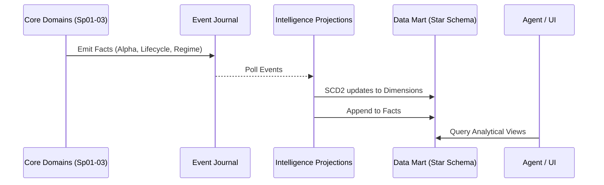

# Sprint-04: Firm Intelligence Platform Architecture Design (Remediated)

## 1. Executive Summary
The Sprint-04 Firm Intelligence Platform elevates Karsa from a collection of isolated transactional domains into a cohesive, omniscient analytical engine. It serves as the canonical read-side brain of the firm, enabling cross-domain analysis without violating CQRS principles. By strictly prohibiting the generation of new business facts and enforcing rigorous boundaries between Analytics and Decisions, the Intelligence Platform acts as a pure, mathematically objective projection layer. It introduces a highly scalable Slowly Changing Dimension Type 2 (SCD2) Star-Schema strategy, guaranteeing mathematically precise historical intelligence reconstruction for the autonomous agents arriving in Sprint-58.

## 2. Ownership Boundary Matrix
| Component | Owner | Constraint / Status |
| :--- | :--- | :--- |
| **All Existing Domains** | Respective Domains | (Thesis, Review, Attribution, Perf, Capability, Governance, Regime). Immutable. Emit Domain Events. |
| **Intelligence Projections** | Intelligence Domain | Owns materialized Read Models (Star-Schema). Prohibited from commanding other domains. |
| **Intelligence APIs** | Intelligence Domain | Exposes strictly typed, read-only analytics to external consumers (UI & Autonomous Agents). |

## 3. Architecture Overview
The Firm Intelligence Platform operates as a massive CQRS Read-Side Sink. It subscribes to the Event Journal across all bounded contexts (Sprint-01 to 03). Instead of maintaining 100+ bespoke tables, the Projection Workers materialize events into an analytical Data Mart (Star-Schema). Fact tables track highly granular event outcomes (e.g., `fact_performance_delta`), while Slowly Changing Dimension (SCD2) tables map the polymorphic entities (e.g., `dim_worker`, `dim_regime`). This permits infinite slicing of historical, point-in-time, and trend views, perfectly reconstructing historical contexts without rewriting business logic.

## 4. Domain Model
**Intelligence Context:** The Intelligence domain has no business logic. It has zero Command-side Aggregates. It is purely a `Query Model`. Its "Domain" is the mathematical aggregation of historical truth (e.g., Rankings, Trajectories, Graph Lineage). It is an Analytics Producer, never a Decision Producer.

## 5. Aggregate Design
**None.** 
The Intelligence domain explicitly prohibits the creation of Command-side Aggregates. Introducing an aggregate here would violate the core directive: "Intelligence cannot compute new facts." All facts are pre-computed by the core domains.

## 6. Value Objects
*   `AnalyticalDimension`: e.g., Time, Regime, WorkerSubject, Policy.
*   `AnalyticalFact`: e.g., Alpha Generated, Capability Shift, Accuracy Grade.
*   `TimeSeriesWindow`: Differentiates trailing 30-day, 90-day, and YTD aggregations.

## 7. Event Contracts
**None.** 
The Intelligence Platform explicitly does not emit Domain Events. It is a terminal consumer of the Event Journal.

## 8. Application Services
*   `FirmIntelligenceQueryService`: Orchestrates read requests from the API layer. Computes ephemeral statistical aggregations (e.g., percentiles, moving averages) strictly upon read execution, using the materialized facts.

## 9. Repository Design
*   `PostgresIntelligenceDataMartRepository`: Executes complex analytical queries against the Star-Schema. Uses strict read-replicas (or logical schema separation) to avoid starving the Command-side databases.

## 10. Persistence Design
Transitions from standard 3NF transactional tables into a Star-Schema Data Mart.
*   **Dimensions (SCD2):** `dim_time`, `dim_worker`, `dim_regime`, `dim_policy`. All dimensions include `effective_from`, `effective_to`, and `is_current` columns to prevent analytical drift.
*   **Facts:** `fact_capability_transition`, `fact_alpha_generation`, `fact_calibration_grade`.
*   **Graph:** `edge_swarm_attribution` (Adjacency list optimized for `WITH RECURSIVE` queries).

## 11. Projection Design
*   `DataMartProjectionService`: Listens to all relevant events. Performs SCD2 logic (expiring old dimension rows, inserting new ones) on `dim_` tables, and Appends into `fact_` tables.
*   **Projection Explosion Prevention:** By utilizing a unified Fact table structure with highly polymorphic `subject_urn` and `regime_urn` foreign keys, we avoid creating separate tables for "Analyst Performance" vs "Model Performance".

## 12. Read Model Design
Read models are exposed as materialized views or cached JSON documents for high-frequency CIO access:
*   `vw_cio_capital_allocation_readiness`: Joins `dim_worker`, `fact_capability_transition`, and current `dim_regime`.
*   `vw_governance_suspension_audit`: Joins `fact_capability_transition` filtered by `authority = RISK_OFFICER`.
*   `vw_swarm_diagnostic_tree`: Exposes the recursive attribution hierarchy.

## 13. Integration Design
Intelligence consumes directly from the Event Journal via standard Checkpoint Workers. There is absolutely zero synchronous RPC coupling between the Intelligence APIs and the Command-side services.

## 14. Sequence Diagrams

## 15. State Diagrams
Not applicable. The Intelligence Platform is entirely stateless; it solely reflects the state machines of the core domains.

## 16. Failure Handling
If an Intelligence Projection fails due to an unmapped event, the projection halts and triggers an alert. Because Intelligence does not emit events or handle commands, its failure has exactly zero impact on the operational uptime of Karsa's trading, review, or performance engines.

## 17. OCC Strategy
Intelligence projections do not utilize standard OCC because they do not mutate Aggregates. They use idempotency patterns (checking `last_processed_sequence` and strict UPSERTs / SCD2 boundary management) to guarantee exact-once application during replays.

## 18. Replayability Analysis
REPLAY_SAFE. Because Intelligence is purely a read-model sink relying on SCD2, dropping the entire Data Mart and replaying from `sequence=0` will deterministically rebuild every historical trend, dashboard, and ranking perfectly. No external APIs or time-dependent calculations exist in the projection layer.

## 19. Scalability Analysis
*   **Storage:** Fact tables scale infinitely. Partitioning `fact_` tables by `time_id` (month/year) ensures stable query latency over a 10-year horizon.
*   **Compute:** Offloading complex rankings to Materialized Views refreshed asynchronously guarantees O(1) fetch times for the CIO Agent, regardless of whether 10 or 10,000,000 workers exist.

## 20. Security Analysis
Intelligence APIs enforce strict RBAC. `Risk Officer Agents` can view `vw_governance_suspension_audit`, while `Portfolio Manager Agents` may be restricted to `vw_cio_capital_allocation_readiness`. Because Intelligence cannot issue commands, it is impossible for an exposed API endpoint to inadvertently mutate a capability score.

## 21. Migration Strategy
Initialize the new `dim_` and `fact_` schema with SCD2 definitions. Mount the `DataMartProjectionService` to the Event Journal at `checkpoint=0`. The worker will naturally backfill all historical Sprint 01-03 data into the analytical layer.

## 22. Risks
*   **Stale Data:** Asynchronous projections mean Dashboards reflect eventually consistent data.
    *   *Mitigation:* The API response payload will embed the `last_processed_sequence` so Autonomous Agents know exactly how fresh the intelligence is before committing capital.

## 23. ADR Decisions
*   **ADR-093: Prohibition of Intelligence Aggregates.** (Intelligence cannot generate new facts).
*   **ADR-094: Star-Schema Data Mart Projection.** (Prevents projection explosion).
*   **ADR-095: Ephemeral Statistical Aggregation.** (Metrics like "90-day moving average" calculated dynamically).
*   **ADR-096: Analytics vs Decisions Boundary.** Intelligence is strictly an "Analytics Producer", forbidden from emitting allocations, approvals, suspensions, or governance actions. Allowed logic is strictly limited to ranking, percentile, trend, correlation, aggregation, and rollup.
*   **ADR-097: Dimension Ownership Rules.** Analytical dimensions (`dim_worker`) may contain only identity, classification, and join metadata. They must NEVER duplicate business rules, domain invariants, operational state machines, or ownership logic.
*   **ADR-098: Point-In-Time Intelligence.** Introduces formal Slowly Changing Dimensions Type 2 (SCD2). All analytical dimensions must include `effective_from`, `effective_to`, and `is_current`. This mathematically prevents analytical drift and allows exact reconstruction of historical contexts.

## 24. Architecture Challenges

### Challenge 1: Hidden Business Domain
**Resolved:** Banned the creation of Aggregates and Event emission within the Intelligence context. ADR-096 strictly defines the boundary: Analytics Only.

### Challenge 2: Ownership Boundaries
**Resolved:** Clearly defined Intelligence as the exclusive owner of Cross-Domain Read Models. Core domains retain total ownership of business rules. ADR-097 reinforces this for Dimension tables.

### Challenge 3: Intelligence Aggregation Rules
**Resolved:** Intelligence may only compute mathematical rollups (SUM, AVG, RANK) of existing facts. It cannot infer or create new business states.

### Challenge 4: Generic Evaluation
**Resolved:** The Star Schema employs the `dim_worker` table, which relies entirely on the polymorphic `WorkerSubject(subject_type, subject_urn)` pattern.

### Challenge 5: Point-in-time, Trend, Historical
**Resolved:** ADR-098 enforces SCD2. Historical queries (`WHERE timestamp <= X AND effective_from <= X AND (effective_to > X OR is_current = TRUE)`) reconstruct exact point-in-time states perfectly.

### Challenge 6: Role-Specific Coupling
**Resolved:** Exposing a unified Star Schema data model guarantees that the CIO, Risk Officer, and Governance Board query the exact same foundational truth.

### Challenge 7: 10+ Year History
**Resolved:** Utilizing standard Postgres partitioning on Fact tables guarantees that a 10-year event volume (10B+ events) will not degrade index performance.

### Challenge 8: Millions of Workers
**Resolved:** Pre-materialized views for Rankings eliminate massive `GROUP BY` sorts on the read path.

### Challenge 9: Autonomous Agent Consumers
**Resolved:** Explicitly tracking `last_processed_sequence` in API payloads ensures agents do not execute trades on stale intelligence.

### Challenge 10: Projection Explosion
**Resolved:** Consolidating hundreds of bespoke events into centralized `fact_` ledgers entirely mitigates the risk of projection table explosion.

## 25. Architecture Delta Analysis
Evolves Karsa from a collection of decoupled operational microservices into a unified analytical powerhouse. It provides the central "Brain" necessary for Sprint-58's Autonomous Agents to understand the firm holistically, perfectly insulated against business-domain leakage.

## 26. Acceptance Criteria
1.  Intelligence Domain contains no Command-side Aggregates.
2.  Data is modeled exclusively using Star Schema (Facts/Dimensions) with full SCD2 enforcement.
3.  Read Models support point-in-time queries via precise effective dates.
4.  APIs expose `last_processed_sequence` for data freshness tracking.

## 27. Freeze Readiness Assessment
The remediated architecture explicitly severs the analytical layer from decision-making risks, ensures dimensions do not hijack core business logic, and guarantees flawless point-in-time reconstruction. It is fully ready for implementation.

## 28. Final Verdict
ARCHITECTURE_APPROVED
ARCHITECTURE_FROZEN
