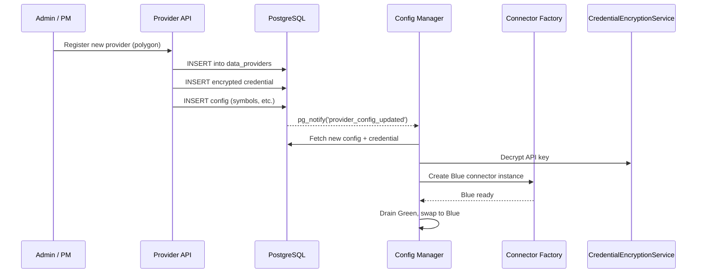

# Sprint-51: Data Bridge — Foundation & Schema

## 1. Executive Summary
Sprint-51 establishes the foundational infrastructure for the `karsa-data-ingestion-worker` (Data Bridge). This sprint focuses exclusively on the database layer, encryption-at-rest for API credentials, and the configuration management system with zero-downtime hot-reload capability. No market data connectors are built in this sprint; this is pure plumbing.

**This sprint EXTENDS the existing `providers/` bounded context.** It does NOT create a new module. The existing `ProviderClient` ABC (`providers/domain/client.py`) and its health check interface are reused.

**Audit Reference:** `docs/qwen-audit/Phase_1_Data_Bridge_Engineering_Spec.md` — Sections 3, 4.1

## 2. Ownership Boundary Matrix
| Component | Owner | Constraint / Status |
| :--- | :--- | :--- |
| **data_providers** | providers/ module | New table. Extends existing provider registry. |
| **provider_credentials** | providers/ module | New table. AES-256-GCM encrypted. |
| **provider_configurations** | providers/ module | New table. JSONB dynamic config. |
| **provider_health_logs** | providers/ module | New table. Reuses `ProviderClient.health_check()`. |
| **Config Manager** | providers/ module | Hot-reload via pg_notify. |
| **Connector Factory** | providers/ module | Registry pattern. Composes with existing `ProviderClient`. |

## 3. Architecture Overview
This sprint creates the database-driven provider management layer. The Data Bridge reads its configuration entirely from PostgreSQL. API keys are encrypted with AES-256-GCM at rest, decrypted only at runtime via a master key injected through environment variables. Configuration changes trigger `pg_notify` notifications, enabling the Config Manager to perform blue/green connector swaps without restarting the worker process.

## 4. Domain Model
**Data Bridge Context (new bounded context):**
- `ProviderRegistry` — aggregate managing provider lifecycle (active, paused, maintenance)
- `ProviderCredential` — value object wrapping encrypted API key material
- `ProviderConfiguration` — value object for JSONB config entries (symbols, aggregation windows, etc.)
- `HealthLogEntry` — immutable record of provider health state transitions

## 5. Aggregate Design
- `Provider` (Aggregate Root): Owns `ProviderCredential`, `ProviderConfiguration[]`, and emits `ProviderRegisteredEvent`, `ProviderConfigChangedEvent`, `ProviderPausedEvent`.

## 6. Value Objects
- `EncryptedCredential`: ciphertext + nonce + key_rotation_version
- `ConfigEntry`: config_key + config_value (JSONB)
- `HealthStatus`: enum — `connected`, `disconnected`, `rate_limited`, `auth_error`

## 7. Event Contracts
- `ProviderRegisteredEvent` — New provider added to registry
- `ProviderConfigChangedEvent` — Config or credential updated (triggers hot-reload)
- `ProviderPausedEvent` — Provider set to maintenance/paused
- `ProviderHealthChangedEvent` — Health state transition logged

## 8. Application Services
- `ProviderManagementService`: CRUD operations on providers, credentials, and configs. Triggers events on mutations.
- `ConfigManager`: Subscribes to `pg_notify('provider_config_updated')`, performs blue/green connector swap.
- `CredentialEncryptionService`: AES-256-GCM encrypt/decrypt using `DATA_BRIDGE_MASTER_KEY`.

## 9. Repository Design
- `PostgresProviderRepository`: Implements provider CRUD, credential storage, config management.
- `PostgresHealthLogRepository`: Append-only health log writes.

## 10. Persistence Design
Four new tables as specified in Phase 1 Spec Section 3.1:
- `data_providers` — UUID PK, name (UNIQUE), type, status, priority
- `provider_credentials` — FK to data_providers, encrypted key material, rotation version
- `provider_configurations` — FK to data_providers, JSONB key-value pairs
- `provider_health_logs` — FK to data_providers, status enum, latency, error message

Plus the `pg_notify` trigger function on `provider_configurations` INSERT/UPDATE.

## 11. Projection Design
None. This sprint does not expose read-models. Health logs are raw writes only.

## 12. Read Model Design
None in this sprint. A future sprint will expose health dashboards.

## 13. Integration Design
- Connects to the existing PostgreSQL instance (shared with all other Karsa modules).
- Uses the existing `PostgresEventBus` for domain event publishing.
- No external API integrations in this sprint.

## 14. Sequence Diagrams


## 15. State Diagrams
```
Provider Status:
[active] --pause--> [maintenance]
[maintenance] --resume--> [active]
[active] --error--> [maintenance]
```

## 16. Failure Handling
- If `DATA_BRIDGE_MASTER_KEY` is missing at startup, the worker must refuse to start with a clear error.
- If `pg_notify` fires but the new config is invalid (bad JSON, missing required keys), the Config Manager must log the error, reject the blue connector, and keep the green (current) connector running.
- Credential decryption failures must be logged to `provider_health_logs` with status `auth_error`.

## 17. OCC Strategy
Provider configuration uses optimistic concurrency via `key_rotation_version` on credentials. If two admin requests race on the same credential row, the version check prevents silent overwrite.

## 18. Definition of Done
- [ ] All 4 tables created via Alembic migration.
- [ ] AES-256-GCM encrypt/decrypt round-trip verified with unit tests.
- [ ] `pg_notify` trigger fires on `provider_configurations` INSERT/UPDATE.
- [ ] Config Manager receives notification and performs blue/green swap (tested in-memory).
- [ ] Connector Factory registry pattern implemented with `BaseConnector` abstract class.
- [ ] `BaseConnector` composes with existing `ProviderClient` (wraps `fetch_asset`/`fetch_universe`).
- [ ] `provider_health_logs` reuses `ProviderClient.health_check()` for health checks.
- [ ] All new entities use Karsa URN format (`urn:karsa:provider:...`).
- [ ] New services registered in `bootstrap.py:ApplicationContainer`.
- [ ] Unit tests for CredentialEncryptionService, ProviderManagementService, ConfigManager.
