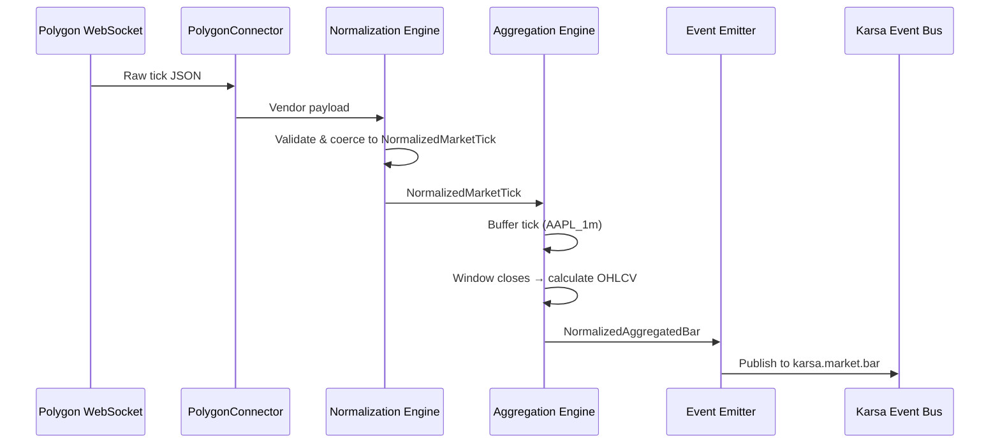

# Sprint-52: Data Bridge — Connectors, Normalization & Aggregation

## 1. Executive Summary
Sprint-52 builds the market-facing layer of the Data Bridge on top of Sprint-51's foundation. This sprint delivers the concrete connector implementations (Polygon for market data, Finnhub for news), the normalization engine that translates vendor payloads into Karsa's unified Pydantic models, and the aggregation engine that converts raw ticks into LLM-friendly OHLCV bars.

**Audit Reference:** `docs/qwen-audit/Phase_1_Data_Bridge_Engineering_Spec.md` — Sections 4.2, 4.3, 4.4, 4.5

## 2. Ownership Boundary Matrix
| Component | Owner | Constraint / Status |
| :--- | :--- | :--- |
| **PolygonConnector** | Data Bridge Module | WebSocket tick ingestion. Registered in factory. |
| **FinnhubConnector** | Data Bridge Module | REST polling for news. Registered in factory. |
| **Normalization Engine** | Data Bridge Module | Pydantic V2 models. Vendor-agnostic downstream. |
| **Aggregation Engine** | Data Bridge Module | In-memory tick buffer → OHLCV bars. |
| **Event Emitter** | Data Bridge Module | Publishes to Karsa event bus topics. |

## 3. Architecture Overview
Connectors are registered via the `@register_connector` decorator pattern from Sprint-51. Each connector receives its config and decrypted credentials from the Config Manager. Raw data flows through the Normalization Engine (strict Pydantic models), then into the Aggregation Engine (tick → bar), and finally out through the Event Emitter to the Karsa message broker.

```
[Polygon WebSocket] → PolygonConnector → NormalizationEngine → AggregationEngine → EventEmitter → [karsa.market.bar]
[Finnhub REST]      → FinnhubConnector → NormalizationEngine → EventEmitter      → [karsa.news.article]
```

## 4. Domain Model
- `NormalizedMarketTick` — unified tick model (symbol, price, volume, timestamp_utc, source_provider)
- `NormalizedAggregatedBar` — OHLCV bar model (symbol, timeframe, OHLCV, bar_close_utc)
- `NormalizedNewsEvent` — news article model (headline, url, tickers, sentiment_score, published_at)
- `EventType` enum — MARKET_TICK, MARKET_BAR, NEWS_ARTICLE

## 5. Aggregate Design
None. Normalization and aggregation are stateless transformation pipelines, not aggregates.

## 6. Value Objects
- `OHLCVBar`: open, high, low, close, volume, bar_close_utc
- `TickBuffer`: in-memory dict keyed by `{symbol}_{timeframe}` holding raw ticks until window closes

## 7. Event Contracts
- `karsa.market.bar` — NormalizedAggregatedBar (consumed by downstream AI agents and projection worker)
- `karsa.news.article` — NormalizedNewsEvent (consumed by downstream AI agents)
- `karsa.market.raw` — NormalizedMarketTick (internal only, consumed by aggregation engine)

## 8. Application Services
- `NormalizationService`: Translates vendor-specific JSON into NormalizedPydantic models. Handles missing fields, timezone coercion, string-to-float.
- `AggregationService`: Maintains in-memory tick buffers, calculates OHLCV on window close, emits bar events.
- `EventEmitterService`: Routes normalized events to the correct Karsa event bus topic.

## 9. Repository Design
None. Connectors are stateless; aggregation state is in-memory only (ephemeral).

## 10. Persistence Design
One new table via Alembic migration (for normalization failure dead-letter):
```sql
CREATE TABLE data_bridge_dead_letter (
    id UUID PRIMARY KEY DEFAULT gen_random_uuid(),
    provider_id UUID REFERENCES data_providers(id),
    raw_payload JSONB NOT NULL,
    error_message TEXT NOT NULL,
    error_type VARCHAR(50) NOT NULL,  -- 'MISSING_FIELD', 'TYPE_COERCION', 'TIMEZONE_ERROR'
    received_at TIMESTAMPTZ DEFAULT NOW()
);
```
Uses Sprint-51's `provider_configurations` for connector config and `provider_health_logs` for status reporting.

## 11. Projection Design
None. Raw ticks are not persisted; only aggregated bars are emitted downstream.

## 12. Read Model Design
None in this sprint.

## 13. Integration Design
- **Polygon.io**: WebSocket API for real-time tick data. REST API for historical gap-filling.
- **Finnhub**: REST API for news polling (scheduled interval from provider config).
- **Karsa Event Bus**: Publishes to existing `PostgresEventBus`.

## 14. Sequence Diagrams


## 15. State Diagrams
```
Aggregation Buffer:
[empty] --tick--> [buffering]
[buffering] --window_close--> [emitting]
[emitting] --> [empty]
[buffering] --disconnect--> [gap_filling]
[gap_filling] --rest_fetch--> [buffering]
```

## 16. Failure Handling
- WebSocket disconnection: Connector must auto-reconnect with exponential backoff (max 30s). On reconnect, trigger gap-filling via REST API to fetch missing bars.
- Normalization failure (malformed JSON, missing required fields): Log the raw payload to a dead-letter table, skip the tick, do not crash the pipeline.
- REST rate limiting: Respect `X-RateLimit-Remaining` headers. If exhausted, log to `provider_health_logs` with status `rate_limited` and pause polling until reset.

## 17. OCC Strategy
Not applicable. Aggregation is stateless transformation; no concurrent mutation.

## 18. Definition of Done
- [ ] `PolygonConnector` connects to Polygon WebSocket, receives live ticks.
- [ ] `FinnhubConnector` polls news endpoint, filters low-impact articles.
- [ ] NormalizationEngine correctly handles: missing bid, timezone drift (UTC normalization), string-to-float coercion, null sentiment_score.
- [ ] AggregationEngine correctly calculates OHLCV from a stream of ticks.
- [ ] Gap-filling: After simulated 3-minute disconnect, REST fetch fills missing 1m bars.
- [ ] Events land on correct Karsa event bus topics (`karsa.market.bar`, `karsa.news.article`).
- [ ] Unit tests for normalization edge cases and aggregation math.
