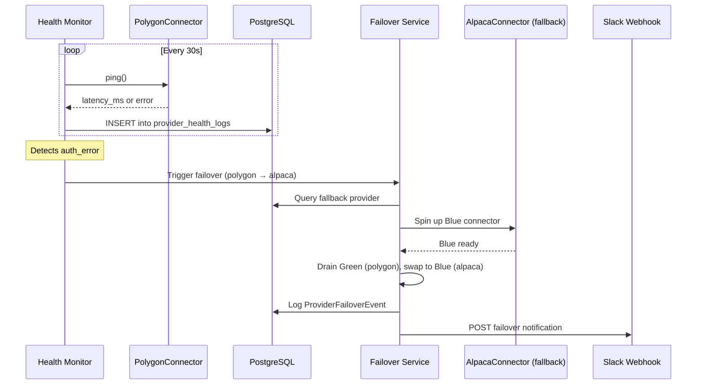

# Sprint-53: Data Bridge — Resilience, Health & Observability

## 1. Executive Summary
Sprint-53 hardens the Data Bridge for production. It adds the health monitoring subsystem, automatic provider failover, and comprehensive observability. After this sprint, the Data Bridge is a production-grade, self-healing data ingestion pipeline.

**Audit Reference:** `docs/qwen-audit/Phase_1_Data_Bridge_Engineering_Spec.md` — Sections 5, 6

## 2. Ownership Boundary Matrix
| Component | Owner | Constraint / Status |
| :--- | :--- | :--- |
| **Health Monitor** | Data Bridge Module | Background asyncio task. Writes to provider_health_logs. |
| **Failover Engine** | Data Bridge Module | Automatic provider swap on auth_error/rate_limited. |
| **Gap Fill Service** | Data Bridge Module | REST-based historical bar recovery. |
| **Alert Service** | Data Bridge Module | Slack/webhook notifications on failover events. |

## 3. Architecture Overview
The Health Monitor runs as a persistent background task within the worker process. It periodically pings active connectors, tracks latency, monitors rate limit headers, and logs state transitions to `provider_health_logs`. When a provider enters a degraded state (`auth_error`, `rate_limited`), the Failover Engine queries the database for an alternative provider of the same type with higher priority, spins it up, and seamlessly redirects traffic.

## 4. Domain Model
- `HealthStatus` — enum: `connected`, `disconnected`, `rate_limited`, `auth_error`
- `FailoverDecision` — value object capturing the reason, source provider, target provider, and timestamp of a failover event
- `GapFillRequest` — value object: symbol, start_time, end_time, source_provider

## 5. Aggregate Design
None. Health monitoring is a read-observe-act pattern, not an aggregate lifecycle.

## 6. Value Objects
- `LatencySample`: provider_id, latency_ms, recorded_at
- `RateLimitState`: provider_id, remaining, reset_at

## 7. Event Contracts
- `ProviderFailoverEvent` — Emitted when traffic switches from primary to fallback provider.
- `ProviderHealthChangedEvent` — Emitted on any health state transition.
- `GapFillCompletedEvent` — Emitted after missing bars are backfilled.

## 8. Application Services
- `HealthMonitorService`: Periodic (configurable interval, default 30s) health check against all active connectors. Tracks connection state, latency, rate limits.
- `FailoverService`: On degraded state detection, queries `data_providers` for fallback, performs blue/green swap via Config Manager, logs the decision.
- `GapFillService`: Given a symbol and time range, fetches historical bars from the provider's REST API and replays them through the normalization/aggregation pipeline.
- `AlertService`: Sends structured alerts on failover and critical health events. Uses `AlertPort` (ABC) for delivery — `SlackAlertAdapter` is the default implementation. Future adapters for email, PagerDuty, etc.

## 9. Repository Design
- `PostgresHealthLogRepository` (from Sprint-51): Extended with query methods for recent health history and alerting thresholds.

## 10. Persistence Design
No new tables. Leverages `provider_health_logs` from Sprint-51. May add an index on `(provider_id, recorded_at DESC)` for fast recent-history queries.

## 11. Projection Design
None. Health data is write-heavy, read-rare (only for alerting and dashboards).

## 12. Read Model Design
None in this sprint. A future CIO dashboard may visualize provider health.

## 13. Integration Design
- **Slack Webhooks**: POST to configurable Slack channel on failover events.
- **Polygon REST API**: Used for gap-filling missing historical bars.
- **Finnhub REST API**: Used for gap-filling missing news articles (if applicable).

## 14. Sequence Diagrams


## 15. State Diagrams
```
Provider Health:
[connected] --timeout--> [disconnected]
[connected] --rate_limit--> [rate_limited]
[connected] --bad_key--> [auth_error]
[disconnected] --reconnect--> [connected]
[rate_limited] --reset--> [connected]
[auth_error] --manual_fix--> [connected]

Failover:
[primary_active] --degraded--> [failover_initiated]
[failover_initiated] --fallback_ready--> [fallback_active]
[fallback_active] --primary_recovered--> [primary_active]
```

## 16. Failure Handling
- Health Monitor crash: If the background task dies, the main event loop must restart it. Log a CRITICAL alert.
- Failover to a provider that is also degraded: Log both failures, halt ingestion for that data type, emit `ProviderHealthChangedEvent` with status `all_providers_degraded`.
- Gap fill failure (REST API down): Retry up to 3 times with exponential backoff. If all retries fail, log the gap and continue live streaming (accept the data gap).

## 17. OCC Strategy
Not applicable. Health logs are append-only. Failover is a single-writer pattern (one Health Monitor per worker process).

## 18. Definition of Done
- [ ] Health Monitor runs as background task, logs to `provider_health_logs` every 30s.
- [ ] Simulated `auth_error` on Polygon triggers automatic failover to Alpaca.
- [ ] Failover event logged to DB and Slack webhook received.
- [ ] `AlertPort` (ABC) defined in `providers/ports.py`. `SlackAlertAdapter` implements it.
- [ ] Gap fill: After simulated 3-minute WebSocket disconnect, REST fetch recovers missing 1m bars.
- [ ] Health Monitor crash recovery: main loop restarts the monitor task.
- [ ] All providers degraded: ingestion halts gracefully, alert sent.
- [ ] New services registered in `bootstrap.py:ApplicationContainer`.
- [ ] Integration test: Full pipeline (connect → tick → aggregate → emit → failover → gap fill → resume).
