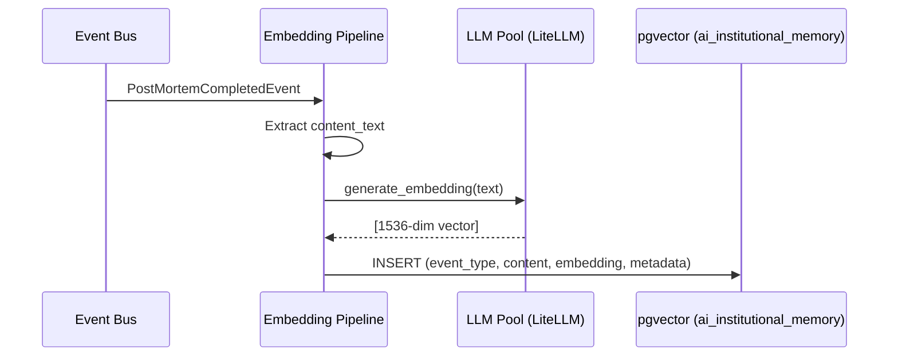
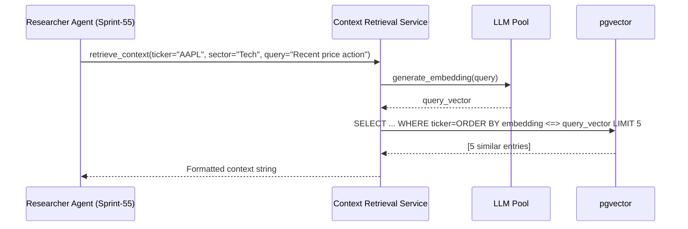

# Sprint-54: AI Grounding — LLM Pool & RAG Infrastructure

## 1. Executive Summary
Sprint-54 builds the AI infrastructure layer: the multi-provider LLM pool for resilient, cost-optimized model routing, and the RAG (Retrieval-Augmented Generation) pipeline backed by pgvector for institutional memory. This sprint lays the plumbing; Sprint-55 builds the agents that consume it.

**Audit Reference:** `docs/qwen-audit/Phase_2_RAG_and_LLM_Pool_Engineering_Spec.md` — Sections 3, 4

## 2. Ownership Boundary Matrix
| Component | Owner | Constraint / Status |
| :--- | :--- | :--- |
| **LLM Pool (LiteLLM)** | AI Infrastructure | Multi-provider routing, failover, cost tiers. |
| **pgvector Schema** | AI Infrastructure | `ai_institutional_memory` table with HNSW index. |
| **Embedding Pipeline** | AI Infrastructure | Background worker embedding theses/post-mortems. |
| **Context Retrieval** | AI Infrastructure | Vector similarity search for RAG context. |

## 3. Architecture Overview
Two independent infrastructure components:

1. **LLM Pool**: LiteLLM proxy manages a pool of API keys across OpenAI, Anthropic, and Mistral. Two model groups: `karsa-reasoning` (frontier models for thesis generation) and `karsa-fast` (cheap models for governance/news parsing). Latency-based routing with automatic failover after 2 failures.

2. **RAG Pipeline**: A background embedding worker listens for `ThesisInvalidatedEvent`, `PostMortemCompletedEvent`, and news events. It generates vector embeddings via `text-embedding-3-small` and stores them in `ai_institutional_memory` (pgvector). The context retrieval function performs cosine similarity search filtered by ticker/sector.

## 4. Domain Model
- `InstitutionalMemoryEntry` — aggregate: event_type, reference_id, ticker, sector, content_text, embedding, metadata
- `EmbeddingRequest` — value object: text, event_type, reference_id, metadata
- `RAGQuery` — value object: ticker, sector, query_text, top_k

## 5. Aggregate Design
- `InstitutionalMemoryEntry` (Aggregate Root): Immutable once written. No updates, only appends. Metadata includes outcome (WIN/LOSS), PnL, horizon.

## 6. Value Objects
- `EmbeddingVector`: 1536-dimension float array (text-embedding-3-small)
- `SimilarityResult`: content_text, metadata, event_type, similarity_score

## 7. Event Contracts
- Consumes: `ThesisInvalidatedEvent`, `PostMortemCompletedEvent`, `NewsArticleEvent` (from existing Karsa event bus)
- Does not emit new events. Embedding is a terminal write.

## 8. Application Services
- `LLMRouterService`: Wraps LiteLLM Router. Exposes `call_llm(model_group, messages, response_format)` and `generate_embedding(text)`.
- `EmbeddingPipelineService`: Subscribes to relevant events, extracts text content, generates embedding, writes to pgvector.
- `ContextRetrievalService`: Given a RAG query, embeds the query text, performs pgvector similarity search, returns formatted context string.

## 9. Repository Design
- `PostgresInstitutionalMemoryRepository`: Writes embedding entries, performs vector similarity queries with HNSW index.

## 10. Persistence Design
New table via Alembic migration:
```sql
CREATE EXTENSION IF NOT EXISTS vector;

CREATE TABLE ai_institutional_memory (
    id UUID PRIMARY KEY DEFAULT gen_random_uuid(),
    event_type VARCHAR(50) NOT NULL,
    reference_id UUID NOT NULL,
    ticker VARCHAR(20),
    sector VARCHAR(50),
    content_text TEXT NOT NULL,
    embedding vector(1536) NOT NULL,
    metadata JSONB,
    created_at TIMESTAMPTZ DEFAULT NOW()
);

CREATE INDEX ON ai_institutional_memory USING hnsw (embedding vector_cosine_ops);
```

## 11. Projection Design
None. The embedding table is a write-once read-many store, not a projection.

## 12. Read Model Design
None. Context retrieval is a direct query against `ai_institutional_memory`.

## 13. Integration Design
- **LiteLLM**: Python SDK integration (not a separate container for MVP). Config loaded from `litellm_config.yaml`.
- **OpenAI API**: `text-embedding-3-small` for embeddings. GPT-4o / GPT-4o-mini for completions.
- **Anthropic API**: Claude Sonnet / Haiku as fallback models.
- **pgvector**: PostgreSQL extension. Requires `CREATE EXTENSION vector` migration.

## 14. Sequence Diagrams




## 15. State Diagrams
Not applicable. LLM Pool is stateless. Embedding entries are immutable.

## 16. Failure Handling
- LiteLLM provider failure: Automatic failover after 2 failures (configured in router_settings). If all providers in a group fail, raise `LLMProviderExhaustedError`.
- pgvector query timeout: Set statement_timeout to 5s for RAG queries. If timeout, return empty context (degrade gracefully, don't block thesis generation).
- Embedding generation failure: Retry once. If still fails, log and skip (the entry can be re-embedded later via a backfill job).

## 17. OCC Strategy
Not applicable. Embedding entries are append-only with UUID PKs.

## 18. Definition of Done
- [ ] LiteLLM configured with at least 2 providers per model group.
- [ ] Simulated API key failure results in transparent failover to backup provider.
- [ ] pgvector extension enabled, `ai_institutional_memory` table created with HNSW index.
- [ ] Embedding pipeline backfills existing post-mortems into `ai_institutional_memory`.
- [ ] Context retrieval returns relevant historical entries for a given ticker/sector.
- [ ] Cost telemetry: `karsa-fast` used for simple tasks, `karsa-reasoning` for thesis generation.
- [ ] pgvector embedding dimension column is flexible (not hardcoded to 1536) — store model version alongside embedding.
- [ ] New services registered in `bootstrap.py:ApplicationContainer`.
- [ ] Unit tests for embedding pipeline, context retrieval, LLM router failover.
