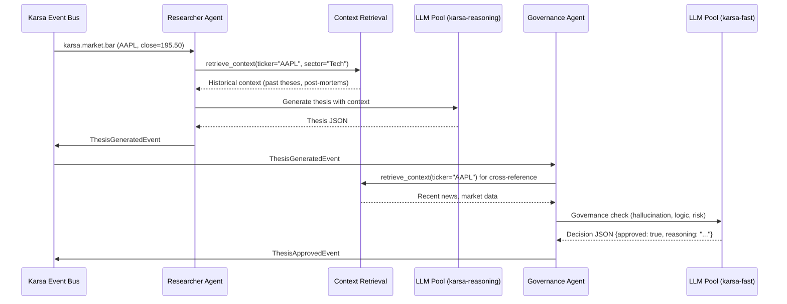

# Sprint-55: AI Grounding — Researcher & Governance Agents

## 1. Executive Summary
Sprint-55 builds the two AI agents that form Karsa's "brain": the **Researcher Agent** (thesis generation) and the **Governance Agent** (LLM-as-a-Judge validation). These agents consume Phase 1 market data events, query RAG for institutional memory, and produce validated, governance-approved theses ready for execution.

**Audit Reference:** `docs/qwen-audit/Phase_2_RAG_and_LLM_Pool_Engineering_Spec.md` — Sections 5, 6

## 2. Ownership Boundary Matrix
| Component | Owner | Constraint / Status |
| :--- | :--- | :--- |
| **Researcher Agent** | AI Orchestration Module | Consumes market/news events, generates theses. |
| **Governance Agent** | AI Orchestration Module | Validates theses, rejects hallucinations. |
| **Thesis Parser** | AI Orchestration Module | Extracts structured thesis from LLM output. |
| **Red Team Test Suite** | QA | Contradiction/hallucination test fixtures. |

## 3. Architecture Overview
The Researcher Agent subscribes to `karsa.market.bar` and `karsa.news.article` events from the Data Bridge. For each significant event, it queries RAG (Sprint-54) for historical context, constructs a context-aware prompt, and calls the `karsa-reasoning` model group to generate a trade thesis. The thesis is emitted as a `ThesisGeneratedEvent`.

The Governance Agent consumes `ThesisGeneratedEvent`, cross-references claims against market data and RAG, checks logical consistency and risk limits, and emits either `ThesisApprovedEvent` or `ThesisRejectedEvent`. It uses the `karsa-fast` model group for cost efficiency.

## 4. Domain Model
- `TradeThesis` — aggregate: ticker, side (BUY/SELL), conviction_score, time_horizon, stop_loss, take_profit, position_size_pct, reasoning
- `GovernanceDecision` — value object: approved (bool), reasoning, risk_flags[], adjusted_position_size_pct
- `ThesisGeneratedEvent` — domain event emitted by Researcher Agent
- `ThesisApprovedEvent` — domain event emitted by Governance Agent (consumed by Execution Bridge in Sprint-56)
- `ThesisRejectedEvent` — domain event emitted by Governance Agent (consumed by post-mortem/audit)

## 5. Aggregate Design
- `TradeThesis` (Aggregate Root): Created by Researcher Agent, validated by Governance Agent. Transitions through states: `generated` → `under_review` → `approved` | `rejected`.

## 6. Value Objects
- `ConvictionScore`: float 0.0–1.0
- `RiskFlag`: enum — `HALLUCINATION`, `LOGICAL_INCONSISTENCY`, `POSITION_SIZE_EXCEEDED`, `HORIZON_MISMATCH`
- `TimeHorizon`: enum — `INTRADAY`, `SWING` (1-5d), `POSITION` (1-4w), `LONG_TERM` (1-6m)

## 7. Event Contracts
- `ThesisGeneratedEvent` — ticker, side, conviction, reasoning, source_market_event_id
- `ThesisApprovedEvent` — extends ThesisGeneratedEvent + governance_decision, adjusted_position_size_pct
- `ThesisRejectedEvent` — extends ThesisGeneratedEvent + governance_decision, risk_flags[]

## 8. Application Services
- `ResearcherAgentService`: Orchestrates the research pipeline — event consumption → RAG query → prompt construction → LLM call → thesis parsing → event emission.
- `GovernanceAgentService`: Orchestrates the governance pipeline — thesis consumption → cross-reference check → LLM judgment → approval/rejection emission.
- `ThesisParser`: Extracts structured fields from LLM text output. Uses `response_format={"type": "json_object"}` for strict JSON output.

## 9. Repository Design
None. Agents are stateless event processors. Theses are stored in the Karsa Event Store.

## 10. Persistence Design
No new tables. Theses are persisted as domain events in the existing event journal. RAG context comes from Sprint-54's `ai_institutional_memory`.

## 11. Projection Design
None. The existing `karsa-projection-worker` will pick up thesis events and update read-models.

## 12. Read Model Design
None in this sprint.

## 13. Integration Design
- **Karsa Event Bus**: Subscribes to `karsa.market.bar`, `karsa.news.article`. Publishes to `karsa.ai.thesis.generated`, `karsa.ai.thesis.approved`, `karsa.ai.thesis.rejected`.
- **LLM Pool (Sprint-54)**: Uses `call_llm()` from LLMRouterService.
- **RAG Pipeline (Sprint-54)**: Uses `retrieve_context()` from ContextRetrievalService.

## 14. Sequence Diagrams


## 15. State Diagrams
```
TradeThesis Lifecycle:
[generated] --governance_check--> [under_review]
[under_review] --approved--> [approved]
[under_review] --rejected--> [rejected]
```

## 16. Failure Handling
- LLM timeout (60s): Researcher skips this market event, logs warning. Does not block the pipeline.
- LLM returns unparseable JSON: Retry once with stricter prompt. If still fails, emit `ThesisRejectedEvent` with reason `PARSE_FAILURE`.
- Governance Agent hallucination check false positive: The "Red Team" test suite (see DoD) validates that legitimate theses are not incorrectly rejected.
- RAG query failure: Degrade gracefully — generate thesis without historical context, flag `NO_RAG_CONTEXT` in metadata.

### 16.1 Cost Control Gate (AUDIT ADDITION)
**Problem:** The design implies the Researcher Agent generates a thesis for every `karsa.market.bar` event. With hundreds of symbols and 1-minute bars, this means hundreds of LLM calls per minute — prohibitively expensive.

**Required mitigation:** Add a **Significance Filter** before the LLM call:
- Only trigger thesis generation when: (a) price moves >2% from previous close, (b) a correlated news event arrives, or (c) a scheduled rebalance window opens.
- The filter runs deterministic math (no LLM) and is configurable per symbol/sector.
- Log filtered-out events for later analysis (in case the filter is too aggressive).

## 17. OCC Strategy
Not applicable. Thesis events are append-only. No concurrent mutation.

## 18. Definition of Done
- [ ] Researcher Agent consumes `karsa.market.bar`, queries RAG, generates structured thesis.
- [ ] **Significance Filter** implemented: only triggers LLM call on >2% price move, correlated news, or scheduled rebalance.
- [ ] Governance Agent consumes `ThesisGeneratedEvent`, validates against hallucination/logic/risk.
- [ ] Deliberately hallucinated thesis ("Apple acquired Microsoft") is rejected with clear reasoning.
- [ ] End-to-end flow: market.bar → Significance Filter → Researcher → Governance → `ThesisApprovedEvent` lands in Event Store.
- [ ] Cost telemetry: governance checks use `karsa-fast`, thesis generation uses `karsa-reasoning`.
- [ ] `ThesisApprovedEvent` contains all fields required by Execution Bridge (asset_urn, side, size, stop-loss, take-profit).
- [ ] All new entities use Karsa URN format (`urn:karsa:thesis:...`).
- [ ] New services registered in `bootstrap.py:ApplicationContainer`.
- [ ] Red Team test suite: 10+ test cases covering hallucination, logical inconsistency, and valid thesis scenarios.
