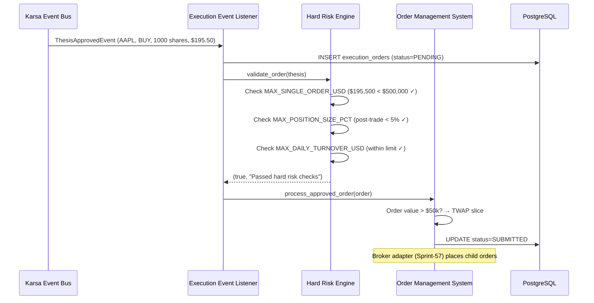

# Sprint-56: Execution Bridge — Hard Risk Engine & Order Slicer

## 1. Executive Summary
Sprint-56 adds the Hard Pre-Trade Risk Engine and TWAP Order Slicer to the **existing** `execution/` module. This component is strictly non-AI — it enforces hard quantitative limits on position sizing, daily turnover, and order value, then slices large orders. No broker integration yet (Sprint-57).

**This sprint EXTENDS the existing `execution/` bounded context.** It does NOT create a new module. The existing `OrderStagedEvent` → `OrderValidatedEvent` → `OrderRoutedEvent` → `OrderFilledEvent` flow, `BrokerAdapterPort`, `DecisionAuthorizationPort`, and `GovernanceAuthorizationPort` are all reused.

**Audit Reference:** `docs/qwen-audit/Phase_3_Execution_Bridge_Engineering_Spec.md` — Sections 3, 4.1, 4.3

## 2. Ownership Boundary Matrix
| Component | Owner | Constraint / Status |
| :--- | :--- | :--- |
| **Hard Risk Engine** | execution/ module | New service. Deterministic. No LLMs. Hard money limits. |
| **Order Slicer** | execution/ module | New service. TWAP slicing for large orders. |
| **execution_risk_limits** | execution/ module | New table. Configurable by PMs. |
| **Kill Switch** | execution/ module | Domain event on existing event bus (`KillSwitchActivatedEvent`). |

## 3. Architecture Overview
The Execution Bridge consumes `ThesisApprovedEvent` from the AI layer. Before any order reaches a broker, it must pass the Hard Risk Engine which checks: max single order value, max position size (post-trade), and daily turnover circuit breaker. If approved, the OMS creates an order record, determines slicing strategy (single order vs TWAP), and prepares child orders for broker routing (Sprint-57).

The component is designed to be the "muscle" of the desk — fully deterministic, no AI involvement, no probabilistic decisions.

## 4. Domain Model
- `ExecutionOrder` — aggregate: thesis_id, symbol, side, target_quantity, filled_quantity, order_type, limit_price, status
- `ExecutionFill` — entity: order_id, broker_fill_id, quantity, fill_price, commission
- `RiskLimit` — value object: limit_type, limit_value, is_active
- `RiskRejection` — value object: reason, limit_type, actual_value, limit_value

## 5. Aggregate Design
- `ExecutionOrder` (Aggregate Root): Owns `ExecutionFill[]`. Transitions through: `PENDING` → `RISK_REJECTED` | `SUBMITTED` → `PARTIALLY_FILLED` → `FILLED` | `CANCELLED` | `FAILED`.

## 6. Value Objects
- `OrderSide`: enum — BUY, SELL, SELL_SHORT
- `OrderType`: enum — MARKET, LIMIT, TWAP
- `OrderStatus`: enum — PENDING, RISK_REJECTED, SUBMITTED, PARTIALLY_FILLED, FILLED, CANCELLED, FAILED
- `RiskLimitType`: enum — MAX_POSITION_SIZE_PCT, MAX_DAILY_TURNOVER_USD, MAX_SINGLE_ORDER_USD

## 7. Event Contracts
- Consumes: `ThesisApprovedEvent` (from Sprint-55)
- Emits: `OrderSubmittedEvent`, `OrderFilledEvent` (from Sprint-57 feedback loop), `ExecutionFailedEvent`, `RiskRejectedEvent`

## 8. Application Services
- `HardRiskEngine`: Validates orders against quantitative limits. Three checks: max single order USD, max position size % of portfolio, daily turnover circuit breaker.
- `OrderManagementSystem`: Creates order records, determines slicing strategy, manages order lifecycle state machine.
- `OrderSlicer`: Splits large orders into TWAP child orders (e.g., $100k order → 5-minute TWAP over 30 minutes = 6 child orders).
- `KillSwitchService`: Subscribes to `KillSwitchActivatedEvent` on the existing `PostgresEventBus`. On activation, cancels all open orders and rejects new theses. The event is published through the standard event journal — not a separate topic.

## 9. Repository Design
- `PostgresExecutionOrderRepository`: CRUD for execution_orders and execution_fills.
- `PostgresRiskLimitRepository`: Read risk limits from execution_risk_limits table.

## 10. Persistence Design
Three new tables via Alembic migration:
```sql
CREATE TABLE execution_orders (
    id UUID PRIMARY KEY DEFAULT gen_random_uuid(),
    thesis_id UUID NOT NULL,
    symbol VARCHAR(20) NOT NULL,
    side VARCHAR(10) NOT NULL CHECK (side IN ('BUY', 'SELL', 'SELL_SHORT')),
    target_quantity DECIMAL(18, 8) NOT NULL,
    filled_quantity DECIMAL(18, 8) DEFAULT 0,
    order_type VARCHAR(20) NOT NULL,
    limit_price DECIMAL(18, 8),
    status VARCHAR(20) DEFAULT 'PENDING',
    broker_order_id VARCHAR(100),
    created_at TIMESTAMPTZ DEFAULT NOW(),
    updated_at TIMESTAMPTZ DEFAULT NOW()
);

CREATE TABLE execution_fills (
    id UUID PRIMARY KEY DEFAULT gen_random_uuid(),
    order_id UUID REFERENCES execution_orders(id),
    broker_fill_id VARCHAR(100),
    quantity DECIMAL(18, 8) NOT NULL,
    fill_price DECIMAL(18, 8) NOT NULL,
    commission DECIMAL(18, 4) DEFAULT 0,
    filled_at TIMESTAMPTZ DEFAULT NOW()
);

CREATE TABLE execution_risk_limits (
    id UUID PRIMARY KEY DEFAULT gen_random_uuid(),
    limit_type VARCHAR(50) UNIQUE NOT NULL,
    limit_value DECIMAL(18, 4) NOT NULL,
    is_active BOOLEAN DEFAULT TRUE
);
```

## 11. Projection Design
None. Execution state is transactional, not analytical.

## 12. Read Model Design
None. The CIO Dashboard (Sprint-59) will consume execution events.

## 13. Integration Design
- **Karsa Event Bus**: Subscribes to `karsa.ai.thesis.approved` and `karsa.system.kill_switch`.
- **PostgreSQL**: Shared instance. New schema namespace for execution tables.
- **Portfolio State Cache**: In-memory cache of current cash/positions for risk checks. Populated from event replay on startup.

## 14. Sequence Diagrams


## 15. State Diagrams
```
ExecutionOrder:
[PENDING] --risk_pass--> [SUBMITTED]
[PENDING] --risk_fail--> [RISK_REJECTED]
[SUBMITTED] --partial_fill--> [PARTIALLY_FILLED]
[SUBMITTED] --full_fill--> [FILLED]
[PARTIALLY_FILLED] --full_fill--> [FILLED]
[SUBMITTED] --cancel--> [CANCELLED]
[SUBMITTED] --broker_error--> [FAILED]
```

## 16. Failure Handling
- Duplicate `ThesisApprovedEvent` (idempotency): Track `thesis_id` in execution_orders. If a duplicate arrives, ignore it. Log the dedup.
- Portfolio state cache stale on startup: Replay last 30 days of `OrderFilledEvent` to rebuild cache.
- Kill switch: All open orders cancelled immediately. New theses rejected with `SYSTEM_HALTED` reason.

## 17. OCC Strategy
`execution_orders.updated_at` serves as a simple concurrency check. The OMS is single-writer per order (no concurrent fills for the same order).

## 18. Definition of Done
- [ ] `execution_risk_limits` table created via Alembic migration.
- [ ] Risk limits seeded with defaults: `MAX_SINGLE_ORDER_USD=500000`, `MAX_POSITION_SIZE_PCT=0.05`, `MAX_DAILY_TURNOVER_USD=5000000`.
- [ ] Hard Risk Engine rejects order exceeding MAX_SINGLE_ORDER_USD. Emits `OrderRejectedEvent`.
- [ ] Hard Risk Engine rejects order that would breach MAX_POSITION_SIZE_PCT post-trade.
- [ ] Daily turnover circuit breaker halts trading when limit reached.
- [ ] TWAP slicer correctly splits $50k+ orders into child orders (5-min intervals over 30 min).
- [ ] TWAP slicer respects market hours (no child orders after 3:55 PM ET).
- [ ] Idempotency: duplicate `OrderStagedEvent` results in only one order.
- [ ] Kill switch: `KillSwitchActivatedEvent` on event bus cancels all open orders, rejects new theses.
- [ ] Paper trading mode: orders simulated locally without broker API calls.
- [ ] Unit tests for all risk engine math and order slicer logic.
- [ ] New services registered in `bootstrap.py:ApplicationContainer`.
- [ ] All new entities use Karsa URN format (`urn:karsa:execution:order:...`).
