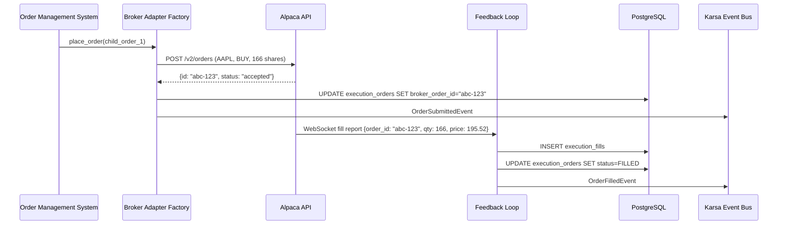

# Sprint-57: Execution Bridge — Broker Adapters & Feedback Loop

## 1. Executive Summary
Sprint-57 completes the Execution Bridge by implementing concrete broker adapters **behind the existing `BrokerAdapterPort`** interface and building the execution feedback loop. The existing `execution/` module already defines the abstract `BrokerAdapterPort.route_order()` — this sprint provides the Alpaca and IBKR implementations.

**This sprint EXTENDS the existing `execution/` bounded context.** It implements `BrokerAdapterPort` (already defined in `execution/application/ports.py`) with concrete adapters. It emits existing event types (`OrderFilledEvent`, `OrderRejectedEvent`) — not new ones.

**Audit Reference:** `docs/qwen-audit/Phase_3_Execution_Bridge_Engineering_Spec.md` — Sections 4.2, 5, 6

## 2. Ownership Boundary Matrix
| Component | Owner | Constraint / Status |
| :--- | :--- | :--- |
| **AlpacaAdapter** | execution/ module | Implements existing `BrokerAdapterPort`. Primary MVP broker. |
| **IBKRAdapter** | execution/ module | Implements existing `BrokerAdapterPort`. Secondary broker. |
| **Feedback Loop** | execution/ module | Translates broker reports → existing `OrderFilledEvent`/`OrderRejectedEvent`. |
| **BrokerAdapterFactory** | execution/ module | Resolves broker name → concrete `BrokerAdapterPort` impl. |

## 3. Architecture Overview
The Broker Adapter Factory uses the same registry pattern as the Data Bridge's Connector Factory. Each adapter implements `connect()`, `place_order()`, `cancel_order()`, and subscribes to broker WebSocket feeds for real-time fill reports. The Feedback Loop translates every broker status change into a Karsa domain event, enabling the projection worker, CIO dashboard, and AI memory to stay synchronized.

## 4. Domain Model
- `BrokerAdapter` — abstract interface: connect, place_order, cancel_order, subscribe_fills
- `BrokerFillReport` — value object: broker_order_id, broker_fill_id, quantity, fill_price, commission, timestamp
- `BrokerRejection` — value object: broker_order_id, error_message, error_code

## 5. Aggregate Design
None. Adapters are stateless service objects. Order state lives in `execution_orders` (Sprint-56).

## 6. Value Objects
- `BrokerOrderResponse`: broker_order_id, status, submitted_at
- `BrokerCredentials`: broker-specific auth material (API key, secret, endpoint)

## 7. Event Contracts
- `OrderSubmittedEvent` — order_id, broker_order_id, symbol, side, quantity, submitted_at
- `OrderFilledEvent` — order_id, fill_id, quantity, fill_price, commission, filled_at
- `ExecutionFailedEvent` — order_id, reason, broker_error_code

## 8. Application Services
- `BrokerAdapterFactory`: Resolves broker name → concrete adapter class. Instantiates with credentials from provider config.
- `AlpacaAdapter`: Implements Alpaca Markets API. Places orders via REST, receives fills via WebSocket.
- `IBKRAdapter`: Implements Interactive Brokers TWS API. Places orders via TWS gateway, receives fills via EWrapper.
- `ExecutionFeedbackLoop`: Listens to broker WebSocket, translates fill/rejection reports into Karsa events, updates execution_orders table.

## 9. Repository Design
- `PostgresExecutionOrderRepository` (from Sprint-56): Extended with `update_status()` and `record_fill()`.

## 10. Persistence Design
No new tables. Uses Sprint-56's `execution_orders` and `execution_fills`.

## 11. Projection Design
None. Execution events are consumed by the existing projection worker.

## 12. Read Model Design
None. CIO Dashboard reads execution data in Sprint-59.

## 13. Integration Design
- **Alpaca Markets API**: REST for order placement, WebSocket for real-time fill stream. Paper trading endpoint for testing.
- **IBKR TWS API**: Gateway connection for order management. Paper trading mode via TWS Paper.
- **Karsa Event Bus**: Publishes `OrderSubmittedEvent`, `OrderFilledEvent`, `ExecutionFailedEvent`.

## 14. Sequence Diagrams


## 15. State Diagrams
```
Broker Connection:
[disconnected] --connect--> [connected]
[connected] --disconnect--> [reconnecting]
[reconnecting] --success--> [connected]
[reconnecting] --max_retries--> [disconnected]
```

## 16. Failure Handling
- Broker rejects order (insufficient margin, market halted): Feedback loop emits `ExecutionFailedEvent`, updates order status to `FAILED`.
- Broker WebSocket disconnect: Auto-reconnect with exponential backoff (max 60s). During disconnect, poll REST API for order status every 10s.
- Broker API rate limit: Queue orders, respect rate limit headers. Alert if queue depth exceeds 50 orders.
- Partial fill: Update `filled_quantity` on each fill report. Only mark `FILLED` when `filled_quantity >= target_quantity`.

## 17. OCC Strategy
`execution_orders.broker_order_id` prevents duplicate submissions. The idempotency check from Sprint-56 (`thesis_id` dedup) is the primary guard.

## 18. Definition of Done
- [ ] `AlpacaAdapter` implements existing `BrokerAdapterPort.route_order()`.
- [ ] `IBKRAdapter` implements existing `BrokerAdapterPort.route_order()` (stubbed if TWS unavailable).
- [ ] `BrokerAdapterFactory` resolves broker name → concrete `BrokerAdapterPort` implementation.
- [ ] AlpacaAdapter places a paper trading order and receives confirmation.
- [ ] Broker WebSocket fill report → existing `OrderFilledEvent` emitted to event journal.
- [ ] Broker rejection → existing `OrderRejectedEvent` emitted, order status updated.
- [ ] Partial fill handling: multiple fill reports accumulate until fully filled.
- [ ] WebSocket disconnect → auto-reconnect + REST polling fallback.
- [ ] New adapters registered in `bootstrap.py:ApplicationContainer`.
- [ ] End-to-end test: `OrderStagedEvent` → Risk Engine → OMS → Broker → Fill → `OrderFilledEvent`.
