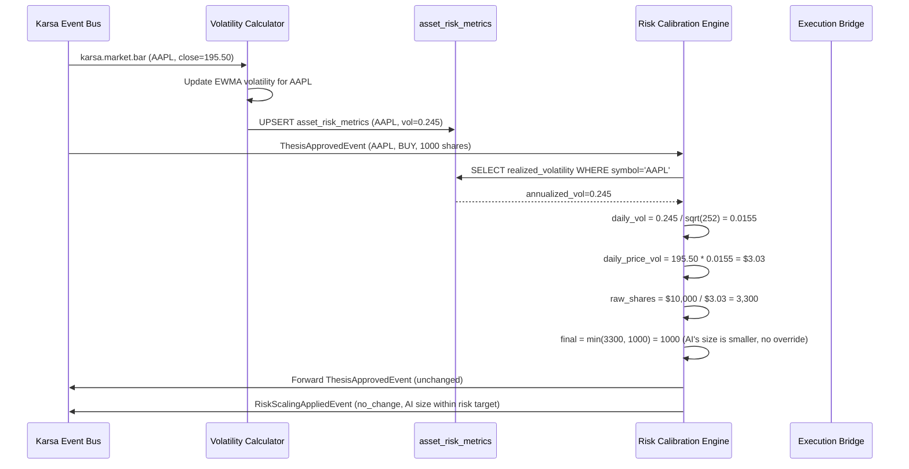

# Sprint-58: Live Risk — Volatility Targeting & Position Sizing

## 1. Executive Summary
Sprint-58 adds a Volatility Targeting service to the **existing** `risk/` module. This component intercepts approved theses before they reach the Execution Bridge and dynamically scales position sizes based on realized market volatility. The goal is volatility targeting: every trade contributes an equal amount of risk to the portfolio, regardless of the underlying asset's volatility.

**This sprint EXTENDS the existing `risk/` bounded context.** It does NOT create a new module. The existing `CovarianceForecastService` already implements EWMA estimation — this sprint reuses that math. The existing `RiskEvaluationService`, `ConcentrationRiskService`, and `LiquidityRiskService` remain untouched.

**Audit Reference:** `docs/qwen-audit/Phase_4_Live_Risk_and_CIO_Dashboards_Engineering_Spec.md` — Sections 3, 4

## 2. Ownership Boundary Matrix
| Component | Owner | Constraint / Status |
| :--- | :--- | :--- |
| **VolatilityTargetingService** | risk/ module | New service. Reuses EWMA from `CovarianceForecastService`. |
| **asset_risk_metrics** | risk/ module | New read-model projection. Not a new aggregate. |
| **RiskScalingAppliedEvent** | risk/ module | New event. Follows existing `risk/events.py` frozen dataclass pattern. |

## 3. Architecture Overview
The Risk Calibration Engine sits between the AI Governance layer (Sprint-55) and the Execution Bridge (Sprint-56). When a `ThesisApprovedEvent` arrives, the engine looks up the asset's current realized volatility (maintained by the Volatility Calculator), computes the risk-targeted position size, and overrides the AI's suggested quantity if necessary. Every override emits a `RiskScalingAppliedEvent` for audit.

The Volatility Calculator runs as a background consumer of `karsa.market.bar` events, continuously updating EWMA volatility estimates for all tracked symbols.

## 4. Domain Model
- `AssetRiskMetrics` — aggregate: symbol, timeframe, realized_volatility, beta_to_spy, var_95, updated_at
- `RiskCalibrationResult` — value object: original_quantity, calibrated_quantity, risk_scaling_applied, target_risk_usd, daily_vol_pct
- `VolatilityEstimate` — value object: symbol, annualized_vol, daily_vol_pct, calculation_timestamp

## 5. Aggregate Design
- `AssetRiskMetrics` (Aggregate Root): Updated by Volatility Calculator on each new bar. Read by Risk Calibration Engine for position sizing.

## 6. Value Objects
- `EWMAParameters`: span_days (default 20), annualization_factor (252 trading days)
- `RiskTarget`: target_risk_per_trade_usd (default $10,000)

## 7. Event Contracts
- Consumes: `karsa.market.bar` (from Data Bridge), `ThesisApprovedEvent` (from Governance Agent)
- Emits: `RiskScalingAppliedEvent` — thesis_id, ticker, original_qty, calibrated_qty, reason, volatility_estimate

## 8. Application Services
- `VolatilityCalculator`: Consumes market bars, maintains rolling EWMA volatility per symbol. Writes to `asset_risk_metrics`.
- `RiskCalibrationEngine`: Intercepts `ThesisApprovedEvent`, reads volatility, computes risk-targeted size, overrides if necessary.
- `RiskScalingAuditor`: Emits `RiskScalingAppliedEvent` for every position size override.

## 9. Repository Design
- `PostgresAssetRiskMetricsRepository`: Upsert volatility estimates. Query latest vol for a symbol.
- `PostgresPortfolioStateRepository`: Read current portfolio equity and positions for risk calculations.

## 10. Persistence Design
New table via Alembic migration:
```sql
CREATE TABLE asset_risk_metrics (
    symbol VARCHAR(20) NOT NULL,
    timeframe VARCHAR(10) NOT NULL,
    realized_volatility DECIMAL(10, 6) NOT NULL,
    beta_to_spy DECIMAL(10, 4),
    var_95 DECIMAL(18, 4),
    updated_at TIMESTAMPTZ DEFAULT NOW(),
    PRIMARY KEY (symbol, timeframe)
);
```

## 11. Projection Design
None. Risk metrics are point-in-time lookups, not projections.

## 12. Read Model Design
None. The CIO Dashboard (Sprint-59) will read risk metrics.

## 13. Integration Design
- **Karsa Event Bus**: Subscribes to `karsa.market.bar` and intercepts `karsa.ai.thesis.approved`.
- **PostgreSQL**: Reads/writes `asset_risk_metrics`. Reads portfolio state for position sizing.
- **Execution Bridge (Sprint-56)**: The calibrated `ThesisApprovedEvent` (with overridden quantity) is forwarded to the Execution Bridge.

## 14. Sequence Diagrams


## 15. State Diagrams
```
Risk Calibration:
[thesis_received] --lookup_vol--> [volatility_loaded]
[volatility_loaded] --calculate--> [size_computed]
[size_computed] --ai_smaller--> [pass_through]
[size_computed] --ai_larger--> [scaled_down]
[scaled_down] --emit_audit--> [forwarded]
[pass_through] --> [forwarded]
```

## 16. Failure Handling
- No volatility data for symbol (new/untracked asset): Use a default conservative volatility (e.g., 50% annualized). Flag the thesis with `NO_VOL_DATA`.
- Volatility calculation produces NaN/Inf: Use previous valid estimate. If no previous exists, use default conservative.
- Risk engine crash mid-interception: The `ThesisApprovedEvent` must pass through unmodified (fail-open for MVP; the hard risk engine in Sprint-56 is the ultimate backstop).

## 17. OCC Strategy
`asset_risk_metrics` uses `(symbol, timeframe)` as PK with UPSERT. The Volatility Calculator is single-writer per symbol.

## 18. Definition of Done
- [ ] `asset_risk_metrics` table created via Alembic migration.
- [ ] `VolatilityTargetingService` reuses EWMA logic from existing `CovarianceForecastService`.
- [ ] Risk Calibration intercepts thesis, calculates risk-targeted size using existing risk infrastructure.
- [ ] High-volatility asset (e.g., meme stock, vol=80%) gets smaller position size than low-volatility asset (e.g., utility stock, vol=15%).
- [ ] `RiskScalingAppliedEvent` follows existing `risk/events.py` frozen dataclass pattern (with `event_id`, `correlation_id`, `causation_id`, `timestamp`).
- [ ] Fail-open: if risk engine crashes, thesis passes through unmodified to Execution Bridge.
- [ ] PM can override fail-open with explicit approval (configurable).
- [ ] All new entities use Karsa URN format.
- [ ] New services registered in `bootstrap.py:ApplicationContainer`.
- [ ] Unit tests for EWMA math, position sizing formula, edge cases (zero volume, halted stock).
