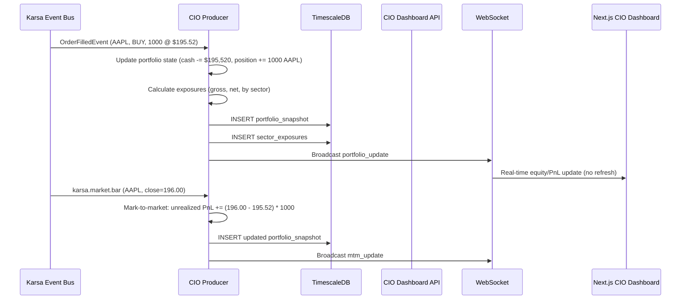

# Sprint-59: CIO Dashboard — Producer, API & Real-Time Frontend

## 1. Executive Summary
Sprint-59 is the final production sprint. It builds the `karsa-cio-producer` worker that aggregates all desk activity into portfolio-level metrics, the FastAPI endpoints that serve the CIO Dashboard, and the Next.js frontend components that render real-time portfolio oversight. After this sprint, the full pipeline — data ingestion → AI reasoning → execution → portfolio oversight — is complete.

**Audit Reference:** `docs/qwen-audit/Phase_4_Live_Risk_and_CIO_Dashboards_Engineering_Spec.md` — Sections 5, 6

## 2. Ownership Boundary Matrix
| Component | Owner | Constraint / Status |
| :--- | :--- | :--- |
| **karsa-cio-producer** | cio/ module | New service within existing CIO bounded context. |
| **CIO Dashboard API** | cio/ module | Extends existing `cio/api.py` with new endpoints. |
| **CIO Dashboard UI** | Frontend Module | Next.js real-time portfolio dashboard. |
| **Stale Data Circuit Breaker** | cio/ module | New service. Emits `StaleDataAlertEvent` on existing event bus. |

**Note:** This sprint EXTENDS the existing `cio/` module which already has `CIODecisionService`, `PortfolioOrchestrationService`, `DecisionJournalPort`, and `GovernanceExceptionPort`. The CIO Producer is a new service that composes with these existing services.

## 3. Architecture Overview
The `karsa-cio-producer` is the "accountant" of the system. It subscribes to execution fills, market bars, and thesis events, maintaining a materialized portfolio state (equity, cash, positions, exposures) in TimescaleDB hypertables. The CIO Dashboard API serves this data via REST endpoints and pushes real-time updates via WebSocket. The Next.js frontend renders an executive-level view: equity curve, sector exposure grid, risk gauges, and real-time PnL.

## 4. Domain Model
- `PortfolioSnapshot` — time-series: total_equity, cash_balance, gross_exposure, net_exposure, daily_pnl, max_drawdown_pct
- `SectorExposure` — time-series: sector_name, gross_exposure, net_exposure
- `PortfolioState` — in-memory cache: cash, positions map, last mark-to-market timestamp

## 5. Aggregate Design
None. The CIO Producer is a projection/aggregation service, not a command-side aggregate.

## 6. Value Objects
- `ExposureBreakdown`: gross, net, by_sector map
- `PnLSnapshot`: realized_pnl, unrealized_pnl, total_pnl, timestamp
- `StaleDataState`: enum — FRESH, STALE, HALTED

## 7. Event Contracts
- Consumes: `karsa.execution.fill`, `karsa.market.bar`, `karsa.ai.thesis.approved`
- Emits: `StaleDataAlertEvent` — when data feed is interrupted for >5 minutes during market hours

## 8. Application Services
- `CIOProducer`: Main event consumer. Processes fills (update positions), bars (mark-to-market), theses (track pipeline). Writes portfolio snapshots and sector exposures to TimescaleDB.
- `PortfolioStateCalculator`: Computes gross/net exposure, sector breakdown, drawdown from in-memory state.
- `StaleDataCircuitBreaker`: Monitors last `karsa.market.bar` timestamp. If gap >5 minutes during market hours, emits `StaleDataAlertEvent` and halts the Execution Bridge.
- `CIODashboardAPI`: FastAPI router serving REST endpoints and WebSocket for real-time updates.

## 9. Repository Design
- `TimescalePortfolioRepository`: Write portfolio_snapshots and sector_exposures hypertables. Read for dashboard queries.
- `TimescaleRiskMetricsRepository`: Read asset_risk_metrics (from Sprint-58) for risk gauge display.

## 10. Persistence Design
TimescaleDB hypertables (PostgreSQL extension):
```sql
CREATE EXTENSION IF NOT EXISTS timescaledb;

CREATE TABLE portfolio_snapshots (
    snapshot_time TIMESTAMPTZ NOT NULL,
    total_equity DECIMAL(18, 4) NOT NULL,
    cash_balance DECIMAL(18, 4) NOT NULL,
    gross_exposure DECIMAL(18, 4) NOT NULL,
    net_exposure DECIMAL(18, 4) NOT NULL,
    daily_pnl DECIMAL(18, 4) NOT NULL,
    max_drawdown_pct DECIMAL(10, 4) NOT NULL
);
SELECT create_hypertable('portfolio_snapshots', 'snapshot_time');

CREATE TABLE sector_exposures (
    snapshot_time TIMESTAMPTZ NOT NULL,
    sector_name VARCHAR(50) NOT NULL,
    gross_exposure DECIMAL(18, 4) NOT NULL,
    net_exposure DECIMAL(18, 4) NOT NULL
);
SELECT create_hypertable('sector_exposures', 'snapshot_time');
```

## 11. Projection Design
The CIO Producer IS the projection. It materializes raw events into time-series read-models. This is the read-side of the CQRS pattern for the portfolio level.

## 12. Read Model Design
Exposed via FastAPI endpoints:
- `GET /api/cio/portfolio/summary` — latest snapshot (equity, cash, exposures, PnL)
- `GET /api/cio/portfolio/equity-curve?timeframe=1D|1W|1M|YTD` — time-series for chart
- `GET /api/cio/exposures/sectors` — current sector breakdown
- `WS /api/cio/ws/live` — real-time push for fills, PnL updates, stale data alerts

## 13. Integration Design
- **Karsa Event Bus**: Subscribes to execution fill, market bar, and thesis events.
- **TimescaleDB**: PostgreSQL extension for time-series optimization.
- **Next.js Frontend**: WebSocket connection for real-time updates. REST for historical charts.
- **Execution Bridge (Sprint-56)**: Stale Data Circuit Breaker can halt the bridge via kill switch topic.

## 14. Sequence Diagrams


## 15. State Diagrams
```
Stale Data Circuit Breaker:
[FRESH] --no_bar_for_5min--> [STALE]
[STALE] --bar_received--> [FRESH]
[STALE] --no_bar_for_15min--> [HALTED]
[HALTED] --manual_resume--> [FRESH]
```

## 16. Failure Handling
- TimescaleDB write failure: Buffer snapshots in-memory (up to 1000), retry on next tick. Alert if buffer overflows.
- WebSocket disconnect: Client auto-reconnects. On reconnect, API sends latest snapshot as initial state.
- CIO Producer crash: On restart, replay last 24 hours of events to rebuild in-memory portfolio state.
- Stale data during market hours: Halt Execution Bridge via kill switch. Display "STALE DATA — TRADING HALTED" on dashboard.

## 17. OCC Strategy
Not applicable. Portfolio snapshots are append-only time-series. No concurrent mutation.

## 18. Definition of Done
- [ ] TimescaleDB hypertables created for `portfolio_snapshots` and `sector_exposures` (with fallback to standard PostgreSQL if TimescaleDB unavailable).
- [ ] CIO Producer consumes `OrderFilledEvent`, updates portfolio state within 2000ms.
- [ ] CIO Producer consumes market bars, performs mark-to-market on open positions.
- [ ] REST endpoints return correct portfolio summary, equity curve, and sector exposures.
- [ ] WebSocket endpoint has token-based authentication.
- [ ] WebSocket pushes real-time updates on fill and mark-to-market events.
- [ ] Next.js CIO Dashboard renders: top banner (equity, PnL, exposures), equity curve chart, sector exposure AG Grid, risk gauges.
- [ ] Stale Data Circuit Breaker: disconnecting Data Bridge triggers "STALE DATA" warning and halts Execution Bridge.
- [ ] CIO Producer composes with existing `CIODecisionService` and `PortfolioOrchestrationService`.
- [ ] New services registered in `bootstrap.py:ApplicationContainer`.
- [ ] End-to-end test: Full pipeline (Data Bridge → AI → Execution → CIO Dashboard updates in real-time).
