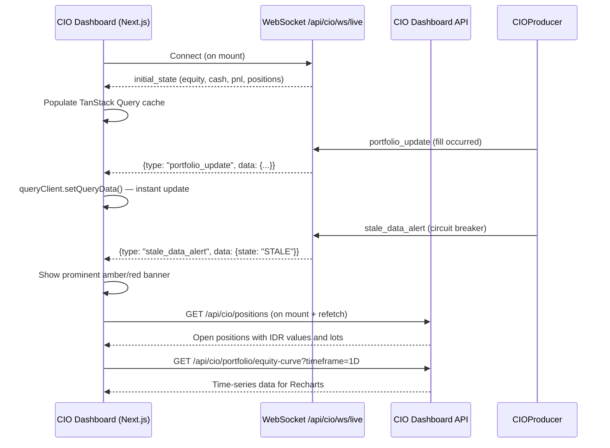
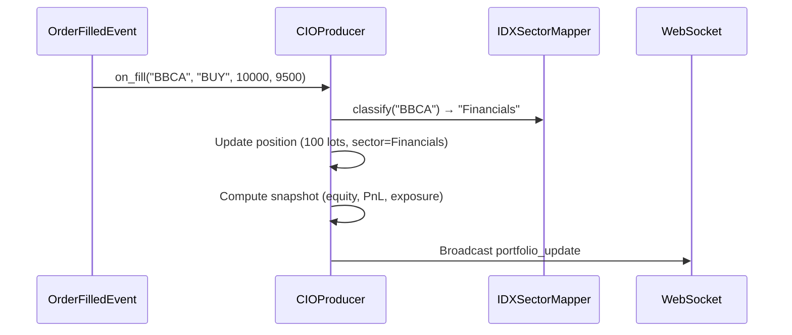

# Sprint-60: CIO Dashboard — IDX Localization, Real-Time Frontend & Safety Hardening

## 1. Executive Summary

Sprint-60 addresses the critical findings from the IDX Trader UAT Audit conducted against the CIO Dashboard (Sprint-59). The backend is architecturally sound — `CIOProducer`, `StaleDataCircuitBreaker`, WebSocket endpoint, and REST APIs are correctly implemented. The problem is a **frontend integration gap**: the Next.js dashboard still uses Sprint-16 REST polling architecture and does not connect to any Sprint-59 backend infrastructure. This sprint bridges that gap and adds IDX-specific localization required for live Indonesian Rupiah capital.

**Audit Reference:** IDX Trader UAT Audit Report (Sprint-59 post-implementation review)

**Problem Statement:** An IDX Portfolio Manager managing a multi-billion Rupiah portfolio cannot trust this dashboard because: (1) currency is hardcoded to USD, (2) no real-time updates, (3) no stale data warnings, (4) no IDX lot/sector handling, (5) no equity curve or position grids.

## 2. Ownership Boundary Matrix

| Component | Owner | Constraint / Status |
| :--- | :--- | :--- |
| **IDX Currency Formatter** | Frontend Module | Extends existing `lib/formatters/currency.ts`. Must handle IDR with `id-ID` locale. |
| **IDX Lot Size Handler** | Frontend + Backend | New utility. 1 lot = 100 shares. Display in lots, store in shares. |
| **IDX Sector Mapper** | Backend cio/ module | New service. Maps IDX tickers to IDX sectors (Financials, Telco, etc.). |
| **WebSocket Live Hook** | Frontend Module | New hook consuming existing `/api/cio/ws/live` endpoint. |
| **Stale Data Banner** | Frontend Module | New component. Polls `/api/cio/stale-data` or listens on WebSocket. |
| **Equity Curve Chart** | Frontend Module | New Recharts `AreaChart` consuming `/api/cio/portfolio/equity-curve`. |
| **Sector Exposure Grid** | Frontend Module | New AG Grid consuming `/api/cio/exposures/sectors`. |
| **Open Positions Grid** | Frontend Module | New AG Grid showing live positions with PnL in IDR. |
| **Unified Portfolio Hooks** | Frontend Module | Consolidate `hooks/portfolio/` and `hooks/cio-dashboard/` to use Sprint-59 backend. |
| **Drawdown Alert** | Frontend Module | Visual indicator when drawdown exceeds configurable threshold. |

## 3. Architecture Overview

This sprint is **frontend-heavy** with minor backend additions. The backend (Sprint-59) already exposes all required endpoints and WebSocket. The work is:

1. **Frontend WebSocket integration** — Replace REST polling with persistent WebSocket connection to `/api/cio/ws/live`. TanStack Query cache updated in real-time on every `portfolio_update`, `mtm_update`, and `stale_data_alert` message.

2. **IDX localization layer** — Currency formatter, lot size utilities, sector mapper. All display values in IDR with proper `id-ID` formatting. All quantities shown in lots (1 lot = 100 shares).

3. **Dashboard component suite** — Equity curve (Recharts), sector exposure grid (AG Grid), open positions grid (AG Grid), stale data banner, drawdown alert. All consume Sprint-59 backend endpoints.

4. **Hook consolidation** — Unify the two disconnected portfolio hook systems into a single set of hooks that consume the Sprint-59 CIO Dashboard API.

## 4. Domain Model

No new domain models. This sprint extends the frontend ViewModel layer:

- `PortfolioSummaryViewModel` — extended: `currency: "IDR"`, `lotSize: number`
- `PositionViewModel` — new: `symbol`, `quantityShares`, `quantityLots`, `entryPrice`, `currentPrice`, `unrealizedPnlIDR`, `sector`
- `SectorExposureViewModel` — new: `sectorName`, `grossExposureIDR`, `netExposureIDR`, `allocationPct`
- `StaleDataViewModel` — new: `state: "FRESH" | "STALE" | "HALTED"`, `lastBarTime`, `warningMessage`
- `EquityCurvePointViewModel` — new: `timestamp`, `equityIDR`, `dailyPnlIDR`

## 5. Aggregate Design

None. This sprint modifies the read-side (frontend) only.

## 6. Value Objects

- `IDRCurrency`: Formatter configuration for Indonesian Rupiah (`id-ID` locale, `Rp` symbol, dot thousand separator, no decimal for whole values)
- `LotConfiguration`: `lotSize: 100` (IDX standard), `displayUnit: "lot"` vs `"share"`
- `IDXSectorMapping`: Static map of IDX ticker → IDX sector classification

## 7. Event Contracts

No new events. This sprint consumes existing events via WebSocket:
- `portfolio_update` — pushed on fill, contains equity/cash/PnL/exposure
- `mtm_update` — pushed on mark-to-market, contains updated position values
- `stale_data_alert` — pushed on circuit breaker state change

## 8. Application Services

### 8.1 Backend Additions

- `IDXSectorMapper`: New service in `cio/` module. Maps IDX tickers to IDX industry sectors using a configurable lookup table. Applied during `CIOProducer.on_fill()` to auto-classify positions.
- `PortfolioAPI` extension: Add `GET /api/cio/positions` endpoint returning current open positions with quantities, prices, PnL, and sector classification.

### 8.2 Frontend Additions

- `useLivePortfolioUpdates()`: WebSocket hook that connects to `/api/cio/ws/live`, parses messages, and updates TanStack Query cache in real-time. Handles reconnection with exponential backoff.
- `useStaleDataState()`: Hook that polls `/api/cio/stale-data` every 5 seconds during market hours, or receives `stale_data_alert` via WebSocket.
- `usePositions()`: Hook consuming `GET /api/cio/positions` for the open positions grid.
- `useEquityCurve(timeframe)`: Hook consuming `GET /api/cio/portfolio/equity-curve` for the chart.
- `useSectorExposures()`: Hook consuming `GET /api/cio/exposures/sectors` for the sector grid.

## 9. Repository Design

No new repositories. Uses existing `TimescalePortfolioRepository` (Sprint-59).

## 10. Persistence Design

No new tables. Extends existing schema:

```sql
-- Add sector classification to positions (if not already present)
-- The CIOProducer already stores sector per position in-memory.
-- No schema change needed — sector comes from IDXSectorMapper at fill time.
```

## 11. Projection Design

None. Frontend-only changes.

## 12. Read Model Design

### 12.1 New Backend Endpoint

```
GET /api/cio/positions
```

Response:
```json
{
  "positions": [
    {
      "symbol": "BBCA",
      "quantity_shares": 10000,
      "quantity_lots": 100,
      "avg_entry_price": 9500,
      "current_price": 9750,
      "market_value_idr": 97500000,
      "unrealized_pnl_idr": 2500000,
      "unrealized_pnl_pct": 2.63,
      "sector": "Financials"
    }
  ],
  "total_market_value_idr": 97500000,
  "total_unrealized_pnl_idr": 2500000
}
```

### 12.2 Frontend Components

| Component | Data Source | Library |
| :--- | :--- | :--- |
| Top Banner (Equity, PnL, Cash) | WebSocket `portfolio_update` + REST fallback | TanStack Query |
| Equity Curve Chart | `GET /api/cio/portfolio/equity-curve` | Recharts `AreaChart` |
| Sector Exposure Grid | `GET /api/cio/exposures/sectors` | AG Grid `React` |
| Open Positions Grid | `GET /api/cio/positions` | AG Grid `React` |
| Risk Traffic Light | `GET /api/risk/traffic-light` | Custom component |
| Stale Data Banner | WebSocket `stale_data_alert` + REST polling | Custom component |
| Drawdown Alert | WebSocket `portfolio_update` (max_drawdown_pct) | Custom component |

## 13. Integration Design

- **WebSocket**: Frontend connects to existing `WS /api/cio/ws/live` (Sprint-59). No backend changes needed.
- **REST API**: Frontend consumes existing `/api/cio/*` endpoints (Sprint-59). One new endpoint added (`/api/cio/positions`).
- **TanStack Query**: WebSocket messages update the query cache directly via `queryClient.setQueryData()`, eliminating stale data.
- **AG Grid**: Existing dependency in `karsa-web`. Reused for sector and position grids.
- **Recharts**: Existing dependency in `karsa-web`. Used for equity curve chart.

## 14. Sequence Diagrams





## 15. State Diagrams

```
Stale Data Banner:
[HIDDEN] --state=FRESH--> [HIDDEN]
[HIDDEN] --state=STALE--> [AMBER_BANNER]
[HIDDEN] --state=HALTED--> [RED_BANNER_PULSING]
[AMBER_BANNER] --state=FRESH--> [HIDDEN]
[AMBER_BANNER] --state=HALTED--> [RED_BANNER_PULSING]
[RED_BANNER_PULSING] --state=FRESH--> [HIDDEN]
[RED_BANNER_PULSING] --manual_resume--> [HIDDEN]

WebSocket Connection:
[disconnected] --connect--> [connected]
[connected] --disconnect--> [reconnecting]
[reconnecting] --success--> [connected]
[reconnecting] --max_retries--> [disconnected]
[disconnected] --manual_retry--> [connecting]
```

## 16. Failure Handling

- **WebSocket disconnect**: Auto-reconnect with exponential backoff (1s, 2s, 4s, 8s, max 30s). Fall back to REST polling (5s interval) during disconnect. Show "Reconnecting..." indicator.
- **WebSocket message parse error**: Log and skip. Do not crash the UI.
- **REST endpoint failure**: TanStack Query `retry: 3` with exponential backoff. Show `ErrorState` component with retry button.
- **IDR formatting edge case**: Negative Rupiah values displayed as `-Rp 1.234.567` (minus prefix, not parenthetical). Zero displayed as `Rp 0`.
- **Lot size rounding**: Quantities that are not multiples of 100 shares displayed as fractional lots (e.g., 150 shares = 1.5 lot). PM can see exact share count on hover.
- **Unknown IDX ticker**: Sector defaults to "Other" if not in `IDX_SECTOR_MAP`. Log warning for classification.

## 17. OCC Strategy

Not applicable. Frontend-only changes with no concurrent mutation.

## 18. Definition of Done

### IDX Localization
- [ ] All currency values displayed in IDR with `id-ID` locale (`Rp 15.000.000.000`, not `$15.0B`).
- [ ] `formatCurrency()` supports `"IDR"` currency with proper Miliar/jt abbreviation.
- [ ] Position quantities displayed in lots (1 lot = 100 shares) with share count on hover.
- [ ] `IDX_SECTOR_MAP` classifies BBCA/BBRI/BMRI to "Financials", TLKM to "Telecommunications", ANTM to "Basic Materials", GOTO to "Technology", etc.
- [ ] Sector Exposure grid correctly shows IDX sector breakdown.

### Real-Time Frontend
- [ ] `useLivePortfolioUpdates()` WebSocket hook connects to `/api/cio/ws/live`.
- [ ] Top banner (Equity, PnL, Cash) updates instantly on `portfolio_update` message without page refresh.
- [ ] WebSocket auto-reconnects on disconnect with exponential backoff.
- [ ] Falls back to REST polling (5s) when WebSocket is disconnected.
- [ ] Equity Curve chart renders smoothly with Recharts, updates on new data points.
- [ ] AG Grid for Sector Exposure renders with sort/filter, updates on `portfolio_update`.
- [ ] AG Grid for Open Positions shows symbol, lots, entry/current price, PnL (IDR), sector.

### Safety & Circuit Breakers
- [ ] Stale Data Banner shows amber warning when `state=STALE` (>5min no data).
- [ ] Stale Data Banner shows red pulsing warning when `state=HALTED` (>15min no data).
- [ ] Banner disappears immediately when data feed restores (`state=FRESH`).
- [ ] Drawdown alert shows visual indicator when `max_drawdown_pct > 5%` (amber) or `> 10%` (red).
- [ ] `staleTime` reduced from 60s to 5s for portfolio summary during market hours.

### Integration & Testing
- [ ] Unified hooks — `hooks/portfolio/` and `hooks/cio-dashboard/` consolidated.
- [ ] Unit tests for IDR formatting, lot size conversion, sector mapping.
- [ ] Unit tests for WebSocket hook (connect, message handling, reconnection).
- [ ] Integration test: fill event → WebSocket push → UI update within 1 second.
- [ ] Integration test: stale data → banner appears → data restores → banner disappears.
- [ ] End-to-end test: Full IDX flow (BBCA fill → mark-to-market → equity curve updates).

## 19. References

- **Audit:** IDX Trader UAT Audit Report (Sprint-59 post-implementation)
- **Sprint-59 Design:** `docs/implementation/sprint-59/design.md`
- **Sprint-59 Backend:** `src/karsa/cio/dashboard_api.py`, `dashboard_services.py`, `dashboard_models.py`
- **Frontend Patterns:** `karsa-web/src/features/*/types/viewmodels.ts`, `karsa-web/src/hooks/*/`
- **Style Guide:** `docs/DOCUMENTATION_STYLE_GUIDE.md`
- **Engineering Standards:** `docs/ENGINEERING_STANDARDS.md`
