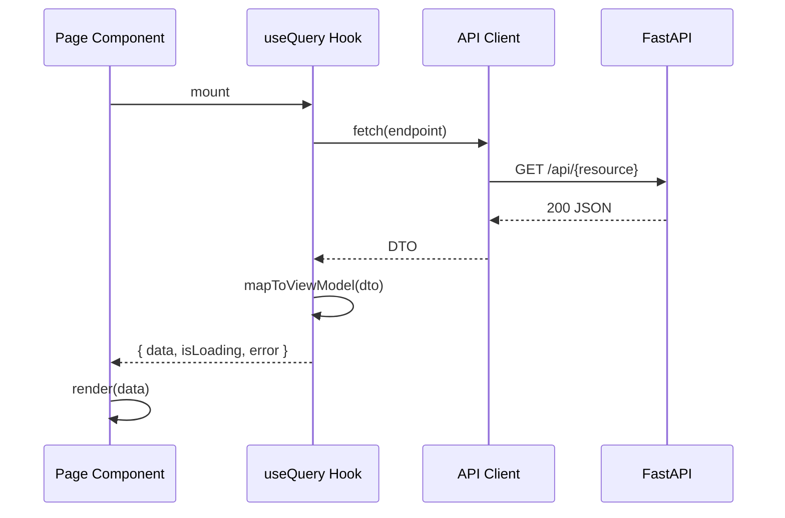
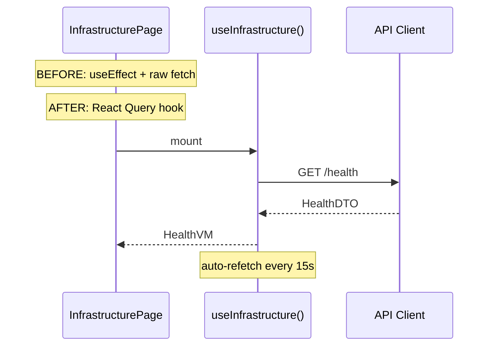

# Sprint-63: Karsa Web Console Revamp

## 1. Executive Summary

The Karsa Web Console has accumulated architectural inconsistencies across 12+ sprints of incremental feature development. This sprint addresses structural debt in the frontend codebase: mixed table implementations, missing route pages, broken patterns (direct fetch vs React Query), shadowed components, absent feature encapsulation, and a monochrome design system lacking brand identity.

**Trigger**: Frontend architectural audit (2026-06-24) identified 10 critical inconsistencies requiring systematic remediation before the next wave of feature work.

**Design Reference**: `docs/revamp/karsa_console_revamp.html` — an interactive HTML prototype that defines the target UI for the revamped console. All pages, components, and layouts in this sprint must match the prototype's structure and visual language. The prototype defines 5 top-level pages: Dashboard, Signals, Portfolio, Performance, Governance.

**Scope**: Frontend-only sprint. No backend changes. No new API endpoints.

## 2. Ownership Boundary Matrix

| Component | Owner | Constraint | Status |
|-----------|-------|------------|--------|
| `karsa-web/src/app/` | Frontend | All route pages | To refactor |
| `karsa-web/src/components/` | Frontend | Shared UI layer | To refactor |
| `karsa-web/src/features/` | Frontend | Domain encapsulation | To refactor |
| `karsa-web/src/hooks/` | Frontend | Data fetching layer | To refactor |
| `karsa-web/src/config/navigation.ts` | Frontend | Nav structure | To update |
| `karsa-web/src/app/globals.css` | Frontend | Design tokens | To extend |
| `karsa-web/src/lib/` | Frontend | Utilities | Reuse |
| `karsa-web/src/api/` | Frontend | API client | Reuse |
| `karsa-web/src/state/` | Frontend | Zustand stores | To extend |

## 3. Architecture Overview

Frontend-only structural refactor. The design reference (`docs/revamp/karsa_console_revamp.html`) defines a 5-page console with top-tab navigation, live ticker tape, and dense financial UI. The sprint restructures the existing 12+ pages into this 5-page model.

### Target Navigation (from prototype)

| Tab | Route | Prototype Sections |
|-----|-------|--------------------|
| **Dashboard** | `/` | KPI strip (NAV, PnL, Alpha, Sharpe, DD, Cash), equity curve vs IHSG, risk monitor, open positions table |
| **Signals** | `/signals` | Thesis/memo signal hub with approve/reject workflow, filter tabs (All/Pending/Approved/Rejected), conviction + target/stop metadata |
| **Portfolio** | `/portfolio` | Full positions table, sector exposure bars, conglomerate exposure heatmap with limit tracking |
| **Performance** | `/performance` | KPI strip (YTD, Selection α, Allocation α, Beta drag, Brier, Win rate), Brinson attribution table, conviction calibration (Brier by tier) |
| **Governance** | `/governance` | Mandate compliance checklist, infrastructure status dashboard |

### Work Streams

1. **WS1: Shell & Navigation** — Replace sidebar navigation with top-tab bar matching the prototype. Add live ticker tape (IHSG, USD/IDR, top holdings). Add WIB clock. Unify the 12+ existing routes into the 5-page model.
2. **WS2: Dashboard Page** — Merge CIO Dashboard + Analytics into a single `/` page. KPI strip, equity curve (TradingView), risk monitor panel, open positions table with conviction pips.
3. **WS3: Signals Page** — New `/signals` route. Merge theses + memos into a signal hub with approve/reject buttons, filter tabs, conviction metadata, target/stop/size display.
4. **WS4: Portfolio & Performance Pages** — Refactor `/portfolio` with conglomerate heatmap. Refactor `/performance` with Brinson attribution table and Brier calibration bars.
5. **WS5: Governance Page** — Merge oversight + infrastructure into `/governance`. Mandate compliance checklist + infrastructure health status.

## 4. Domain Model

Existing ViewModels in `features/*/types/viewmodels.ts` are reused and consolidated. The prototype defines these data shapes:

### Dashboard Page

| ViewModel | Source | Fields (from prototype) |
|-----------|--------|------------------------|
| `DashboardKpiVM` | `features/cio-dashboard/` | `nav`, `dailyPnl`, `dailyPnlPct`, `ytdAlpha`, `sharpe`, `maxDD`, `cash`, `cashIdle` |
| `EquityCurveVM` | `features/cio-dashboard/` | `karsa: Point[]`, `ihsg: Point[]`, `period: string` |
| `RiskMonitorVM` | `features/cio-dashboard/` | `var95`, `volAnn`, `betaIhsg`, `conglomerateExposure`, `maxDD`, `rupiahWeekly` — each with `value`, `status: green|amber|red`, `barPct` |
| `PositionVM` | `features/portfolio/` | `ticker`, `sector`, `side`, `lots`, `entry`, `last`, `mktVal`, `pnlPct`, `conviction: 1-5` |

### Signals Page

| ViewModel | Source | Fields (from prototype) |
|-----------|--------|------------------------|
| `SignalVM` | `features/theses/` + `features/memos/` | `ticker`, `action: BUY|SELL|HOLD`, `status: Pending|Approved|Rejected`, `summary`, `conviction`, `target`, `stop`, `size`, `style`, `thesisId` |

### Portfolio Page

| ViewModel | Source | Fields (from prototype) |
|-----------|--------|------------------------|
| `SectorExposureVM` | `features/portfolio/` | `sector`, `pctNav` |
| `ConglomerateExposureVM` | `features/portfolio/` | `name`, `exposurePct`, `limitPct`, `status: ok|warning|breach` |

### Performance Page

| ViewModel | Source | Fields (from prototype) |
|-----------|--------|------------------------|
| `PerformanceKpiVM` | `features/performance/` | `ytdReturn`, `selectionAlpha`, `allocationAlpha`, `betaDrag`, `brierScore`, `winRate` |
| `BrinsonAttributionVM` | `features/performance/` | `period`, `selection`, `allocation`, `beta`, `residual`, `total`, `winRate` |
| `CalibrationVM` | `features/performance/` | `tier: STRONG|MEDIUM|WEAK`, `winPct`, `count`, `target` |

### Governance Page

| ViewModel | Source | Fields (from prototype) |
|-----------|--------|------------------------|
| `MandateCheckVM` | `features/governance/` | `rule`, `status: pass|warn|fail`, `value` |
| `InfrastructureStatusVM` | `features/cio-dashboard/` | `service`, `status: online|degraded|offline`, `note` |

## 5. Aggregate Design

None. This sprint modifies read-side only (frontend).

## 6. Value Objects

| Value Object | Specification |
|-------------|---------------|
| `BrandColor` | OKLCH color space, chromatic primary + accent. Defined as CSS custom properties. |
| `StatusSemantic` | Extends existing `StatusBadge` with `info` variant (blue). Maps to CSS tokens `--status-success`, `--status-warning`, `--status-destructive`, `--status-info`. |
| `ChartPalette` | 8-color categorical palette for charts. Defined as `--chart-palette-1` through `--chart-palette-8`. |

## 7. Event Contracts

No new events. Frontend-only sprint.

## 8. Application Services

### Backend Additions

None.

### Frontend Additions

| Service | Location | Purpose |
|---------|----------|---------|
| `useDashboardKpis()` | `hooks/dashboard/index.ts` | React Query hook for NAV, PnL, Alpha, Sharpe, DD, Cash |
| `useEquityCurve()` | `hooks/dashboard/index.ts` | React Query hook for Karsa vs IHSG equity curve |
| `useRiskMonitor()` | `hooks/dashboard/index.ts` | React Query hook for VaR, Vol, Beta, conglomerate risk |
| `useSignals()` | `hooks/signals/index.ts` | React Query hook merging theses + memos into signal feed |
| `useApproveSignal()` | `hooks/signals/index.ts` | Mutation hook for thesis/memo approval |
| `useRejectSignal()` | `hooks/signals/index.ts` | Mutation hook for thesis/memo rejection |
| `useSectorExposure()` | `hooks/portfolio/index.ts` | React Query hook for sector allocation bars |
| `useConglomerateExposure()` | `hooks/portfolio/index.ts` | React Query hook for conglomerate limit tracking |
| `usePerformanceKpis()` | `hooks/performance/index.ts` | React Query hook for YTD, Alpha, Brier, Win rate |
| `useBrinsonAttribution()` | `hooks/performance/index.ts` | React Query hook for period-level attribution |
| `useCalibration()` | `hooks/performance/index.ts` | React Query hook for Brier score by conviction tier |
| `useMandateChecks()` | `hooks/governance/index.ts` | React Query hook for mandate compliance rules |
| `useInfrastructureStatus()` | `hooks/governance/index.ts` | React Query hook replacing direct fetch |
| `TickerTape` | `components/shared/TickerTape.tsx` | Live market ticker (IHSG, USD/IDR, top holdings) |
| `KpiStrip` | `components/shared/KpiStrip.tsx` | Row of 6 KPI cards with delta and status |
| `ConvictionPips` | `components/shared/ConvictionPips.tsx` | 5-dot conviction indicator |
| `StatusBadge` | `components/ui/status-badge.tsx` | Semantic status: Pending/Approved/Rejected |
| `ActionBadge` | `components/ui/action-badge.tsx` | BUY/SELL/HOLD action indicator |

## 9. Repository Design

None. Frontend-only sprint.

## 10. Persistence Design

No new tables. No schema changes.

## 11. Projection Design

None. Frontend-only sprint.

## 12. Read Model Design

### API Endpoints (Existing — consumed by new hooks)

| Endpoint | Method | Source | Maps to Page |
|----------|--------|--------|-------------|
| `/api/portfolio/summary` | GET | `api/endpoints/portfolio.ts` | Dashboard, Portfolio |
| `/api/portfolio/positions` | GET | `api/endpoints/portfolio.ts` | Dashboard, Portfolio |
| `/api/portfolio/sector-exposure` | GET | `api/endpoints/portfolio.ts` | Portfolio |
| `/api/portfolio/conglomerate-exposure` | GET | `api/endpoints/portfolio.ts` | Portfolio |
| `/api/theses` | GET | `api/endpoints/theses.ts` | Signals |
| `/api/memos` | GET | `api/endpoints/memos.ts` | Signals |
| `/api/performance` | GET | `api/endpoints/performance.ts` | Performance |
| `/api/governance` | GET | `api/endpoints/governance.ts` | Governance |
| `/api/health` | GET | Existing | Governance |

### Frontend Components (mapped to prototype)

| Component | Prototype Section | Data Source | Library |
|-----------|------------------|-------------|---------|
| `DashboardPage` | Dashboard tab | `useDashboardKpis()`, `useEquityCurve()`, `useRiskMonitor()`, `usePositions()` | KpiStrip, TradingView, RiskPanel, DataTable |
| `SignalsPage` | Signals tab | `useSignals()` | DataTable with approve/reject actions |
| `PortfolioPage` | Portfolio tab | `usePositions()`, `useSectorExposure()`, `useConglomerateExposure()` | DataTable, SectorBars, ConglomerateHeatmap |
| `PerformancePage` | Performance tab | `usePerformanceKpis()`, `useBrinsonAttribution()`, `useCalibration()` | KpiStrip, AttributionTable, BrierBars |
| `GovernancePage` | Governance tab | `useMandateChecks()`, `useInfrastructureStatus()` | ChecklistPanel, StatusPanel |
| `TickerTape` | Top bar ticker | `useTickerData()` | Inline |
| `AppShell` | Top bar + tabs | — | Replaces GlobalSidebar |

## 13. Integration Design

- **Navigation**: Replace sidebar with top-tab bar. 5 tabs: Dashboard, Signals, Portfolio, Performance, Governance. Tab state via Next.js App Router (`usePathname()`).
- **Ticker Tape**: Live market data strip in the top bar. Uses `useTickerData()` hook with 30s polling. Shows IHSG, USD/IDR, and top 3 holdings by weight.
- **Clock**: WIB timezone clock in top-right corner. Client-side only, updates every second.
- **Data Fetching**: All pages use TanStack React Query via domain hooks. No direct `fetch()` calls.
- **Caching**: Existing stale time (60s) and GC time (5min) apply. Risk monitor uses 15s stale time.
- **State Management**: Zustand store extended with `activeTab` for navigation state.
- **Theming**: `next-themes` class-based toggle. Dark mode is the primary mode (matching prototype).

## 14. Sequence Diagrams

### Page Load with React Query



### Infrastructure Health (Before vs After)



## 15. State Diagrams

### Top-Level Shell (from prototype)

```
┌──────────────────────────────────────────────────────────────┐
│ [K] Dashboard  Signals  Portfolio  Performance  Governance   │
│     ─────────  ───────  ─────────  ───────────  ──────────   │
│ IHSG 6,842 ▼  USD/IDR 16,240 ▼  CUAN 4,180 ▲  ...   14:32 │
├──────────────────────────────────────────────────────────────┤
│                                                              │
│  {active page content}                                       │
│                                                              │
└──────────────────────────────────────────────────────────────┘
```

### Dashboard Page Layout

```
┌──────────────────────────────────────────────────────────────┐
│ ┌──────┐ ┌──────┐ ┌──────┐ ┌──────┐ ┌──────┐ ┌──────┐     │
│ │ NAV  │ │ PnL  │ │Alpha │ │Sharpe│ │Max DD│ │ Cash │     │
│ │4.83B │ │+12.4M│ │+4.12%│ │ 0.82 │ │-11.4%│ │18.2% │     │
│ └──────┘ └──────┘ └──────┘ └──────┘ └──────┘ └──────┘     │
│ ┌─────────────────────────────────┐ ┌────────────────────┐  │
│ │ Equity curve (Karsa vs IHSG)    │ │ Risk monitor       │  │
│ │ ▁▂▃▄▅▆▇█▇█▇█▇█▇████████████   │ │ VaR 95%    1.41%   │  │
│ │                                 │ │ Vol ann.   17.8%   │  │
│ │                                 │ │ Beta       1.08    │  │
│ │                                 │ │ Prajogo    7.2% ⚠  │  │
│ └─────────────────────────────────┘ └────────────────────┘  │
│ ┌──────────────────────────────────────────────────────────┐│
│ │ Open positions (9 holdings · 81.8% deployed)             ││
│ │ Ticker Side Lots Entry  Last   MktVal    PnL%  Conv     ││
│ │ CUAN   BUY  500  3,940  4,180  209M     +6.09% ●●●●○   ││
│ │ TPIA   BUY  800  1,580  1,635  130.8M   +3.48% ●●●○○   ││
│ │ ...                                                      ││
│ └──────────────────────────────────────────────────────────┘│
└──────────────────────────────────────────────────────────────┘
```

### Signal Page Layout

```
┌──────────────────────────────────────────────────────────────┐
│ Signal hub — theses & memos           3 pending · 1 approved │
│ [All] [Pending] [Approved] [Rejected]                        │
├──────────────────────────────────────────────────────────────┤
│ BUY  CUAN  [Pending]                                         │
│      Prajogo petrochemical — MSCI reclassification inflow... │
│      Conv: STRONG 4/5 · Target 4,800 · Stop 3,750 · 2.8%   │
│      [✓ Approve] [✕ Reject]                                  │
├──────────────────────────────────────────────────────────────┤
│ BUY  TPIA  [Pending]                                         │
│      Chandra Asri capex cycle winding down, FCF inflecting.. │
│      Conv: MEDIUM 3/5 · Target 2,000 · Stop 1,450 · 1.8%   │
│      [✓ Approve] [✕ Reject]                                  │
├──────────────────────────────────────────────────────────────┤
│ SELL BUMI  [Pending]                                         │
│      Bakrie governance risk re-elevated. ICI coal price...   │
│      Conv: STRONG 4/5 · Exit: market · PnL impact −3.2M    │
│      [✓ Approve] [✕ Reject]                                  │
├──────────────────────────────────────────────────────────────┤
│ HOLD BBCA  [Approved]                                        │
│      Fundamental thesis intact. NIM guidance maintained 5.3% │
│      Conv: STRONG 5/5 · Monitor IDR trigger · Review 2W     │
└──────────────────────────────────────────────────────────────┘
```

## 16. Failure Handling

| Failure Mode | Mitigation |
|-------------|------------|
| API endpoint returns 404 for new routes | Graceful empty state with `EmptyState` component |
| React Query cache miss on route change | Skeleton loading via `LoadingSkeleton` |
| AG Grid column definition mismatch | Defensive column defaults with `valueFormatter` fallback |
| Theme token missing in custom component | Fallback to `--muted` / `--muted-foreground` |
| Breadcrumb generation for nested routes | Static mapping in `navigation.ts` with fallback to parent label |

## 17. OCC Strategy

Not applicable. Frontend-only sprint with no concurrent write conflicts.

## 18. Definition of Done

### WS1: Shell & Navigation
- [ ] Top-tab navigation bar replaces sidebar (5 tabs: Dashboard, Signals, Portfolio, Performance, Governance)
- [ ] Ticker tape displays IHSG, USD/IDR, and top 3 holdings with live-style updates (30s polling)
- [ ] WIB clock renders in top-right corner, updates every second
- [ ] Active tab highlighted with bottom border accent
- [ ] All 12+ existing routes redirect to the appropriate 5-page tab
- [ ] Old sidebar navigation removed, `GlobalSidebar.tsx` replaced with `TopTabBar.tsx`

### WS2: Dashboard Page
- [ ] KPI strip renders 6 metrics: NAV, Daily PnL, YTD Alpha, Sharpe, Max DD, Cash
- [ ] Each KPI shows value, delta (pos/neg color), and subtitle
- [ ] Equity curve chart shows Karsa vs IHSG with dashed IHSG line
- [ ] Risk monitor panel shows 6 risk metrics with bar indicators and green/amber/red dots
- [ ] Open positions table shows ticker, side, lots, entry, last, mkt val, PnL%, conviction pips
- [ ] Conviction pips render as 5-dot indicator (filled = active)
- [ ] No shadowed `MetricCard` — uses shared `KpiStrip` component

### WS3: Signals Page
- [ ] `/signals` route renders signal hub combining theses + memos
- [ ] Filter tabs: All, Pending, Approved, Rejected
- [ ] Each signal shows: action badge (BUY/SELL/HOLD), ticker, status badge, summary, conviction metadata
- [ ] Pending signals show [✓ Approve] and [✕ Reject] buttons
- [ ] Approved/Rejected signals show status badge only (no action buttons)
- [ ] Metadata line shows: conviction level, target, stop, size, style

### WS4: Portfolio & Performance Pages
- [ ] Portfolio page shows full positions table (matching Dashboard but with more columns)
- [ ] Sector exposure renders as horizontal bar chart with % labels
- [ ] Conglomerate exposure renders as 4-column grid with limit bars and green/amber/red status
- [ ] Performance page shows 6 KPIs: YTD Return, Selection α, Allocation α, Beta drag, Brier, Win rate
- [ ] Brinson attribution table shows period rows with Selection, Allocation, Beta, Residual, Total, Win rate
- [ ] Brier calibration shows 3 tiers (STRONG/MEDIUM/WEAK) with bar chart and count

### WS5: Governance Page
- [ ] Mandate compliance checklist renders with pass/warn/fail indicators
- [ ] Infrastructure status panel shows service health with green/amber/red dots
- [ ] Infrastructure uses React Query hook (no direct `fetch()`)
- [ ] Each mandate rule shows: rule name, status icon, current value

### Quality Gates
- [ ] Unit test coverage does not drop below 80% baseline
- [ ] Zero critical/high-severity ESLint errors
- [ ] All existing mapper tests pass
- [ ] New mapper tests for `DashboardKpiVM`, `SignalVM`, `ConglomerateExposureVM`, `CalibrationVM`, `MandateCheckVM`
- [ ] `npm run build` succeeds with zero errors
- [ ] `npx tsc --noEmit` passes
- [ ] Visual comparison: each page matches `docs/revamp/karsa_console_revamp.html` prototype layout

## 19. References

- **Design Prototype**: `docs/revamp/karsa_console_revamp.html` — interactive HTML prototype defining target UI
- Architecture: `docs/architecture/58-karsa-web-console.md`
- ADR-071: `docs/adr/ADR-071-portfolio-read-models.md`
- Sprint-60: `docs/implementation/sprint-60/design.md`
- Frontend Remediation: `docs/implementation/web-console-remediation-plan.md`
- Engineering Standards: `docs/ENGINEERING_STANDARDS.md`
- Workflow Rules: `docs/WORKFLOW_RULES.md`
- Documentation Style Guide: `docs/DOCUMENTATION_STYLE_GUIDE.md`
